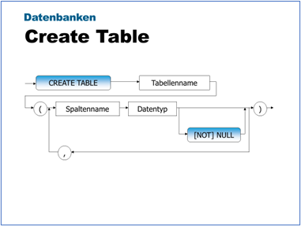
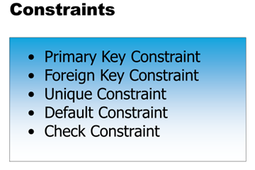
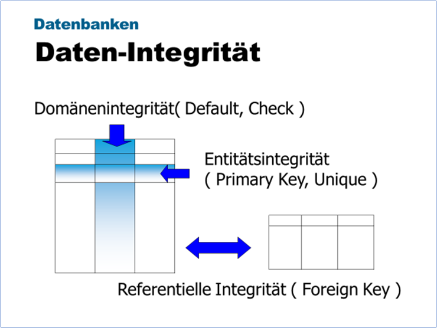
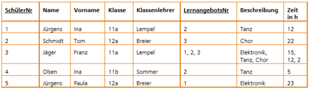

|                             |                          |                               |
| --------------------------- | ------------------------ | ----------------------------- |
| **Techniker HF Informatik** | **Kurs Datenbanken Da2** |  |

- [1. Datenmodell / Schema implementieren (Data Definition Language DDL)](#1-datenmodell--schema-implementieren-data-definition-language-ddl)
  - [1.1. Tabelle erstellen](#11-tabelle-erstellen)
    - [1.1.1. Syntax](#111-syntax)
    - [1.1.2. ANSI SQL Datentypen](#112-ansi-sql-datentypen)
    - [1.1.3. SQL Server 2025 (Version 17.x)](#113-sql-server-2025-version-17x)
  - [1.2. Tabelle ändern](#12-tabelle-ändern)
  - [1.3. Tabelle löschen](#13-tabelle-löschen)
  - [1.4. SQL-Constraints](#14-sql-constraints)
    - [1.4.1. Zweck von Constraints](#141-zweck-von-constraints)
    - [1.4.2. Prinzip](#142-prinzip)
    - [1.4.3. Primary Key](#143-primary-key)
    - [1.4.4. Foreign Key](#144-foreign-key)
    - [1.4.5. Unique](#145-unique)
    - [1.4.6. Default](#146-default)
  - [1.5. Daten-Integrität](#15-daten-integrität)
    - [1.5.1. Domänen-Integrität](#151-domänen-integrität)
    - [1.5.2. Entitätsintegrität](#152-entitätsintegrität)
    - [1.5.3. Referentielle Integrität](#153-referentielle-integrität)
- [2. Aufgaben](#2-aufgaben)
  - [2.1. Schulverwaltung (Datenmodell)](#21-schulverwaltung-datenmodell)
  - [2.2. Schulverwaltung (Implementierung)](#22-schulverwaltung-implementierung)
  - [2.3. Lernangebot (Normalisierung u. Implementierung)](#23-lernangebot-normalisierung-u-implementierung)
  - [2.4. SQL DDL- u. DML-Befehle](#24-sql-ddl--u-dml-befehle)

---

</br>

# 1. Datenmodell / Schema implementieren (Data Definition Language DDL)

## 1.1. Tabelle erstellen



### 1.1.1. Syntax

```sql
CREATE TABLE Mitarbeiter
(
   MitarbeiterID     INT            NOT NULL,
   MitarbeiterName   VARCHAR(20)    NULL,
   Eintritt          DATE           NULL
)
```

### 1.1.2. ANSI SQL Datentypen

Bezeichnung und Syntax von **Datentypen** variieren von DBS zu DBS recht stark. Aber alle haben folgende **skalare** Typen auf mindestens eine Art implementiert:

**Zeichenketten (Character String Types):**

| Datentyp             | Beschreibung                                           | Beispiel               |
| -------------------- | ------------------------------------------------------ | ---------------------- |
| CHAR(n)              | Feste Länge von n Zeichen (mit Leerzeichen aufgefüllt) | CHAR(10)               |
| VARCHAR(n)           | Variable Länge bis maximal n Zeichen                   | VARCHAR(255)           |
| CHARACTER(n)         | Synonym für CHAR(n)                                    | CHARACTER(20)          |
| CHARACTER VARYING(n) | Synonym für VARCHAR(n)                                 | CHARACTER VARYING(100) |

---

</br>

**Numerische Datentypen (Exact Numeric Types):**

| Datentyp     | Beschreibung                                       | Beispiel      |
| ------------ | -------------------------------------------------- | ------------- |
| INTEGER      | Ganze Zahl                                         | INTEGER       |
| INT          | Synonym für INTEGER                                | INT           |
| SMALLINT     | Kleine ganze Zahl                                  | SMALLINT      |
| BIGINT       | Große ganze Zahl                                   | BIGINT        |
| DECIMAL(p,s) | Festkommazahl mit p Stellen und s Nachkommastellen | DECIMAL(10,2) |
| NUMERIC(p,s) | Synonym zu DECIMAL                                 | NUMERIC(8,3)  |

---

</br>

**Approximate Numeric Types (Gleitkommazahlen):**

| Datentyp         | Beschreibung                     | Beispiel         |
| ---------------- | -------------------------------- | ---------------- |
| FLOAT(p)         | Gleitkommazahl mit Präzision p   | FLOAT(24)        |
| REAL             | Einfachpräzisions-Gleitkommazahl | REAL             |
| DOUBLE PRECISION | Doppelte Genauigkeit             | DOUBLE PRECISION |

---

</br>

**Boolean:**

| Datentyp | Beschreibung                         | Beispiel |
| -------- | ------------------------------------ | -------- |
| BOOLEAN  | Wahrheitswert (TRUE, FALSE, UNKNOWN) | BOOLEAN  |

---

</br>

**Datums- und Zeittypen (Datetime Types):**

| Datentyp                 | Beschreibung             | Beispiel                 |
| ------------------------ | ------------------------ | ------------------------ |
| DATE                     | Datum (Jahr, Monat, Tag) | DATE                     |
| TIME[(p)]                | Uhrzeit                  | TIME                     |
| TIMESTAMP[(p)]           | Datum und Uhrzeit        | TIMESTAMP                |
| TIME WITH TIME ZONE      | Uhrzeit mit Zeitzone     | TIME WITH TIME ZONE      |
| TIMESTAMP WITH TIME ZONE | Zeitstempel mit Zeitzone | TIMESTAMP WITH TIME ZONE |

---

</br>

**Binary String Types:**

| Datentyp     | Beschreibung               | Beispiel       |
| ------------ | -------------------------- | -------------- |
| BINARY(n)    | Binärdaten fester Länge    | BINARY(16)     |
| VARBINARY(n) | Binärdaten variabler Länge | VARBINARY(255) |

---

**Hinweis:**
Die ANSI-SQL-Norm definiert diese Grundtypen. Datenbanksysteme wie Oracle, MySQL, PostgreSQL oder SQL Server erweitern diese Liste um systemspezifische Typen (z.B. TEXT, MONEY, UUID, etc.).

### 1.1.3. SQL Server 2025 (Version 17.x)

Die Kapazität hängt stark von der verwendeten Edition ab. Während die Enterprise Edition technisch nur durch das Betriebssystem begrenzt wird, gab es für die kleineren Editionen wichtige Upgrades

| **Feature**          | **Express Edition**  | **Standard Edition** | **Enterprise Edition** |
| -------------------- | :------------------: | :------------------: | :--------------------: |
| Max. Datenbankgrösse | 50 GB (vorher 10 GB) |        524 PB        |         524 PB         |
| Max. Dateigrösse     |        16 TB         |        16 TB         |         16 TB          |
| Max. Dateien pro DB  |        32.767        |        32.767        |         32.767         |

- Max. Spalten pro Tabelle: **1.024 für Standard-Tabellen**.
  - 30.000 bei Verwendung von "Sparse Columns" (Wide Tables).
- Max. Bytes pro Datensatz (In-Row): **8.060 Bytes**.
  - Hinweis: SQL Server nutzt das sogenannte "Row-Overflow Storage".
  - Wenn Datensätze mit variabler Länge (z.B. varchar(8000)) diese Grenze überschreiten, werden die Daten auf zusätzliche Seiten ausgelagert.
  - Nur der 24-Byte-Pointer verbleibt im Hauptdatensatz.
- Max. Bytes pro Datensatz (LOB-Daten)
  - Spalten wie `varchar(max)`, `varbinary(max)` oder `xml` können bis zu **2 GB pro Feld** speichern.

---

</br>

## 1.2. Tabelle ändern

Mit **`ALTER TABLE tabellenname ...`** können

- Spalten einer Tabelle entfernt oder
- neue Spalten zu einer Tabelle hinzugefügt

```sql
-- Spalte hinzufügen
ALTER TABLE Kunde
   ADD Email VARCHAR(100);

-- Spalte ändern (Datentyp anpassen)
ALTER TABLE Kunde
   ALTER COLUMN Email VARCHAR(150);

-- Spalte löschen
ALTER TABLE Kunde
   DROP COLUMN Vorname;

-- Fremdschlüssel hinzufügen (Referenzielle Integrität)
ALTER TABLE Kunde
   ADD CONSTRAINT fk_kunde_ort
   FOREIGN KEY (OrtID)
   REFERENCES Ort(OrtID);   
```

---

</br>

## 1.3. Tabelle löschen

- Um eine Tabelle wieder zu löschen, verwendet man **`DROP TABLE`** Tabellenname.
- Mit **`DROP TABLE`** werden nicht nur die Daten, sondern auch die Tabellendefinitionen und die zugehörigen Berechtigungen gelöscht.
- Sind Abhängigkeiten auf die zu löschenden Tabellen vorhanden, kann die Tabelle nicht gelöscht werden.

```sql
-- Tabelle löschen
DROP TABLE Lieferant;

-- Löschen mit Sicherheitsprüfung
DROP TABLE IF EXISTS Lieferant;
```

> **Wichtig: Dieser Befehl kann nicht rückgängig gemacht werden (ohne Backup).**

---

</br>

## 1.4. SQL-Constraints

**SQL Constraints** sind Regeln auf Tabellen- oder Spaltenebene, die die Datenintegrität einer Datenbank sicherstellen.
Sie **verhindern**, dass ungültige, widersprüchliche oder unvollständige Daten gespeichert werden.



### 1.4.1. Zweck von Constraints

- **Sicherstellung der Datenqualität**
  - Nur erlaubte Werte dürfen gespeichert werden (z. B. keine negativen Preise).
- **Durchsetzung fachlicher Regeln**
  - Geschäftsregeln werden direkt in der Datenbank definiert – nicht nur im Programmcode.
- **Wahrung der Datenkonsistenz**
  - Beziehungen zwischen Tabellen bleiben korrekt (z. B. keine Bestellung ohne Kunde).
- **Fehlervermeidung auf Datenbankebene**
  - Schutz vor fehlerhaften Eingaben – unabhängig von der Anwendung.

### 1.4.2. Prinzip

- Nicht nur Programmierer machen Fehler, sondern vor allem auch Benutzer.
- Mit Constraints kann man sie vor sich selber schützen.
- Constraints sind Einschränkungen, die vom Programmierer definiert werden und deren Einhaltung von der DB erzwungen wird.

| **Constraint**  | **Zweck**                                               |
| --------------- | ------------------------------------------------------- |
| **NOT NULL**    | Verhindert leere Werte                                  |
| **PRIMARY KEY** | Eindeutige Identifikation eines Datensatzes             |
| **FOREIGN KEY** | Sicherstellt referenzielle Integrität zwischen Tabellen |
| **UNIQUE**      | Verhindert doppelte Werte                               |
| **CHECK**       | Definiert zulässige Wertebereiche                       |
| **DEFAULT**     | Setzt Standardwerte                                     |

### 1.4.3. Primary Key

- Erzwingt Entitäts-Integrität (Einmaligkeit des Datensatzes)
- Spalte muss als **`NOT NULL`** definiert sein
- Kreiert automatisch einen Index
- Wird von **`REFERENCES`** Constraint als Referenzpunkt angesprochen
- Hat die gleiche Charakteristik wie Unique Constraint, ausser, dass er **`NULL`** nicht zulässt und pro Tabelle nur einmal vorkommen darf.
- Beispiel:
  - `CREATE TABLE Lieferant ( ..., CONSTRAINT PK_Id PRIMARY KEY (id))`

### 1.4.4. Foreign Key

- Foreign Keys Constraints garantieren, dass nur Werte eingefügt werden können, die sich bereits in der anderen Tabelle befinden.
- Umgekehrt verhindern sie die Löschung von Datensätzen in der referenzierten Tabelle, wenn noch entsprechende Bezüge in der referenzierten Tabelle existieren.
- Beispiel
  - `CREATE TABLE Artikel ( ..., CONSTRAINT FK_Lieferant FOREIGN KEY (LieferantId) REFERENCES lieferant(id))`

### 1.4.5. Unique

- Unique Constraints spezifizieren, dass zwei Zeilen nicht den gleichen Wert in der gleichen Spalte haben können.
- Erlaubt `NULL`
- Mehrere Unique Constraints können in einer Tabelle vorkommen.
- Beispiel
  - `CREATE TABLE Angebot (..., CONSTRAINT U_code UNIQUE (lfr_code, art_code))`

### 1.4.6. Default

- Der Default Constraint füllt einen Wert in ein Feld ein, wenn das Feld im INSERT-Befehl ausgelassen wird.
- Beispiel
  - `CREATE TABLE Adult( ..., CONSTRAINT D_state, DEFAULT 'CA' FOR  state`
- Zusätzlich zu Konstanten kann `DEFAULT` auch DBS-spezifische Funktionen beinhalten: `current_user()`, `current_timestamp()`.

---

</br>

## 1.5. Daten-Integrität

- **Datenintegrität** stellt sicher, dass die in einer Datenbank gespeicherten Daten **korrekt**, **konsistent** und **widerspruchsfrei** sind.
- Sie wird durch verschiedene Integritätsregeln im relationalen Modell garantiert.



Die verschiedenen Constraints lassen sich gruppieren in 3 Typen:

- Domänen-Integrität
- Entitäts-Integrität
- Referentielle-Integrität

### 1.5.1. Domänen-Integrität

Die Domain-Integrität (Wertebereichsintegrität) stellt sicher, dass alle Daten in einer bestimmten Spalte einer Tabelle gültig, konsistent und innerhalb der vordefinierten Grenzen liegen.

Sie wird durch verschiedene Mechanismen erzwungen:

- Datentypen (Data Types)
- Nullwert-Zulässigkeit (Nullability)
- Check-Constraints (Prüfeinschränkungen)
- Standardwerte (Default Constraints)

```sql
CREATE TABLE Mitarbeiter (
    ID INT PRIMARY KEY,
    Name NVARCHAR(100) NOT NULL,              -- Nullability
    Einstiegsdatum DATE DEFAULT GETDATE(),    -- Default Constraint
    Gehalt DECIMAL(10,2) CHECK (Gehalt > 0),  -- Check Constraint
    Status VARCHAR(10) CHECK (Status IN ('Aktiv', 'Inaktiv', 'Austritt')) -- Wertebereich
);
```

### 1.5.2. Entitätsintegrität

Die Entitätsintegrität besagt:

- Jede Tabelle besitzt einen Primärschlüssel, und dieser darf nicht NULL sein.
- Jeder Datensatz (Tupel) muss eindeutig identifizierbar sein.
- Es darf keinen Datensatz ohne gültigen Primärschlüssel geben.
- Der **Primärschlüsselwert** muss eindeutig sein.

### 1.5.3. Referentielle Integrität

- Die referenzielle Integrität regelt die Beziehungen **zwischen Tabellen**.
- Ein **Fremdschlüsselwert** muss entweder auf einen existierenden **Primärschlüssel** verweisen oder `NULL` sein (falls erlaubt).

Die referentielle Integrität ist in einer DB erfüllt, wenn jeder **Fremdschlüssel* ungleich NULL eine Entsprechung beim zugehörigen *Primärschlüssel** hat.
Ein DBS kann auf eine Integritätsverletzung auf drei Arten reagieren:

- `RESTRICT`   - Bei einer **restriktiven** Lösung wird die Löschaktion abgewiesen, die eine Verletzung der ref. Integrität zur Folge hätte.
- `CASCADE`    - Beim **kaskadierenden** Löschen werden **alle Datensätze gelöscht**, die den Schlüssel des gelöschten Datensatzes als Fremdschlüssel enthalten.
- `SET NULL`   - Als dritte Variante besteht die Möglichkeit, den Inhalt des Fremdschlüsselattributes auf **NULL** zu setzen.

---

</br>

# 2. Aufgaben

## 2.1. Schulverwaltung (Datenmodell)

| **Vorgabe**             | **Beschreibung**                                                                          |
| :---------------------- | :---------------------------------------------------------------------------------------- |
| **Lernziele**           | Die Teilnehmer können unnormalisierte Daten in eine normalisierte Struktur transformieren |
| **Sozialform**          | Einzelarbeit                                                                              |
| **Auftrag**             | siehe unten                                                                               |
| **Hilfsmittel**         |                                                                                           |
| **Erwartete Resultate** |                                                                                           |
| **Zeitbedarf**          | 60 min                                                                                    |
| **Lösungselemente**     | Excel                                                                                     |

**Ausgangssituation:**

- In Datenbanken gilt das **«on fact one place»** Prinzip.
- Folglich müssen sämtliche redundante Information beseitigt werden sodass sämtliche Widersprüche und Anomalien beseitigt sind.

**Auftrag:**

- Sie erhalten sie unten abgebildete Tabelle.
- Diese sollen nun in eine stark strukturierte Form (normalisierte Struktur) übertragen werden

| **StudentNr** | **Name** | **Vorname** | **Geburtsdatum** | **Fachrichtung** | **AnzahlSemester** | **KursNr** | **Bezeichnung** |
| ------------- | -------- | ----------- | ---------------- | ---------------- | ------------------ | ---------- | --------------- |
| 1             | Müller   | Hans        | 01.03.1990       | BWL              | 6                  | 1, 2, 3    | VWL, Mathe, EDV |
| 2             | Maier    | Lieschen    | 24.02.1991       | Maschinenbau     | 7                  | 2          | Mathe           |
| 3             | Schulz   | Klaus       | 11.03.1989       | BWL              | 6                  | 2, 3       | Mathe, EDV      |
| 4             | Bayer    | Ina         | 08.08.1988       | Maschinenbau     | 7                  | 2          | Mathe           |
| 5             | Schmidt  | Egon        | 12.02.1984       | Biologie         | 8                  | 4          | Vererbungslehre |

- Modellieren Sie diesen Sachverhalt mit einem geeigneten Relationen Modell (mit Attributen, Beziehungen und Kardinalitäten dar).
- Erfassen Sie die normalisierten Daten in Excel.
- Kennzeichnen Sie Primary Key und Foreign Key.

---

## 2.2. Schulverwaltung (Implementierung)

| **Vorgabe**             | **Beschreibung**                                                                   |
| :---------------------- | :--------------------------------------------------------------------------------- |
| **Lernziele**           | Kann ein relationales Datenbankmodell mit SQL implementieren und Dateien einfügen. |
| **Sozialform**          | Einzelarbeit                                                                       |
| **Auftrag**             | siehe unten                                                                        |
| **Hilfsmittel**         |                                                                                    |
| **Erwartete Resultate** |                                                                                    |
| **Zeitbedarf**          | 80 min                                                                             |
| **Lösungselemente**     | Fehlerfreie SQL-Skriptdateien                                                      |
|                         | `sv_create_schema.sql`                                                             |
|                         | `sv_drop_schema.sql`                                                               |
|                         | `sv_insert_data.sql`                                                               |

**Ausgangssituation:**

- Sie verwenden das Datenbank Modell vorangegangener Aufgabe.
- Implementieren Sie dieses Modell und fügen Sie die aufgelisteten Daten ein.
- Schreiben Sie die notwendigen SQL-Skriptdateien (sv_...sql).

**A1:**

- Schreiben Sie die SQL-Befehle (create table …) um alle Tabellen in Ihrer Schulverwaltungsdatenbank anzulegen.
- Verwenden Sie hierzu das „SQL Server Management Studio“.

```sql
CREATE TABLE [user.]table ({column_element ¦ table_constraint} 
[,{column_element ¦ table_constraint} ] ...)

column_element         = column datatype [column constraint]
column constraint     = column [NULL] | [NOT NULL]
table constraint        = [{UNIQUE | PRIMARY KEY}]
```

Beispiel:

```sql
CREATE TABLE MITGLIED (
    ID            INTEGER        NOT NULL,
    VORNAME       VARCHAR(40)    NULL,
    CONSTRAINT [PK_MITGLIED] PRIMARY KEY (ID)
```

**A2:**

Fügen Sie per SQL Befehl (insert into …) alle Datenzeilen aus der Tabelle unten in Ihre Datenbank ein.

```sql
INSERT INTO [user.]tabelle [ (column [,column] ...) ]
VALUES (value [,value] ...)
```

---

## 2.3. Lernangebot (Normalisierung u. Implementierung)

| **Vorgabe**             | **Beschreibung**                                                          |
| :---------------------- | :------------------------------------------------------------------------ |
| **Lernziele**           | Kann unnormalisierte Daten in eine normalisierte Struktur transformieren. |
| **Sozialform**          | Einzelarbeit                                                              |
| **Auftrag**             | siehe unten                                                               |
| **Hilfsmittel**         |                                                                           |
| **Erwartete Resultate** |                                                                           |
| **Zeitbedarf**          | 60 min                                                                    |
| **Lösungselemente**     | Excel-Datei mit normalisierten Daten                                      |

**Aufgabenstellung:**

- Sie erhalten sie unten abgebildete Tabelle. Diese sollen nun in eine stark strukturierte Form (normalisierte Struktur) übertragen werden
- Aktuell wird das Lernangebot einer Bildungseinrichtung in einer Excel Datei mit nachfolgender Struktur geführt.
- Überlegen Sie, wie redundante Daten ohne Informationsverlust eliminiert werden kann.



---

## 2.4. SQL DDL- u. DML-Befehle

| **Vorgabe**             | **Beschreibung**                                         |
| :---------------------- | :------------------------------------------------------- |
| **Lernziele**           | Kann SQL DDL und DML-Befehle ausführen                   |
|                         | Kann Daten in eine Tabelle einfügen, ändern und löschen. |
|                         | Kann Daten in einer Tabelle abfragen                     |
| **Sozialform**          | Einzelarbeit                                             |
| **Auftrag**             | siehe unten                                              |
| **Hilfsmittel**         | Kursunterlagen, SQL-Management Studio                    |
| **Erwartete Resultate** |                                                          |
| **Zeitbedarf**          | 40 min                                                   |
| **Lösungselemente**     | Vollständige SQL-Skript-Datei                            |

Erstelle zu den nachfolgenden Aufgaben die korrekten und vollständigen SQL-Befehle. Die
Lösungen müssen mit Aufgabentext in einer SQL-Skriptdatei abgespeichert werden.

**A1:** Kreiere mit SQL-Statements eine Tabelle BLUME mit den Attributen:

```sql
ID    INT NOT       NULL ➔ PK 
Name  VARCHAR(50)   NOT NULL 
Preis DECIMAL(8,2)  NOT NULL 
```

**A2:** Füge zwei Datensätze zu mit den Werten:

```sql
10,   Nelke,  2.35 
11,   Rose,   4.50
```

**A3:** Überprüfe diese Einträge mit einem `SELECT`-Statement.

**A4:** Erhöhe den Preis der Rose um 10%.

**A5:** Überprüfe das Update in 4) mit einem `SELECT`-Statement.

**A6:** Lösche den Datensatz mit der **Nelke**

**A7:** Erweitere die `BLUME` Tabelle mit Spalte SORTE (VARCHAR(20)).

**A8:** Stelle sicher, dass nicht zweimal derselbe Blumenname eingetragen werden kann.

**A9:** Stelle sicher, dass der Blumenpreis immer > 0 sein muss.

**A10:** Entferne die gesamte Tabelle `BLUME`, inklusive Metadaten.

---

© 2026 Lukas Müller – Licensed under CC BY-NC-ND 4.0
See [LICENSE](..\license.md) file for details.
