|                             |                          |                                   |
| --------------------------- | ------------------------ | --------------------------------- |
| **Techniker HF Informatik** | **Kurs Datenbanken Da2** |  |

- [1. Erweiterte Modellierungsvarianten EERM](#1-erweiterte-modellierungsvarianten-eerm)
  - [1.1. Verbundinstrumente](#11-verbundinstrumente)
  - [1.2. Spezialisierung / Generalisierung (IS-A)](#12-spezialisierung--generalisierung-is-a)
  - [1.3. Notation Entity Relationship Modell](#13-notation-entity-relationship-modell)
  - [1.4. Beispiel einer Spezialisierung / Generalisierung (IS-A Beziehung)](#14-beispiel-einer-spezialisierung--generalisierung-is-a-beziehung)
  - [1.5. Rekursion](#15-rekursion)
    - [1.5.1. Stücklistenproblematik](#151-stücklistenproblematik)
  - [1.6. Aggregation](#16-aggregation)
  - [1.7. Generisches Datenmodell](#17-generisches-datenmodell)
    - [1.7.1. Vorteil](#171-vorteil)
    - [1.7.2. Nachteile](#172-nachteile)
    - [1.7.3. Einsatzbereich](#173-einsatzbereich)
- [2. Aufgaben](#2-aufgaben)
  - [2.1. IS-A Beziehung (Einführung)](#21-is-a-beziehung-einführung)
  - [2.2. IS-A Struktur implementieren](#22-is-a-struktur-implementieren)
  - [2.3. Rekursion (Einführung)](#23-rekursion-einführung)
  - [2.4. Rekursion Teilestruktur](#24-rekursion-teilestruktur)
  - [2.5. Betriebsmittel (generisches Datenmodell)](#25-betriebsmittel-generisches-datenmodell)

 

# 1. Erweiterte Modellierungsvarianten EERM

## 1.1. Verbundinstrumente

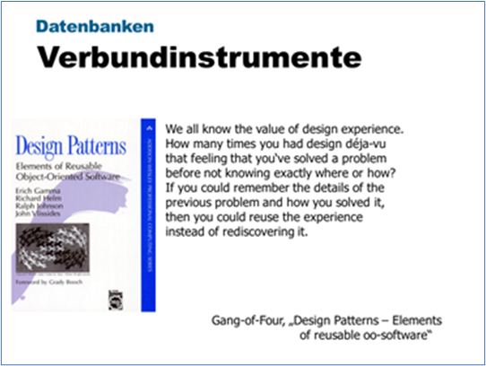

Experten gehen nicht jedes Problem von Grund auf neu an. Sie verstehen es, bereits gefundene Lösungen, die sie oder andere zuvor erfolgreich eingesetzt haben, wieder zu verwenden. Haben sie einmal eine gute Lösung gefunden, verwenden sie diese wieder und wieder. Solche Erfahrungen sind Teil dessen, was sie zu Experten macht.

**Ein Verbundinstrument ...:**

- ist eine **generische Lösung** für eine Gruppe von ähnlichen Problemen.
- ist ein Zusammenspiel von mehreren Entitätsmengen (Ausnahme: Rekursion).
- ist vergleichbar mit dem **Design Pattern**s im SW-Engineering.
- Ist eine mentale **Werkzeugkiste** zur Entwicklung von SW.
- hilft bei der Bewältigung der Komplexität.
- ist kein Programmiertrick, kein Algorithmus und keine Programmiertechnik.
- beschreibt ein in unserer Umwelt beständig **wiederkehrendes Problem** und erläutert den Kern der Lösung für dieses Problem, so dass die Lösung beliebig oft angewendet werden kann.

**Benefit:**

- Mit **Verbundinstrumenten** profitieren wir von der langjährigen Erfahrung von andern Informatikern.
- Es geht darum, das Rad nicht immer wieder neu zu erfinden.
- Ein **Verbundinstrument** hat sich in einem bestimmten Kontext bewährt, und es könnte sich in einem ähnlichen Kontext auch bewähren.
- **Verbundinstrumente** helfen uns, Erfahrungen beim SW-Entwurf festzuhalten, so dass sie von andern verwendet werden können.

**Synonyme:**

- Verbundinstrumente
- Design Pattern
- Entwurfsmuster

---

 

## 1.2. Spezialisierung / Generalisierung (IS-A)

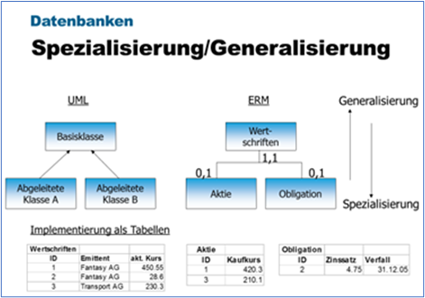

**Anwendung**:

- Ähnliche Tabellen mit identischen Attributen sollten diese identischen Attribute in eine gemeinsame, übergeordnete Entitätsmenge auslagern.

**Prinzip:**

- Die **Spezialisierung/Generalisierung** besteht aus einer **Superentitätsmenge** und mehreren **Subentitätsmengen**.
- Die **Superentitätsmenge** enthält alle gemeinsamen Eigenschaften (Attribute), während die **Subentitätsmengen** nur die für sie spezifischen Eigenschaften enthalten.
- Die gesamten Eigenschaften einer Entität sind dabei nur bekannt, falls die Attribute beider Entitäten zusammen betrachtet werden.

**Analogie:**

- In der objektorientierten SW-Entwicklung entspricht diese **Spezialisierung/Generalisierung** dem Konzept der Vererbung mit einer **Basisklasse** und einer oder mehreren **abgeleiteten Klassen**.

> **Viele NULL-Werte in einer Entitätsmenge sind häufig ein Hinweis darauf, dass die betroffene Entitätsmenge mittels einer Spezialisierung in eine oder mehrere Subentitätsmengen zerlegt werden könnte.**

**Überlappung:**

Diese Unter- und Obermengenbeziehungen lassen sich in drei verschiedene Fälle gruppieren:

- Subentitätsmengen mit zugelassener Überlappung
- Subentitätsmengen ohne Überlappung
- Superentitätsmengen mit vollständiger Überdeckung

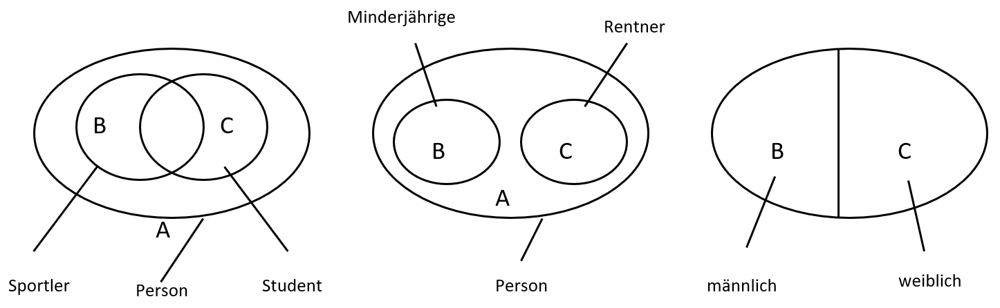

Vererbung wird verwendet, um auszudrücken, dass **Gemeinsamkeiten** (d.h. gemeinsame Attribute) von Entitätstypen in einem separaten, **übergeordneten Entitätstyp (Supertyp)** untergebracht sind, mit dem die **ursprünglichen Entitätstypen (Subtypen)** eine besondere Beziehung eingehen. Dadurch wird die redundante Modellierung in beiden Entitätstypen vermieden und gleichzeitig ihre Gemeinsamkeit explizit im Modell deutlich gemacht.

**Disjunkt:**
Ein System von **Subtypen** und **Supertypen** in einem EERM heisst **disjunkt**, wenn es**keine Entität (Datensatz)** gibt, die **gleichzeitig** zu mehreren Subtypen gehört. Dies bedeutet, dass jedes Objekt der realen Welt entweder durch den einen oder den anderen **Subtypen** abgebildet wird (exklusives entweder oder).

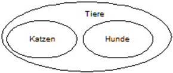

---

## 1.3. Notation Entity Relationship Modell

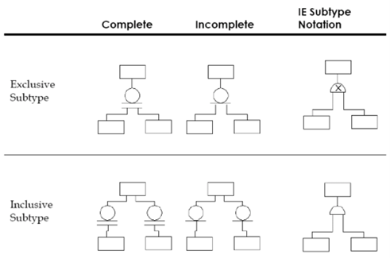

**Exclusive Subtype:**

- Ein Super Typ Eintrag, darf ausschliesslich in einem Subtyp enthalten sein (z.B. Person  Rentner, Minderjährige)

**Inclusive Subtype:**

- Ein Super Typ Eintrag kann in mehreren Subtypen enthalten sein (z.B. Person  Sportler, Student).

**Complete:**

- Jeder Eintrag in der Super Typ Tabelle muss zwingend in einem Subtyp enthalten sein (z.B. Geschlecht  Mann oder Frau).

**Incomplete:**

- Super Typ Einträge müssen nicht zwingend im Subtyp enthalten (z.B.: Personen  Sportler, Student)

---

## 1.4. Beispiel einer Spezialisierung / Generalisierung (IS-A Beziehung)

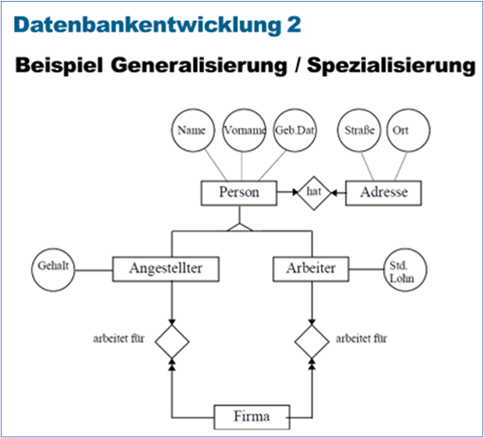

- Das obige Beispiel drückt aus, dass sowohl Angestellte als auch Arbeiter Personen mit Name, Vorname und Geburtsdatum sind.
- Jeder Arbeiter/Angestellte ist mit einer Entität des Typs Person verbunden, welche die gemeinsamen Attribute aufnimmt.

---

 

## 1.5. Rekursion

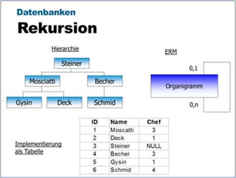

**Idee:**
Bei der Rekursion erstellt eine Entitätsmenge mittels einer 0,1: 0,1 oder 0,1: 0, n Beziehung via Fremdschlüssel eine Referenz auf sich selbst. Dabei sind Minimum Kardinalitäten von 1 fast immer ungeeignet, da sonst eine Entität immer eine Referenz aufweisen muss, wobei zwangsläufig Zyklen, Kreise entstehen.

**Paarige Verknüpfung:**
Eine rekursive 0,1: 0,1 Beziehung lässt eine paarige Verknüpfung zu. So liesse sich z.B. in einer Entitätsmenge Kunde festhalten, welches der Lebenspartner – welcher auch Kunde sein kann – des Kunden ist

**Hierarchie:**
Mit einer rekursiven 0,1: 0, n Beziehung wie oben abgebildet kann eine beliebige Hierarchie recht einfach abgebildet werden. Bei einer hierarchischen Grundstruktur hat eine Entität maximal eine übergeordnete Entität. Nur die Entität der obersten Hierarchiestufe hat keine übergeordnete Entität mehr.

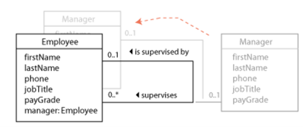

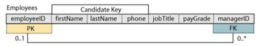

### 1.5.1. Stücklistenproblematik

Die Stücklistenproblematik ist nicht eine Erfindung der Datenmodellierung. Sie ist ein Thema, das v.a. in der Fertigung auftaucht. Eine Stückliste beschreibt die Zusammensetzung eines Objekts, das aus mehreren Elementen besteht. Jedes Element kann wieder aus Unterelementen bestehen und / oder aber selber wieder ein Objekt sein. Ausserdem kann jedes Element in mehreren Objekten auftreten. Diese Stücklistenproblematik kann man mit einer rekursiven 0, n: 0, n Beziehung darstellen. Solch eine n: n Beziehung muss aber mit einer Hilfstabelle (Struktur) aufgelöst sein.

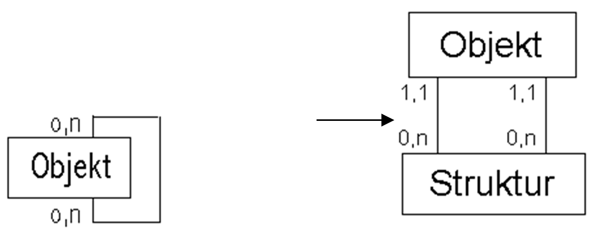

**Beispiel:**
In einer Projektorganisation kann ein Angestellter im Teilpensum auch für mehrere Manager arbeiten.

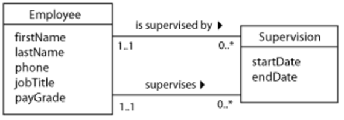

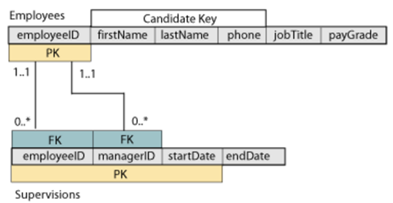

---

 

## 1.6. Aggregation

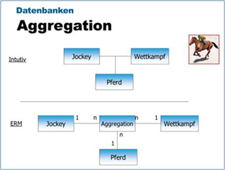

In einem Datenmodell beschreibt die **Aggregation** eine spezielle Form der **Assoziation zwischen Objekten**, die eine „**Ganzes-Teil**“-Beziehung darstellt.
Man kann es sich als eine „**besteht aus**“-Beziehung vorstellen, bei der ein übergeordnetes Objekt (**das Ganze**) aus mehreren untergeordneten Objekten (den Teilen) zusammengesetzt ist.

**Idee:**
Es gibt relativ viele Situationen, bei denen rein intuitiv ein Knotenpunkt zwischen den Beziehungen entsteht. Dies ist aber gemäss ERM nicht erlaubt. Solche Situationen können mit einer Aggregation gelöst werden. Eine Aggregation entspricht einer zusätzlichen Entitätsmenge – auch Beziehungsmenge genannt – im Knotenpunkt.
Mit diesem Verbundmuster kann jede beliebige **Jockey – Pferd – Wettkampf** Kombination erzeugt werden.

**Netzstrukturen:**
Eine solche Aggregations-Entitätsmenge kann beliebig viele andere Entitätsmengen via Foreign Key referenzieren. Dadurch können alle denkbaren Netzstrukturen gebildet werden

**Jeder-mit-jedem Kombination:**
Ein Spital bietet Hunderte von Untersuchungen (HIV, Bilirubin, Hepatitis, etc.) an. Ausführende (Verantwortliche) sind Ärzte, Laborantinnen, MTA, etc. Es soll möglich sein, dass theoretisch mit jedem Patienten jede Untersuchung durch jeden Verantwortlichen gemacht wird. Auch hier bietet sich die Aggregation als Verbundinstrument an.

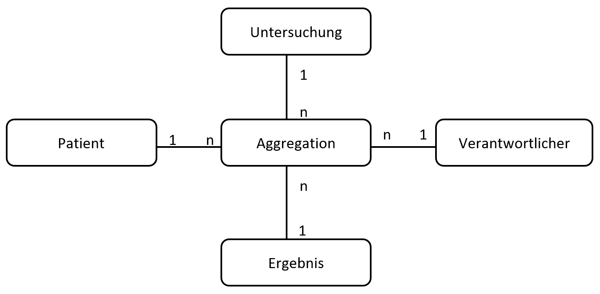

Das Entscheidende bei der **Aggregation** im Datenbank-Design ist die Löschweitergabe (**Delete-Logik**): Da die Teile unabhängig vom Ganzen existieren können, setzen wir den Fremdschlüssel beim Löschen des "Ganzen" normalerweise auf **NULL** oder lassen ihn einfach stehen, anstatt die Teile mitzulöschen.

**Technisches Beispiel:** Bibliothek und Buch
Ein Buch kann in einer Bibliothek stehen, existiert aber als Objekt (Physisches Buch) auch weiter, wenn die Bibliothek aufgelöst wird.

**Vergleich zur Komposition (Strenge Form):**
Wäre es eine Komposition (z.B. ein Buch und seine Kapitel), würde man **NOT NULL** und **ON DELETE CASCADE** verwenden, da ein Kapitel ohne sein Buch keinen Sinn ergibt.

---

## 1.7. Generisches Datenmodell

Ein **generisches Datenmodell** (oft auch als Universal Data Model oder Metadata-driven Model bezeichnet) ist ein hochflexibler Entwurfsansatz, bei dem die Struktur der Daten nicht durch feste Tabellenspalten, sondern durch abstrakte Zeilen definiert wird.

Anstatt für jedes neue Objekt (z.B. "Auto", "Mitarbeiter", "Smartphone") eine eigene Tabelle mit spezifischen Spalten anzulegen, nutzt ein generisches Modell eine universelle Struktur, die fast jeden Datentyp speichern kann, **ohne** dass das Datenbankschema (DDL) geändert werden muss.

**Das Kernkonzept: EAV (Entity-Attribute-Value):**
Die häufigste Form des generischen Modells ist das EAV-Modell.
Es besteht meist aus drei Hauptkomponenten:

- Entity (Entität): Das Objekt (z. B. "Produkt Nr. 101").
- Attribute (Attribut): Die Eigenschaft (z. B. "Farbe" oder "Gewicht").
- Value (Wert): Der eigentliche Inhalt (z. B. "Blau" oder "1.5kg").

### 1.7.1. Vorteil

- **Extreme Flexibilität:** Neue Eigenschaften können zur Laufzeit hinzugefügt werden, ohne die Tabellenstruktur zu ändern.
- **Platzsparend:** Bei "spärlichen" Daten (viele Spalten, die meist leer sind) wird kein unnötiger Speicher für NULL-Werte verbraucht.
- **Wiederverwendbarkeit:** Ein Modell kann für völlig unterschiedliche Geschäftsbereiche genutzt werden.

### 1.7.2. Nachteile

- **Komplexität:** Abfragen (SQL Joins) werden sehr kompliziert und unübersichtlich.
- **Performance:** Da für jeden Attributwert eine neue Zeile gelesen werden muss, sind solche Modelle bei großen Datenmengen oft langsam.
- **Verlust von Datentypen:** Oft werden alle Werte als VARCHAR gespeichert, was die Typsicherheit (Domain-Integrität) erschwert.

### 1.7.3. Einsatzbereich

Generische Modelle sind ideal für Systeme, bei denen die Eigenschaften der Objekte im Vorfeld nicht bekannt sind oder sich ständig ändern, wie zum Beispiel:

- Produktkataloge im E-Commerce (ein T-Shirt hat andere Merkmale als eine Festplatte).
- Medizinische Datenbanken (Patientendaten mit sehr unterschiedlichen Untersuchungswerten).
- Content-Management-Systeme (CMS).

> **Moderne Alternative: In SQL Server 2025 wird oft statt eines rein generischen Tabellenmodells der Datentyp JSON verwendet.**
> **Dies kombiniert die Flexibilität eines generischen Modells mit der Performance klassischer Tabellen.**

---

 

# 2. Aufgaben

## 2.1. IS-A Beziehung (Einführung)

| **Vorgabe**             | **Beschreibung**                                                     |
| :---------------------- | :------------------------------------------------------------------- |
| **Lernziele**           | Kennt die Möglichkeiten der Generalisierung/Spezialisierungsstruktur |
| **Sozialform**          | Einzelarbeit                                                         |
| **Auftrag**             | siehe unten                                                          |
| **Hilfsmittel**         |                                                                      |
| **Erwartete Resultate** |                                                                      |
| **Zeitbedarf**          | 20 min                                                               |
| **Lösungselemente**     | Datenmodell / ERM                                                    |

**Ausgangssituation:**

- Die nachfolgenden Fahrzeuge sollen in einer Fahrzeugdatenbank verwaltet werden.
- Zu den spezifischen Eigenschaften der einzelnen Fahrzeuge sind zudem auch gemeinsame Merkmale wie nachfolgend aufgeführt festzuhalten:
  - Farbe
  - Leistung
  - Gewicht
  - Max. Geschwindigkeit

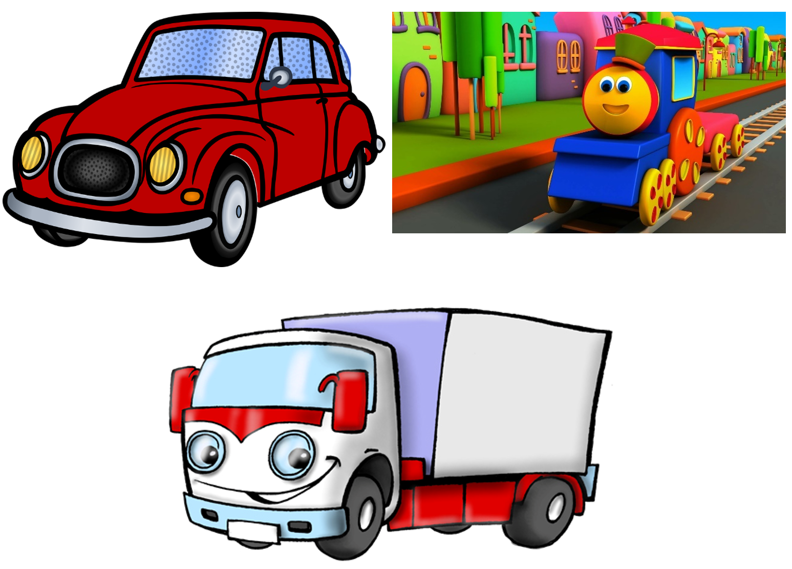

**Aufgabe:**

- Ermittle die spezifischen Merkmale eines Fahrzeugtyps.
- Überlege wie diese Datenbank aufgebaut werden kann und skizziere einem Relationen Modell die Tabellen, Beziehungen und Attribute.
- Entwerfe ggf. mehrere Lösungsvorschläge und diskutieren zusammen Sie die Vor-/Nachteile des Datenbankentwurfs.

---

 

## 2.2. IS-A Struktur implementieren

| **Vorgabe**             | **Beschreibung**                                                    |
| :---------------------- | :------------------------------------------------------------------ |
| **Lernziele**           | Kann IS-A (Generalisierung/Spezialisierungsstruktur) implementieren |
| **Sozialform**          | Einzelarbeit                                                        |
| **Auftrag**             | siehe unten                                                         |
| **Hilfsmittel**         |                                                                     |
| **Erwartete Resultate** |                                                                     |
| **Zeitbedarf**          | 40 min                                                              |
| **Lösungselemente**     | SQL-Skriptdatei  / Grafikdatei                                      |

**Aufgabe:**

1. Modellieren Sie aus dem ERM-Modell ein Relationen Modell mit den Entity-Mengen, den notwendigen Attributen, Dem Primärschlüssel und den Fremdschlüsseln sowie die Beziehungen zwischen den Entity-Mengen.
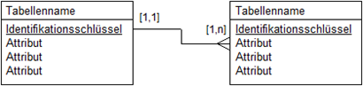
2. Erfasse min. 2 Kunden u. 2 Dozenten (insert into …).
3. Erstelle eine Abfrage, welche alle Kunden mit sämtlichen Attributen selektiert.
4. Erstelle eine Abfrage, welche alle Dozenten mit sämtlichen Attributen selektiert.
5. Überlege dir folgende Unter- und Obermengenbeziehungen:
   1. Kann ein Kunde auch Dozent sein, wenn ja wie?
   2. Zeichnen Sie grafisch die verschiedenen Möglichkeiten und unterscheiden Sie dabei zwischen vollständige / nicht vollständige und disjunkte und nicht disjunkte Beziehung

---

 

## 2.3. Rekursion (Einführung)

| **Vorgabe**             | **Beschreibung**                                 |
| :---------------------- | :----------------------------------------------- |
| **Lernziele**           | Kennt die Möglichkeiten einer Rekursionsstruktur |
| **Sozialform**          | Einzelarbeit                                     |
| **Auftrag**             | siehe unten                                      |
| **Hilfsmittel**         |                                                  |
| **Erwartete Resultate** |                                                  |
| **Zeitbedarf**          | 20 min                                           |
| **Lösungselemente**     | Datenmodell / ERM                                |

**Ausgangssituation:**

Um eine bessere Übersicht über das Angebot eines Warenhauses zu erhalten wurden die Produkte in verschiedene Kategorien hierarchisch, gemäss nachfolgender Aufstellung gegliedert.

- Lebensmittel
  - Getränke
    - Cola
    - Red Bull
  - Gemüse
    - Broccoli
    - Kohlrabi
  - Obst
    - Pfirsich
    - Orange
- Kleidung
  - Herrenkleidung
  - Damenkleidung

**Aufgabe:**

- Überlegen Sie sich wie diese Produkte inkl. der Gliederung in einer Datenbank verwaltet werden können.
- Entwickeln Sie ggf. mehrere Lösungsansätze und stellen Sie diese grafisch (Modell) dar.
- Implementieren Sie Ihre Lösung mit SQL, fügen Sie die Datensätze ein
- Erstellen Sie eine Abfrage welche z.B. alle Getränke selektiert

---

 

## 2.4. Rekursion Teilestruktur

| **Vorgabe**             | **Beschreibung**                                                    |
| :---------------------- | :------------------------------------------------------------------ |
| **Lernziele**           | Kann eine rekursive Struktur analysieren und Suchabfragen vornehmen |
| **Sozialform**          | Einzelarbeit                                                        |
| **Auftrag**             | siehe unten                                                         |
| **Hilfsmittel**         |                                                                     |
| **Erwartete Resultate** |                                                                     |
| **Zeitbedarf**          | 40 min                                                              |
| **Lösungselemente**     | SQL-Skriptdatei                                                     |

**Teile:**
Teile sind alle Artikel, Baugruppen oder Materialien, die im Unternehmen benötigt werden. Man unterscheidet nach dem Attribut "Typ": Materialien (Typ=Material) sind Teile, die von Lieferanten hinzugekauft werden. Baugruppen (Typ=Baugruppen) sind Zwischenteile, die gefertigt, aber nicht an Kunden verkauft werden. Artikel (Typ=Artikel) sind schließlich Endprodukte, die an Kunden verkauft werden und außerdem eine Stückliste haben.

**Struktur:**
Die Struktur-Entität-Menge stellt die Stückliste dar. Sie beinhaltet, welches Teil in welcher Menge bei der Herstellung eines anderen Teils verwendet wird.

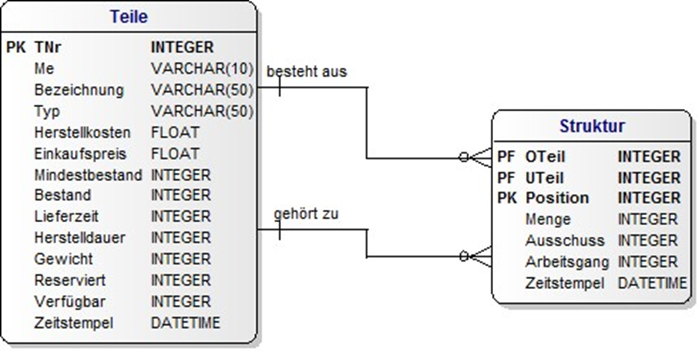
[Download SQL-Projekt](./x_gitres/Teilestruktur.zip)

**Aufgabe:**

1. Implementieren Sie das obige Relationen Modell in Ihrer Datenbank. Schreiben Sie hierfür die SQL-Befehle (Tabellen und Beziehungen)
2. Erfassen Sie die Teile und Strukturdaten. Laden Sie die Teiledaten eines Bike Shops (TEILEINSERT.SQL)
3. Erstellen Sie für folgende Abfragen die SELECT Anweisung
   1. Welche Bestandteile hat der Artikel mit der Teile Nr. (TNr) = 60
   2. Die in der Baugruppe enthaltenen Teile werden aufgelöst (2 stufig)
   3. Die in der Baugruppe enthaltenen Teile werden aufgelöst (3 stufig)

---

 

## 2.5. Betriebsmittel (generisches Datenmodell)

| **Vorgabe**             | **Beschreibung**                                                              |
| :---------------------- | :---------------------------------------------------------------------------- |
| **Lernziele**           | Kennt die Möglichkeiten eines generischen Datenmodells                        |
|                         | Kann ein generisches Datenmodell implementieren und darauf Abfragen vornehmen |
| **Sozialform**          | Einzelarbeit                                                                  |
| **Auftrag**             | siehe unten                                                                   |
| **Hilfsmittel**         |                                                                               |
| **Erwartete Resultate** |                                                                               |
| **Zeitbedarf**          | 50 min                                                                        |
| **Lösungselemente**     | Datenmodell / SQL-Skript                                                      |

Eine Maschinenbauunternehmung setzt in der Produktion verschiedenen Fertigungshilfsmittel (Geräte) ein. Ein solches "Gerät" kann sowohl ein **Messgerät**, ein **Roboter** als auch ein **Kran** oder irgendetwas anderes sein. Will man jetzt für ein solches Unternehmen eine Datenbank für die Verwaltung dieser Fertigungshilfsmitteln entwickeln, so müsste man eigentlich für jedes diesen unterschiedlichen Betriebsmitteln (so wollen wir die "Geräte" ab jetzt nennen) eine extra Tabelle anlegen. Kommt dann ein neue Betriebsmittel hinzu, muss wieder eine neue Tabelle angelegt werden. Das Problem ist offensichtlich, bei einem neuen Gerätetyp muss die Datenbank Entwicklungsabteilung aktiv werden, um die Struktur in der Datenbank einzubauen.
Der Nutzer einer Datenbank wünscht sich aber, dass er diese Erweiterung selbst und ohne Programmierung vornehmen werden kann. Er verlangt ein allgemein gültiges bzw. universelles Datenmodell, um alle möglichen Geräte verwalten zu können.

**Aufgabe:**

1. Überlegen Sie sich wie diese Anforderung umgesetzt werden kann. D.h. es darf weder eine Tabelle "Messgerät", noch eine Tabelle "Roboter", noch eine Tabelle "Kran" vorkommen. Stattdessen sollen "universelle" (=verallgemeinerte) Tabellen Anwendung finden.
2. Überlegen Sie sich, wie die spezifischen Eigenschaften (Merkmale), der Roboter hat z.B. einen Arbeitsbereich, das Messgerät ein Nennmass, der Kran eine Nutzlast in der Datenbank gespeichert werden können.
3. Stellen Sie Ihren Lösungsansatz in einem Relationen Modell dar.

4. Implementieren Sie die Tabellen und Beziehungen komplett in SQL. Erstellen Sie hierzu eine SQL Skriptdatei.
5. Schreiben Sie die SQL Befehle, um mindestens zwei Gerätetypen mit unterschiedlichen Merkmalen in die Datenbank einzufügen.
6. Erstellen Sie eine Abfrage, welche die Merkmale eines Gerätes auflistet.
