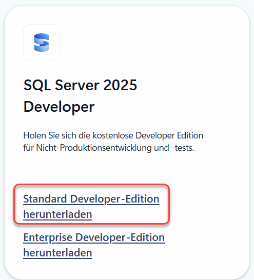

|                             |                     |                                 |
| --------------------------- | ------------------- | ------------------------------- |
| **Techniker HF Informatik** | **Datenbanken Da2** |  |

- [1. Voraussetzungen / Softwareinstallationen](#1-voraussetzungen--softwareinstallationen)
  - [1.1. SQL-Server](#11-sql-server)
  - [1.2. SQL-Server Management Studio](#12-sql-server-management-studio)
- [2. Aufgaben](#2-aufgaben)
  - [2.1. Installation u. Softwarevoraussetzungen / Tools](#21-installation-u-softwarevoraussetzungen--tools)
  - [2.2. SQL-Server Management Schnellstart Tutorial](#22-sql-server-management-schnellstart-tutorial)
  - [2.3. GitHub Account erstellen](#23-github-account-erstellen)

---

 

# 1. Voraussetzungen / Softwareinstallationen

## 1.1. SQL-Server

- 
- [Download SQL-Server](https://www.microsoft.com/en-us/sql-server/sql-server-downloads)

## 1.2. SQL-Server Management Studio

- 
- [Download SQL-Server Management Studio](https://learn.microsoft.com/de-de/ssms/install/install))

 

# 2. Aufgaben

## 2.1. Installation u. Softwarevoraussetzungen / Tools

| **Vorgabe**             | **Beschreibung**                     |
| :---------------------- | :----------------------------------- |
| **Lernziele**           | Softwarevoraussetzungen sind erfüllt |
| **Sozialform**          | Einzelarbeit                         |
| **Auftrag**             | Softwareinstallationen auf Laptop    |
| **Hilfsmittel**         | siehe Download links                 |
| **Erwartete Resultate** |                                      |
| **Zeitbedarf**          | 40 min                               |
| **Lösungselemente**     | Ausführbare SW Anwendungen           |

Installiere alle erforderlichen Softwarekomponenten auf Deinem Rechner.
Teste soweit möglich, dass alle Komponenten ohne Fehler ausgeführt werden und funktionstauglich sind.

---

 

## 2.2. SQL-Server Management Schnellstart Tutorial

| **Vorgabe**             | **Beschreibung**                                                       |
| :---------------------- | :--------------------------------------------------------------------- |
| **Lernziele**           | Kann das Management Studio korrekt einsetzen und SQL-Befehle ausführen |
| **Sozialform**          | Einzelarbeit                                                           |
| **Auftrag**             | Softwareinstallationen auf Laptop                                      |
| **Hilfsmittel**         | siehe Download links                                                   |
| **Erwartete Resultate** |                                                                        |
| **Zeitbedarf**          | 30 min                                                                 |
| **Lösungselemente**     |                                                                        |

Arbeite das [Schnellstart Tutorial des Management Studios](https://learn.microsoft.com/de-de/ssms/quickstarts/ssms-connect-query-sql-server?view=sql-server-ver15&tabs=modern) Schritt für Schritt komplett durch.

- Eine Verbindung mit einer SQL Server-Instanz herstellen
- Erstellen einer Datenbank
- Erstellen einer Tabelle in der neuen Datenbank
- Einfügen von Zeilen in die neue Tabelle
- Abfragen der neuen Tabelle und Anzeigen der Ergebnisse

[Link Schnellstart Tutorial](https://learn.microsoft.com/de-de/ssms/quickstarts/ssms-connect-query-sql-server?view=sql-server-ver15&tabs=modern)

---

 

## 2.3. GitHub Account erstellen

| **Vorgabe**         | **Beschreibung**                           |
| :------------------ | :----------------------------------------- |
| **Lernziele**       | GitHub Account seht zur Verfügung          |
|                     | GitHub Benutzername in OneNote eingetragen |
| **Sozialform**      | Einzelarbeit                               |
| **Auftrag**         | siehe unten                                |
| **Hilfsmittel**     | Internet / Browser                         |
| **Zeitbedarf**      | 10 min                                     |
| **Lösungselemente** |                                            |

Erstelle einen **GitHub** Account. Verwende dabei wenn möglich die E-Mail Adresse deiner Bildungsinstitution.
Gehe dabei wie folgt vor:

1. Gehe auf die Website
   1. <https://github.com/>
2. Klicke auf **„Sign up“**
   1. Oben rechts auf der Startseite findest du die Schaltfläche „Sign up“ (Registrieren).
3. Gib deine E-Mail-Adresse ein
   1. Beispiel: <dein.name@schule.ch>
   2. ? Klicke dann auf **„Continue“**
4. Wähle einen Benutzernamen
   1. Das ist dein öffentlicher Name auf GitHub, z.B. **codefan123**.
5. Lege ein sicheres Passwort fest
   1. Mindestens 8 Zeichen, am besten mit Gross-, Kleinbuchstaben, Zahlen und Symbolen.
6. Gib an, ob du E-Mails von GitHub erhalten willst
   1. Das ist optional.
7. Verifiziere, dass du kein Roboter bist
   1. GitHub zeigt dir manchmal ein kleines Rätsel oder Bild-Puzzle.
8. Bestätige deine E-Mail-Adresse
   1. GitHub sendet dir eine Mail mit einem Bestätigungslink – klicke darauf, um dein Konto zu aktivieren.
9. Wähle deine GitHub-Einstellungen
   1. Privatperson oder Unternehmen
   2. Deine Interessen
10. Fertig!
    1. Du wirst zu deinem GitHub-Dashboard weitergeleitet.
11. Trage nun dein GitHub Benutzername im Class Notebook (Teams) bei Kursnotizen ein.
