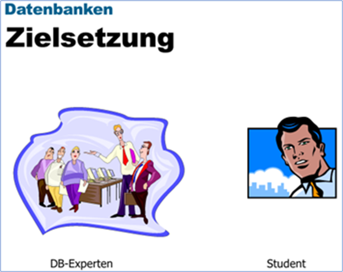

|                             |                     |                              |
| --------------------------- | ------------------- | ---------------------------- |
| **Techniker HF Informatik** | **Datenbanken Da2** |  |

 

# TSI - Datenbanken Da2 - Praxisorientierte Datenbankentwicklung

 

## Allgemein

- [Kursübersicht u. Vorstellung](./GE2_Intro/README.md)

## Kompetenz

- Logisches Datenbankschema mit Standardsprachmitteln (Structured Query Language SQL) in ein relationales Datenbank Management System (RDBMS) integrieren. Transaktionen durchführen.
- Bereitet Daten durch Abfragen auf und nimmt Optimierungen zur Leistungssteigerung vor.
- Ändert Struktur und Daten einer Datenbank, schützt die Daten durch Zugriffsberechtigungen und sichert die Daten wie auch das Datenbankschema in einem Backup.
- Kundenanforderungen für Informationen und Informationsbestände aufnehmen, analysieren und Datenmodell(e) entwickeln

---

## Objekt

- Datenbanken mit bis zu zehn Tabellen (einfache, komplexe und rekursive Beziehungstypen) und schützenswerten Daten (z.B. Kunden- oder Patientenverwaltung).

---

## Handlungsziele

1. Ein Logisches Datenbankschema mit Hilfe von SQL-Befehlen (DDL) das Datenbankschema in einem RDBMS implementieren.
   1. Kennt die wichtigsten Befehle einer Datendefinitionssprache (DDL) zur Einrichtung einer Datenbank und kann beschreiben, wie diese Definitionen den Zugriff auf die Datenbank unterstützen.
   2. Kann die geforderten Beziehungen unter Berücksichtigung der referenzielle Integrität (Datenkonsistenz) implementieren.
   3. Konzeptionelles Datenmodell in ein logisches überführen und Attribute, Identifikations-, Fremdschlüssel und Datentypen ergänzen.
2. Rollen/Berechtigungen vergeben zur Gewährleistung der Datensicherheit und des Datenschutzes.
   1. Kennt die Funktionen eines Datenbankmanagementsystems um gemäss Vorgabe die Einschränkung des Zugriffs und der Manipulationen von Daten zu steuern
3. Mit einem Datenbank Utility (Bulk load) oder mittels SQL-Befehlen die Datenbank mit Testdaten laden.
   1. Kennt Varianten, grössere Datenmengen in eine Datenbank zu laden und kann erläutern, welche Varianten bei bestimmten Ausgangssituationen vorzugsweise einzusetzen sind.
4. Mit SQL-Befehlen Transaktionen zur Bearbeitung und Auswertung der Datenbank ausführen.
   1. Kennt die Befehle einer Datenmanipulations- und Abfragesprache (DML,SQL) zur Manipulation, Selektion und Auswertung von Datenbeständen
   2. Kennt die prozedurale Elemente der Datenbank und kann diese korrekt einsetzen.
5. Aufgrund geänderter Anforderungen das Datenbankschema anpassen
   1. Kennt das schrittweise Vorgehen bei der Änderung eines Datenbankschemas und kann an Beispielen aufzeigen, welche Auswirkungen die Änderungen auf einen bestehenden Datenbestand haben können.
