|                             |                   |                               |
| --------------------------- | ----------------- | ----------------------------- |
| **Techniker HF Informatik** | **Datenbanken 2** |  |

- [1. SQL-Transaktionen](#1-sql-transaktionen)
  - [1.1. Ausgangslage](#11-ausgangslage)
    - [1.1.1. Atomarität](#111-atomarität)
    - [1.1.2. Konsistenz](#112-konsistenz)
    - [1.1.3. Isolation](#113-isolation)
    - [1.1.4. Dauerhaftigkeit](#114-dauerhaftigkeit)
  - [1.2. COMMIT / ROLLBACK](#12-commit--rollback)
  - [1.3. Transaktionsabbrüche](#13-transaktionsabbrüche)
  - [1.4. ROLLBACK](#14-rollback)
  - [1.5. Dauer einer Transaktion](#15-dauer-einer-transaktion)
  - [1.6. Beispiel einer Transaktion](#16-beispiel-einer-transaktion)
  - [1.7. LOCK-Mechanismen](#17-lock-mechanismen)
  - [1.8. Isolations Levels](#18-isolations-levels)
  - [1.9. Probleme im Mehrbenutzerbetrieb](#19-probleme-im-mehrbenutzerbetrieb)
  - [1.10. Konzepte](#110-konzepte)
    - [1.10.1. Pessimistische Verfahren](#1101-pessimistische-verfahren)
    - [1.10.2. Optimistische Verfahren](#1102-optimistische-verfahren)
    - [1.10.3. Vergleich](#1103-vergleich)
    - [1.10.4. Zusammenfassung](#1104-zusammenfassung)
  - [1.11. Transaction Log](#111-transaction-log)
    - [1.11.1. Vorgehen](#1111-vorgehen)
    - [1.11.2. Mirroring](#1112-mirroring)
    - [1.11.3. Schlussfolgerung](#1113-schlussfolgerung)
- [2. Deadlock](#2-deadlock)
  - [2.1. Lockmanager / Deadlock Monitor](#21-lockmanager--deadlock-monitor)
  - [2.2. Strategien zur Vermeidung](#22-strategien-zur-vermeidung)
  - [2.3. Beispiel Deadlock in der Bibliothek](#23-beispiel-deadlock-in-der-bibliothek)
- [3. Aufgaben](#3-aufgaben)
  - [3.1. Gruppenarbeit Transaktionen / Isolationslevel / Deadlock](#31-gruppenarbeit-transaktionen--isolationslevel--deadlock)
  - [3.2. Transaktionen (Schulverwaltung)](#32-transaktionen-schulverwaltung)

</br>

# 1. SQL-Transaktionen

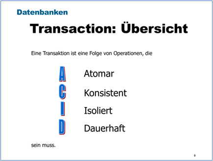

Das bisher Gesagte reicht im Wesentlichen aus, wenn wir eine Datenbank auf einem Einzelplatz-rechner betreiben. In betrieblichen Anwendungen ist jedoch davon auszugehen, dass die Daten unternehmensweit organisiert sind und die Nutzer Zugriff über ein lokales Netzwerk haben.

## 1.1. Ausgangslage

Sobald mehrere Benutzer **gleichzeitig** auf dieselben Datenbestände zugreifen, müssen spezielle Massnahmen getroffen werden, um Probleme wie Inkonsistenzen oder Deadlocks zu vermeiden.
In Verarbeitungen werden meist mehrere Datensätze verändert; dabei lassen sich oft Sequenzen identifizieren, die entweder insgesamt korrekt abgeschlossen werden müssen oder sich überhaupt nicht im Datenbestand niederschlagen dürfen. Um dies sicherzustellen, werden derartig zusammengehörige Datenmanipulationen zu Transaktionen zusammengefasst

Eine Transaktion hat 4 wesentliche Eigenschaften:

### 1.1.1. Atomarität

**Atomarität** besagt, dass eine Transaktion eine unteilbare Einheit darstellt. Sie wird entweder komplett durchgeführt oder gar nicht. D.h. Eine Folge von Datenbank Operationen wird komplett oder nicht ausgeführt. Alles oder nichts Prinzip.

### 1.1.2. Konsistenz

Bei Transaktionsende müssen alle **Konsistenzbedingungen** erfüllt sein. Während der Transaktion können sie verletzt sein.

### 1.1.3. Isolation

Das Prinzip der Isolation verlangt, dass gleichzeitig ablaufende Transaktionen dieselben Resultate wie im Falle einer Einzelbenutzerumgebung erzeugen müssen, sie dürfen sich **nicht gegenseitig** beeinflussen. Die Transaktion bildet so eine Einheit für ihre Serialisierbarkeit. Wird durch Sperrmechanismen realisiert

### 1.1.4. Dauerhaftigkeit

Bei Programmfehlern, Systemabbrüchen oder Fehlern auf dem Speichermedium **garantiert** die Dauerhaftigkeit die Wirkung einer korrekt abgeschlossenen Transaktion. Alle mit commit abgeschlossenen Transaktionen müssen auch nach einem Systemabbruch auf der Harddisk `verewigt` sein. Die Transaktion bildet eine Einheit für eine Wiederherstellung ( Recovery ).

## 1.2. COMMIT / ROLLBACK

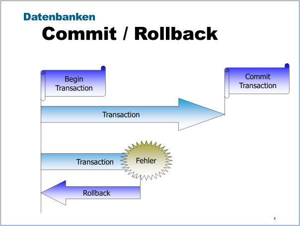

Eine **Transaktion** wird zu einem bestimmten Zeitpunkt mit `BEGIN TRANSACTION` explizit begonnen und wird am Ende mit `COMMIT TRANSACTION` abgeschlossen oder mit `ROLLBACK TRANSACTION` zurückgesetzt.

Etliche DBMS, die für den PC verfügbar sind, enthalten keine Mechanismen für die Transaktion. Dieses Fehlen der sehr komplizierten Mechanismen ist u.a. der Grund für den relativ tiefen Preis dieser Systeme. Solche Systeme sind daher nur für den Einbenutzerbetrieb zu verwenden. Bei der Auswahl eines DBMS ist auf diesen Punkt besonders Wert zu legen.

## 1.3. Transaktionsabbrüche

In grossen DBS, bei denen mehrere hundert Transaktionen pro Sekunde ausgeführt werden, sind Transaktionsabbrüche an der Tagesordnung. Solche Abbrüche sind entweder lokaler Natur, wenn nur eine Transaktion betroffen ist, oder sie sind global, wenn mehrere Transaktionen betroffen sind.

- Die Ursachen für lokale Abbrüche sind z.B.:
  - Arithmetik-Fehler (Division durch 0 )
  - Canceln einer Transaktion durch den Benutzer
  - Software-Fehler
- Globale Abbrüche:
  - Hardware-Fehler in CPU, BUS, etc.
  - Harddisk-Crash
  - Stromausfall
  - Software-Fehler

Eine Transaktion wird durch ein `ROLLBACK` zurückgesetzt (ungeschehen gemacht).

## 1.4. ROLLBACK

Technisch liegt dieser Möglichkeit eine zeitweise Duplizierung der Daten zugrunde. Alle Tupel werden vor der Änderung in eine **'Before-Image-Datei'** kopiert. Aus dieser werden sie bei einem Rollback in die Datenbank zurück kopiert.

## 1.5. Dauer einer Transaktion

Eine Transaktion hat solange Bestand wie:

- `COMMIT` Statement wird abgesetzt
  - Änderungen werden bestätigt und festgeschrieben
- `ROLLBACK` Statement wird abgesetzt
  - Änderungen werden rückgängig gemacht
  - Datenbank wird in den konsistenten Zustand vor der Transaktion zurückgestellt.
- `AUTO COMMIT` findet statt
  - Sobald ein TSQL Batch oder ein Statement aus einer Applikation abgesetzt und fehlerfrei ausgeführt wurde und die Applikation beendet wird.
- `AUTO ROLLBACK`
  - Sobald ein TSQL Batch oder ein Statement aus einer Applikation abgesetzt und ein Fehler verursacht wurde und die Applikation beendet wird

**Auto COMMIT Transactions (default):**

- Statement level implicit transaction

**Explicit transaction (user-defined):**

- BEGIN TRANSACTION
- COMMIT / ROLLBACK TRANSACTION

## 1.6. Beispiel einer Transaktion

```sql
-- 1. Vorbereitung: Eine kleine Tabelle für Kontostände
CREATE TABLE Konten (
    KontoID INT PRIMARY KEY,
    Inhaber NVARCHAR(50),
    Kontostand DECIMAL(10, 2)
);

INSERT INTO Konten VALUES (1, 'Alice', 1000.00), (2, 'Bob', 500.00);

-- 2. Die Transaktion
BEGIN TRY
    BEGIN TRANSACTION; -- Start der atomaren Einheit

    -- Schritt A: Alice 500 € abziehen
    UPDATE Konten 
    SET Kontostand = Kontostand - 500 
    WHERE KontoID = 1;

    -- Simulation eines Fehlers (optional zum Testen):
    -- RAISERROR('Simulierter Systemfehler!', 16, 1);

    -- Schritt B: Bob 500 € gutschreiben
    UPDATE Konten 
    SET Kontostand = Kontostand + 500 
    WHERE KontoID = 2;

    -- Wenn alles okay ist: Dauerhaft speichern
    COMMIT TRANSACTION;
    PRINT 'Überweisung erfolgreich ausgeführt.';
END TRY

BEGIN CATCH
    -- Wenn IRGENDETWAS schiefgeht: Alles rückgängig machen
    IF @@TRANCOUNT > 0
    BEGIN
        ROLLBACK TRANSACTION;
        PRINT 'Fehler aufgetreten. Transaktion wurde zurückgerollt.';
    END
    
    -- Fehlerdetails ausgeben
    SELECT ERROR_MESSAGE() AS Fehlermeldung;
END CATCH;

-- 3. Ergebnis prüfen
SELECT * FROM Konten;
```

**Erläuterung der Befehle:**

- `BEGIN TRANSACTION`: Eröffnet einen geschützten Bereich. Ab jetzt werden Änderungen nur "vorläufig" im Log-File vorgemerkt, aber noch nicht endgültig in die Datenseiten der Datenbank geschrieben.
- `COMMIT TRANSACTION`: Bestätigt alle Änderungen seit dem Start. Die Daten sind nun dauerhaft und für alle anderen Benutzer sichtbar gespeichert.
- `ROLLBACK TRANSACTION`: Setzt die Daten exakt auf den Zustand vor dem BEGIN zurück. Das ist Ihre "Rettungstaste", wenn mitten im Prozess ein Fehler auftritt (z. B. Stromausfall, Constraint-Verletzung oder Logikfehler).

---

</br>

## 1.7. LOCK-Mechanismen

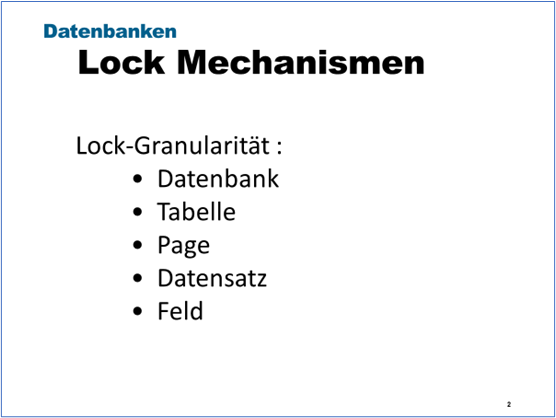

- **Lock-Granularität**: Jedes professionelle DBS bietet die Möglichkeit, Objekte einer Datenbank für Transaktionen zu locken (sperren).  Solche Locks können unterschiedliche Feinheiten besitzen, siehe oben.
- **Lockmanager:** Die Anforderung, ein Objekt zu locken, wird an den so genannten Lockmanager gerichtet. Dieser Prozess führt die Lockanforderungen zentral für alle Transaktionen eines DBS aus. Er hält die Locks in speziellen Locktabellen, in denen neben der Transaktions-ID auch die eindeutige Kennung des gelockten Objekts eingetragen wird.
Bevor ein Objekt gelockt werden kann, muss der Lockmanager in der Locktabelle nachsehen, ob das Objekt bereits von einer andern Transaktion gelockt wurde. Falls das der Fall ist, wird die den Lock anfordernde Transaktion in einen Wartezustand gesetzt, bis der Lock freigegeben ist. In der Praxis werden zwei Arten von Locks unterschieden: exlusive und shared Locks.
- **Exklusive Locks**: XLOCK’s werden gesetzt, wenn eine Transaktion ein Objekt ändern möchte.
- **Shared Locks**: Es muss sichergestellt sein, dass zu der Zeit, in der Transaktionen lesend auf Daten zugreifen, keine andere Transaktion diese Daten ändert; lediglich lesender Zugriff ist erlaubt.
Um dies zu gewährleisten, müssen auch lesende Transaktionen Daten locken. Aus diesem Grund gibt es einen andern, schwächeren Lock, den sogenannten Shared Lock (SLOCK). Damit wird sichergestellt, dass beliebig viele Transaktionen lesend auf ein Datenbankobjekt zugreifen können.
- **DeadLock:** Ein Deadlock entsteht, wenn Transaktionen wechselseitig aufeinander warten oder wenn zyklische Abhängigkeiten vorliegen. DBMS verfügen meist über Algorithmen, die solche Verklemmungen aufspüren können. Aufgrund verschiedener Kriterien wird anschliessend entschieden, welche Transaktion zurückgesetzt wird, womit sich die Verklemmung auflöst. Ein sehr einfacher Entscheid ist z.B. aufgrund einer Zeitschranke möglich, d.h. nach Ablaufen der Zeit wird eine der Transaktionen automatisch abgebrochen.

---

</br>

## 1.8. Isolations Levels

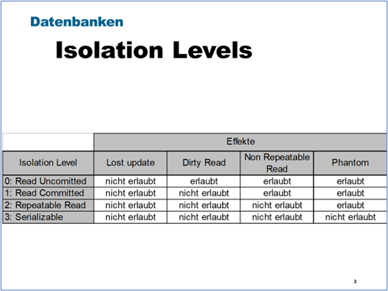

Zur Synchronisation des Mehrbenutzerbetriebs bietet SQL/92 über `SET TRANSACTION ISOLATION LEVEL` vier abgestufte Isolationsebenen an. Die unterschiedlichen „Isolation Levels“ lassen unterschiedliche Effekte bei der Transaktionsverarbeitung zu bzw. schliessen sie aus. Jeder Isolation Level schliesst bestimmte Phänomene, die im Mehrbenutzerbetrieb auftreten können, aus bzw. nimmt
sie in Kauf. In konkurrierenden Transaktionen können folgende Phänomene auftreten:

**Transaktionen definieren eine Isolationsstufe:**

- Bestimmt wie Ressourcen- oder Datenänderungen anderer Transaktionen isoliert sein muss.
- Sie beschreibt, welche Parallelitätsnebeneffekte (wie z.B. **Dirty Reads** oder **Phantom lese-Zugriffe**) zulässig sind.
- Ob beim Lesen von Daten Sperren aktiviert werden können und welcher Sperrtyp angefordert wird.
- Wie lange die Lesesperren aufrechterhalten werden.
- Transaktionsisolationsstufe hat keine Auswirkungen auf die Sperren, die zum Schutz der Datenänderung eingerichtet werden.

**Niedrige Isolationsstufe:**

- Erhöht die Möglichkeit, dass viele Benutzer gleichzeitig auf die Daten zugreifen können.
- Führt gleichzeitig zum Anstieg negativer Parallelitätseffekte wie "**Dirty Reads**" oder ""**Lost Updates**"

**Hohe Isolationsstufe:**

- Minimiert Parallelitätseffekte
- Beansprucht mehr Systemressourcen (z.B. **Locks**)
- Wahrscheinlichkeit steigt, dass sich die Transaktionen untereinander blockieren

**Höchste Isolationsstufe (Serializable) garantiert:**

- Dass eine Transaktion jedes Mal, wenn sie einen Lesevorgang wiederholt, genau dieselben Daten liest.
- Dies wird jedoch durch ein Ausmass an Sperren erreicht, die in Systemen mit mehreren Benutzern wahrscheinlich zu negativen Auswirken für andere Benutzer führt.

**Niedrigste Isolationsstufe:**

- Daten können gelesen werden, die von anderen Transaktionen geändert und noch kein **COMMIT / ROLLBACK** ausgeführt wurde.
- Alle Parallelitätsnebeneffekte können auftreten.
- Keine Lesesperren, keine Versionsverwaltung (minimaler Aufwand an Systemressourcen)

**Read Uncommitted:**

- Commit muss vor Lesevorgang nicht ausgeführt sein.
- Niedrigste Stufe bei den Transaktionen nur soweit isoliert, dass sichergestellt ist, dass keine physisch beschädigten Daten gelesen werden.

**Read Committed:**

- Commit muss vor Lesevorgang ausgeführt sein
- Standardstufe von SQL Server

**Repeatable Read:**

- Ermöglicht dieselben Daten wiederholt zu lesen und stellt sicher, dass keine andere Transaktion diese Daten aktualisieren kann, bis das Lesen abgeschlossen ist. Wenn die gleiche Zeile zweimal oder mehrmals in einer Transaktion abgefragt wird, liefern die Abfragen immer die gleichen Ergebnisse zurück.

**Serializable:**

- Höchste Stufe
- Transaktionen werden vollständig voneinander getrennt.

---

## 1.9. Probleme im Mehrbenutzerbetrieb

**Lost Update:**

Ein Lost Update wurde von einem anderen Update überschrieben, und geht somit verloren.

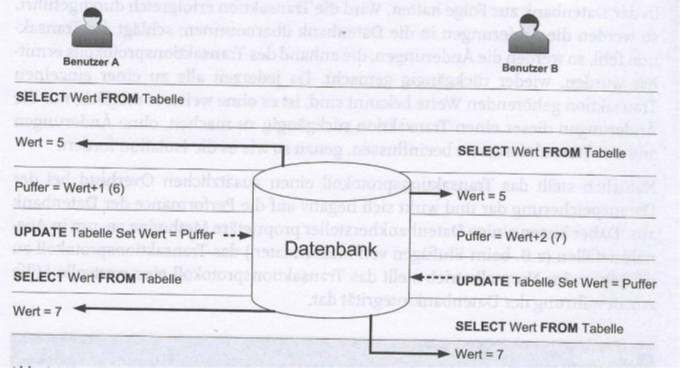

1. Benutzer A hat "1" addiert, Benutzer B hat "2" addiert
2. Richtiges Ergebnis 5 + 1 + 2 = 8
3. Effekt: Die Änderung von Benutzer A wurde überschrieben

**Dirty Read:**
Ein Dirty Read ist ein Lesevorgang, der veränderte Zeilen anderer noch nicht terminierter Transaktionen liest. Es können sogar Zeilen gelesen werden, die nicht existieren oder nie existiert haben. Die Transaktion sieht einen temporären Schnappschuss der Datenbank, der zwar aktuell ist, aber bereits inkonsistent sein kann. Offensichtlich erfasst die Abfrage Ergebnisse einer nicht (mit COMMIT) bestätigten Transaktion und erzeugt dadurch ein falsches Ergebnis.

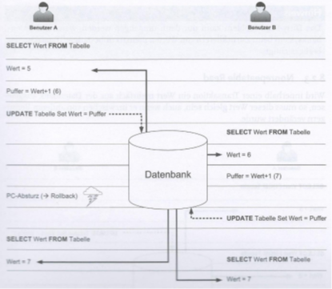

- Tritt auf, wenn unbestätigte Transaktionen der Transaktion A von einer anderen Transaktion gelesen werden
- Kann nur vermieden werden, wenn das DBMS verhindert, dass unbestätigte Transaktion berücksichtigt werden

**Non-Repeatable Read:**

Ein Non-Repetable Read ist ein Lesevorgang, der im Falle von mehrmaligem Lesen zu unterschiedlichen Ergebnissen führt. Innerhalb einer Transaktion führt die mehrfache Ausführung einer Abfrage zu unterschiedlichen Ergebnissen, die durch zwischenzeitliche Änderungen (update) und Löschungen (delete) entstehen. Die einzelnen Abfrageergebnisse sind konsistent, beziehen sich aber auf unterschiedliche Zeitpunkte.

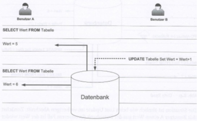

- Wird innerhalb einer Transaktion ein Wert mehrfach gelesen, so muss dieser Wert gleich sein, auch wenn er inzwischen von anderen Transaktionen verändert wurde.
- Das DBMS muss jeder Transaktion eine eigene Sicht auf die Daten bereitstellen.

**Phantom-Read:**

Ein Phantom ist ein Lesevorgang bzgl. einer Datenmenge, die einer bestimmten Bedingung genügen. Fügt eine andere Transaktion einen Datensatz ein, der ebenfalls diese Bedingung erfüllt, dann führt die Wiederholung der Abfrage innerhalb einer Transaktion zu unterschiedlichen Ergebnissen. Bei jeder Wiederholung einer Abfrage innerhalb einer Transaktion enthält das zweite Abfrageergebnis mehr Datensätze als das erste, wenn in der Zwischenzeit neue Datensätze eingefügt wurden.

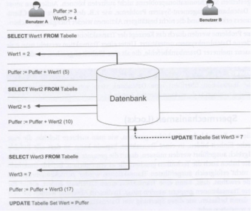

- Tritt auf, wenn Berechnungen auf gelesene Werte gemacht werden und diese Werte in der Zwischenzeit von einer anderen Transaktion verändert werden.
- Das DBMS muss sicherstellen, dass jede Transaktion während der gesamten Laufzeit immer dieselbe Datensituation antrifft, wie zu Beginn der Transaktion.

---

</br>

## 1.10. Konzepte

Man unterscheidet hierbei zwei grundlegende Philosophien: **Pessimismus** und **Optimismus**.

### 1.10.1. Pessimistische Verfahren

**Pessimistische Verfahren** sichern Transaktionen ab, indem sie durch Sperren die zu lesenden oder zu verändernden Daten vor andern Zugriffen schützen. Dabei werden zu Beginn der Transaktion alle Sperren gesetzt und diese am Ende der Transaktion wieder abgebaut. Transaktionen, die auf Daten zugreifen wollen, welche durch eine andere Transaktion gesperrt wurden, müssen warten, bis die Daten wieder freigegeben werden. Bei Transaktionen, die Benutzereingriffe erwarten, um beispielsweise Entscheidungen zu treffen, wird von diesem Verfahren abgeraten, da der Benutzer unbewusst andere Benutzer stundenlang blockieren kann.

Das System geht davon aus, dass Konflikte sehr wahrscheinlich sind. Sobald ein Benutzer einen Datensatz liest oder bearbeiten möchte, wird dieser für andere **gesperrt**.

- **Ablauf:**
  1. Benutzer A liest Daten und setzt eine Sperre (Lock).
  2. Benutzer B möchte dieselben Daten lesen/ändern, muss aber warten, bis A fertig ist.
  3. Erst nach dem COMMIT von A wird die Sperre aufgehoben und B darf zugreifen.
- **Vorteil:** Maximale Datenintegrität. Es kann physisch kein Konflikt entstehen.
- **Nachteil:** Schlechte Performance bei vielen Benutzern ("Stau"-Gefahr/Deadlocks)

**Zusammenfassung:**

- Alle von der Transaktion angefassten Daten sind für andere Transaktionen gesperrt.
- Freigabe der Sperre am Transaktionsende
- Konsequenz
- Andere Transaktionen müssen gegeben falls warten

> **Motto: "Sicher ist sicher – ich vertraue niemandem."**

### 1.10.2. Optimistische Verfahren

Bei optimistischen Verfahren geht man davon aus, dass Konflikte konkurrierender Transaktionen selten vorkommen. Daher wird wo immer möglich auf Sperren verzichtet, um so die Parallelität zu erhöhen und die Performance des Systems zu verbessern. Das Verfahren durchläuft 3 Phasen:

- **Lesephase:** In der Lesephase werden die benötigten Daten gelesen und in einen lokalen Arbeitsbereich kopiert und dort bearbeitet. Sind auch Benutzereingriffe notwendig, finden sie jetzt statt. Nichts ist gesperrt.
- **Validierungsphase:**  In der Validierungsphase wird überprüft, ob andere Transaktionen in der Zwischenzeit dieselben Daten bearbeitet haben. Wenn ja, muss unter Umständen gar der Benutzer benachrichtigt werden. Wenn nein, kann in die Schreibphase übergegangen werden.
- **Schreibphase:** Jetzt wird die Transaktion ausgeführt. Die Daten sind nur für einen relativ kurzen Zeitintervall gesperrt.

Das System geht davon aus, dass Konflikte selten sind. Es werden keine Sperren während der Bearbeitung gesetzt. Jeder darf alles lesen und lokal ändern.

- **Ablauf:**
  1. Benutzer A liest Daten (und merkt sich die Version, z. B. über einen Zeitstempel oder ROWVERSION).
  2. Benutzer B liest dieselben Daten gleichzeitig.
  3. Beide arbeiten lokal.
  4. Die Stunde der Wahrheit: Wenn A speichert, prüft das System: "Ist die Version noch die gleiche wie beim Lesen?" Wenn ja -> Speichern erfolgreich.
  5. Wenn nun B speichern will, stellt das System fest: "Die Version hat sich geändert (durch A)!" -> B erhält eine Fehlermeldung und muss von vorne beginnen.
- **Vorteil:** Sehr hohe Performance und Skalierbarkeit, da niemand auf andere warten muss.
- **Nachteil:** Wenn doch viele Leute gleichzeitig dasselbe ändern, müssen viele Operationen wiederholt werden (Rollbacks).

> **Motto: "Es wird schon gutgehen – wir prüfen am Ende."**

### 1.10.3. Vergleich

| **Merkmal**         | **Pessimistisch**               | **Optimistisch**                             |
| ------------------- | ------------------------------- | -------------------------------------------- |
| **Mechanismus**     | Sperren (Locks)                 | Versionierung / Zeitstempel                  |
| **Strategie**       | Konflikte verhindern            | Konflikte bei Abschluss erkennen             |
| **Wartezeiten**     | Hoch (Benutzer blockieren sich) | Keine (bis zum Speichern)                    |
| **Datenintegrität** | Sehr hoch                       | Hoch (erfordert aber Fehlerhandling im Code) |
| **Einsatzgebiet**   | Buchhaltung, kritische Bestände | Web-Apps, soziale Medien, CMS                |

### 1.10.4. Zusammenfassung

- **Pessimistisch** ist wie eine Einzelkabine beim Umkleiden: Solange ich drin bin, kommt niemand rein. Punkt.
- **Optimistisch** ist wie ein Google-Doc: Jeder schreibt rein. Wenn zwei exakt dieselbe Zeile zur exakt gleichen Millisekunde ändern, sagt das System: "Halt, da war jemand schneller, bitte prüf deine Änderungen nochmal."

---

</br>

## 1.11. Transaction Log

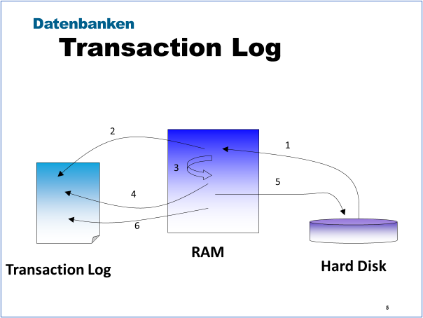

- **Motivation:** Computersysteme stürzen ab. Wenn ein System abstürzt, während Datenbanktransaktionen aktiv sind, wird die Datenbank beschädigt. Man spricht von einer korrupten Datenbank, oder von korrupten Daten. Jedes DBS, das für ernsthafte Anwendungen eingesetzt werden soll, muss in der Lage sein, sich von möglichen Schäden zu erholen.
- **Idee:** Der Schlüssel zur Wiederherstellung ( Recovery ) nach einem Absturz besteht darin, dass sämtliche Transaktionen in einem File protokolliert sind -> Transaction Log
**Location:** Das Transaction log muss zwingend auf einem physisch anderen Speichermedium sein als der Datenbestand.
**Checkpoint:** Das Lesen und vor allem das Schreiben einer Harddisk ist langsam. Das heisst, diese HD-Zugriffe müssen optimiert sein. Darum wird nicht nach jeder Transaktion diese auch sofort auf den Datenträger geschrieben. Es wird nur periodisch, zu bestimmten Zeitpunkten – dies ist der Checkpoint – der gesamte Datencache en bloc auf die HD zurückgeschrieben.

### 1.11.1. Vorgehen

1. Datensatz wird von der HD ins RAM gelesen.
2. Datensatz wird als `Before Image` ins Transaction log geschrieben.
   1. -> ermöglicht Rollback
3. Transaktion wird im RAM ausgeführt.
4. Veränderter Datensatz wird als `After Image` ins Transaction log geschrieben.
   1. -> ermöglicht Rollforward
5. Beim nächsten Checkpoint wird veränderter Datensatz vom RAM auf die HD geschrieben.
6. Eine Prüfmarke wird für diese Transaktion ins Transaction Log geschrieben, der aussagt, dass die Transaktion sich auf der HD wiederspiegelt

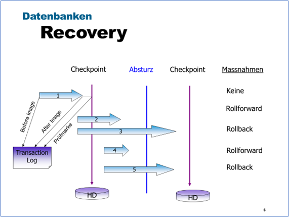

**Generell:**

- Ein DBMS stellt sicher, dass sämtliche Transaktionen, für die ein Commit ausgeführt wurde, bei einem Stromausfall, bei SW-Fehlern und andern Abstürzen wiedergegeben werden.
- Nach einem Absturz wird beim Booten anhand des Transaction Logs für alle Transaktionen, für die ein Commit vorliegt, ein Rollforward und für alle unvollständigen Transaktionen ein Rollback ausgeführt.
- Um die verlorenen Transaktionen zu wiederholen, muss nur bis zum letzten Checkpoint zurückgegangen werden.

**Beispiel:**

- Transaktion 1 hat im Transaction log einen Prüfpunkt, d.h. die Transaktion wird auch nach dem Absturz auf der DB angezeigt. -> keine Massnahmen
- Für die Transaktionen 2 und 4 wurde der Commit nach dem Checkpoint ausgeführt, d.h. sie haben keinen Prüfpunkt im Transaction log. Diese Transaktionen müssen beim Rebooten der DB anhand des Transaction Logs wieder hergestellt werden ( Rollforward ).
- Die Transaktionen 3 und 5 haben kein After Image in Transaction log, d.h. das DBS nimmt beim Rebooten einen Rollback vor.

### 1.11.2. Mirroring

Man spricht von einer Spiegelung einer DB, wenn zwei separate Kopien des Datenbestandes auf zwei verschiedenen nichtflüchtigen Speichermedien verwaltet werden. Jedes Mal, wenn eine Kopie geändert wird, wird gleichzeitig die andere Kopie geändert. Auf diese Weise verlieren Sie – falls eine Ihrer Festplatten crashed – nicht nur keine Daten, sondern auch keine Zeit, weil die Verarbeitung mit Hilfe der Spiegelplatte fortgesetzt werden kann.

### 1.11.3. Schlussfolgerung

Die Verfahren zur Wiederherstellung einer DB nach einem Absturz, wie mit Hilfe eines Transaction Logs sind wirksam, aber teuer. Die Spiegelung ist sogar noch teurer. Bei Datenbankanwendungen, von denen das Überleben eines Unternehmens abhängt, geht man davon aus, dass die Verbesserung der Zuverlässigkeit, die mit diesen Techniken erreicht werden, die Kosten wert sind.
Bei preiswerten DBS wie z.B. Access werden Sie solche Funktionen jedoch nicht finden.

---

</br>

# 2. Deadlock

Ein **Deadlock** (zu Deutsch: Verklemmung) ist eine Sackgasse in einem Mehrbenutzersystem. Er tritt auf, wenn zwei oder mehr Transaktionen **gegenseitig** auf Ressourcen warten, die von der jeweils anderen Transaktion gesperrt sind.

Stellen Sie sich das wie einen Kreisverkehr vor, in dem vier Autos gleichzeitig einfahren und jeder darauf wartet, dass der jeweils andere ihm Vorrang gewährt – niemand kann sich mehr bewegen.

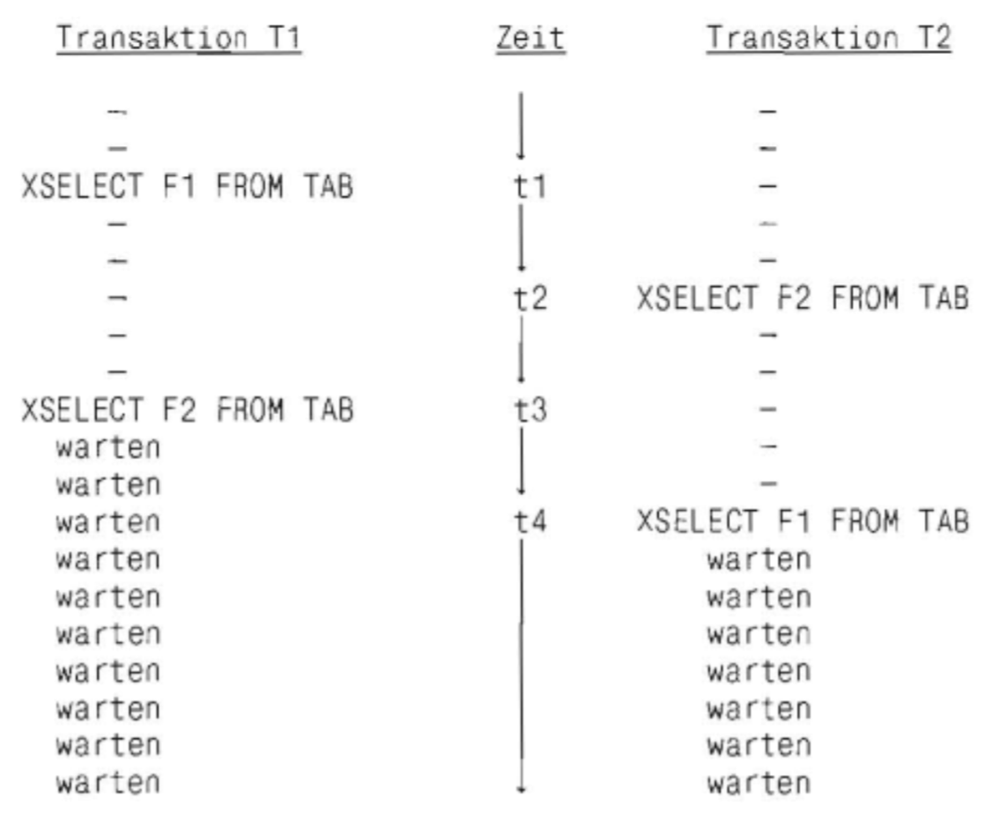

## 2.1. Lockmanager / Deadlock Monitor

Da ein Deadlock ein logischer Stillstand ist, besitzt der SQL Server einen speziellen Hintergrundprozess: den **Deadlock Monitor**.

- **Erkennung:** Der Monitor prüft ca. alle 5 Sekunden, ob solche zyklischen Abhängigkeiten bestehen.
- **Das Opfer (Deadlock Victim):** Der SQL Server bricht eine der beiden Transaktionen gewaltsam ab.
- **Kriterium:** Normalerweise wird die Transaktion geopfert, die bisher am wenigsten Rechenaufwand verursacht hat (Rollback-Kosten minimieren).
- **Fehlermeldung:** Die abgebrochene Anwendung erhält den Error 1205. Die andere Transaktion kann nun ihre Arbeit fortsetzen.

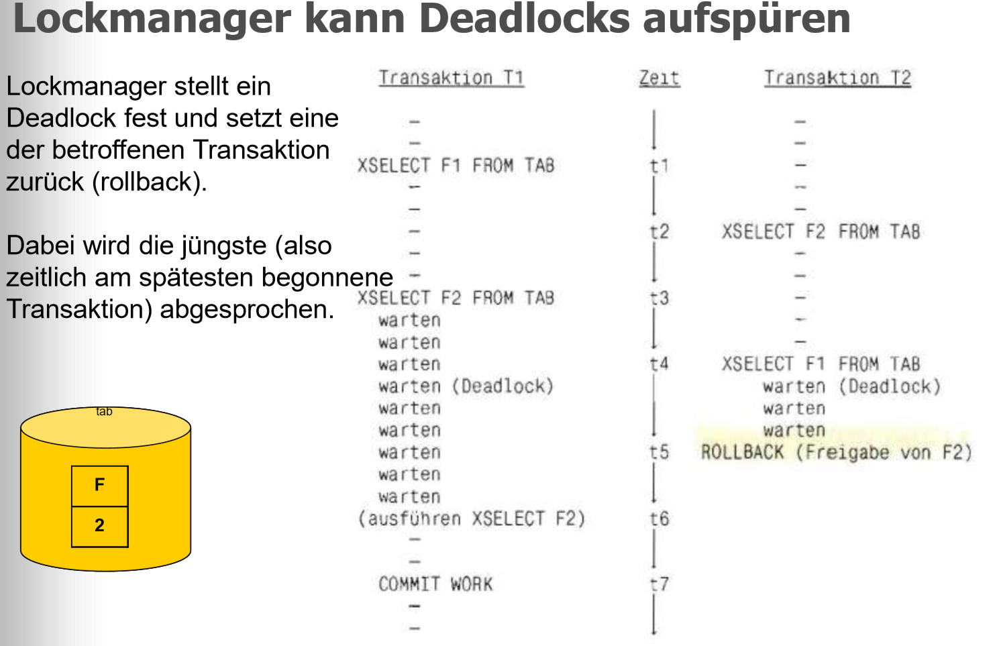

## 2.2. Strategien zur Vermeidung

Ein Deadlock ist kein Datenbankfehler, sondern meist ein Designproblem der Anwendung.
So verhindert man sie:

1. **Gleiche Reihenfolge:** Alle Prozesse sollten auf Tabellen immer in der gleichen Reihenfolge zugreifen (z. B. erst Kunden, dann Bestellungen).
2. **Kurze Transaktionen:** Halten Sie Transaktionen so kurz wie möglich, um Sperrzeiten zu minimieren.
3. **Keine Benutzerinteraktion:** Lassen Sie niemals eine Transaktion offen, während ein Benutzer gerade eine Kaffeepause macht oder eine Eingabe tätigt.
4. **Niedrigere Isolationsstufen:** Falls möglich, nutzen Sie Read Committed Snapshot Isolation (optimistisches Verfahren), um Lesesperren zu vermeiden.

---

## 2.3. Beispiel Deadlock in der Bibliothek

Herr T1 leiht sich in der Bibliothek ein Buch über Schrittmotoren. Der Titel dieses Buches ist F1. Beim Lesen dieses Buches findet T1 plötzlich den Hinweis, dass Schrittmotoren unter anderem auch in elektrischen Schreibmaschinen Verwendung finden. Da sich T1 sehr für den Einsatz von Schrittmotoren interessiert, geht er erneut in die Bibliothek mit der Absicht, sich ein Buch über elektrische Schreibmaschinen zu leihen. Dort wird ihm das Buch F2 empfohlen, mit dem Hinweis, dass dieses Buch vor kurzem erst an Herrn T2 verliehen wurde. Da ihm diese Problematik doch sehr am Herzen liegt, beschliesst T1, sein Buch über Schrittmotoren so lange zur Seite zu legen, bis er das Buch F2 über elektrische Schreibmaschinen ausleihen kann.

Unterdessen liest T2 sein Buch. Plötzlich findet er einen Hinweis auf sogenannte Schrittmotoren. Da er in diesen Dingen nicht so bewandert ist, er jedoch grosses Interesse an diesem Buch findet, beschliesst er, seine Lektüre zu unterbrechen und sich erst einmal ein Buch über Schrittmotoren auszuleihen. In der Bibliothek wird ihm natürlich sogleich das Buch F1, das die Thematik Schrittmotoren bestens behandelt, empfohlen. Da das Buch zurzeit verliehen ist, wird ihm geraten, er solle doch in den nächsten Tagen nochmals reinschauen. T2 geht unverrichteter Dinge nach Hause und wird sich noch oft, aber leider vergeblich, in der Bibliothek um das Buch über Schrittmotoren bemühen müssen. Genauso ergeht es T1, der vergeblich darauf wartet, dass T2 sein Buch über elektrische Schreibmaschinen wieder zurückgibt.

> **Jeder wartet somit ewig auf den anderen, ohne von ihm zu wissen. Es ist ein Deadlock entstanden.**

---

</br>

# 3. Aufgaben

## 3.1. Gruppenarbeit Transaktionen / Isolationslevel / Deadlock

| **Vorgabe**             | **Beschreibung**                                                                                                      |
| :---------------------- | :-------------------------------------------------------------------------------------------------------------------- |
| **Lernziele**           | Gewinnt eine Übersicht zu den Einsatzbereichen der SQL-Transaktionen.                                                 |
|                         | Kann in SQL-Datenmutationen in Transaktionen ausführen und dabei die verschiedenen Isolationsstufen korrekt einsetzen |
| **Sozialform**          | Teamarbeit mit max. Grösse von 3-4 Personen                                                                           |
| **Auftrag**             | siehe unten                                                                                                           |
| **Hilfsmittel**         |                                                                                                                       |
| **Erwartete Resultate** |                                                                                                                       |
| **Zeitbedarf**          | 45 min (Arbeit), 8-10 min (Präsentation)                                                                              |
| **Lösungselemente**     | Präsentation (PowerPoint, Markdown)                                                                                   |
|                         | SQL-Skriptdateien (Beispiele)                                                                                         |

**Gruppe 1 – SQL-Transaktionen:**
Programmiere in SQL eine Datenveränderung, die in einer Transaktion durchgeführt wird.:

- Zeige wie eine Transaktion gestartet und beendet wird
- Zeige wozu die beiden Befehle Commit u. Rollback Befehle benötigt werden
- Zeige Sinn u. Zweck von Savepoints auf
- Erläutere was unter „auto commit“ verstanden wird
- Erläutere was mit Rollforward gemeint ist

**Gruppe 2 – Isolationlevels:**
Für die Synchronisation eines Mehrbetriebs bietet SQL vier abgestufte Isolationsebenen an:

- Zeige wie der aktuelle Isolationslevel einer Transaktion abgefragt werden kann
- Zeige wie die Isolationslevels in SQL gesetzt werden können
- Erläutere den Standard-Isolationslevel von MS-SQL
- Versuche mit Isolationslevel ein unterschiedliches Verhalten bei Datenmutationen aufzuzeigen

**Gruppe 3 - Deadlock:**

Deadlocks bzw. Verklemmungen können in einer Datenbank nicht ausgeschlossen werden.

- Recherchiere was mit Deadlock in einer Datenbank gemeint ist
- Zeige ggf. als Wartegraph auf wie eine Deadlock Situation entstehen kann.
- Erläutere wie ein Deadlock aufgelöst wird
- Zeige den Unterschied zwischen pessimistischen u. optimistischen Locking Verfahren auf.

---

## 3.2. Transaktionen (Schulverwaltung)

| **Vorgabe**             | **Beschreibung**                                                                                                   |
| :---------------------- | :----------------------------------------------------------------------------------------------------------------- |
| **Lernziele**           | Kann SQL-Datenmutationen in Transaktionen ausführen und dabei die verschiedenen Isolationslevels korrekt einsetzen |
| **Sozialform**          | Einzelarbeit                                                                                                       |
| **Auftrag**             | siehe unten                                                                                                        |
| **Hilfsmittel**         |                                                                                                                    |
| **Erwartete Resultate** |                                                                                                                    |
| **Zeitbedarf**          | 30 min                                                                                                             |
| **Lösungselemente**     | SQL-Skriptdatei                                                                                                    |

Die folgenden Aufgaben beziehen sich auf die Schulverwaltung-Datenbank. Den Parallelzugriff (**Benutzer A, B**) auf die Datenbank können Sie in Ihrem SQL-Management mit zwei Sessions (zwei offenen Query Fenstern) simulieren.

**Datenmodell:**


**Syntax:**

```sql
BEGIN TRANSACTION
COMMIT [WORK]
ROLLBACK [WORK]
```

**A1:**

- Starten Sie eine Transaktion (begin tran)
- Fügen Sie mit dem Insert-Befehl einen neuen Kurs hinzu. (`insert into ...`)
- Überprüfen Sie Ihre Änderung mit einer Abfrage (`select ...`).
- Führen Sie ein Rollback der aktuellen Transaktion aus. (`rollback tran`)
- Überprüfen Sie nun ob der Ursprungszustand wiederhergestellt wurde.

**A2:**

- Gleiches Vorgehen wie bei A1. Führen Sie jedoch anstelle des Rollback-Befehls den Commit-Befehl aus (`commit tran`).
- Überprüfen Sie nun ob der neue Datensatz eingefügt wurde.

**A3:**

- A, B) Starten Sie eine neue Transaktion (`begin tran`).
- A) Ändern Sie mit einem Update-Befehl ein Student Name (`update .. set name =..`)
- B) Ändern Sie den gleichen Studenten wie Benutzer A (gleicher Update-Befehl jedoch mit einem anderen Namen).
- A, B) Überprüfen Sie den aktuellen Zustand.
- A) Beenden Sie Ihre Transaktion mit Rollback.
- A, B) Stellen Sie fest, welcher Student Name nun gesetzt wurde.

**A4:**

- A, B) Versuchen Sie eine Deadlock Situation herzustellen.
- Beenden Sie Ihre Transaktion mit Rollback.
