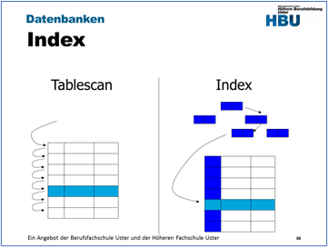
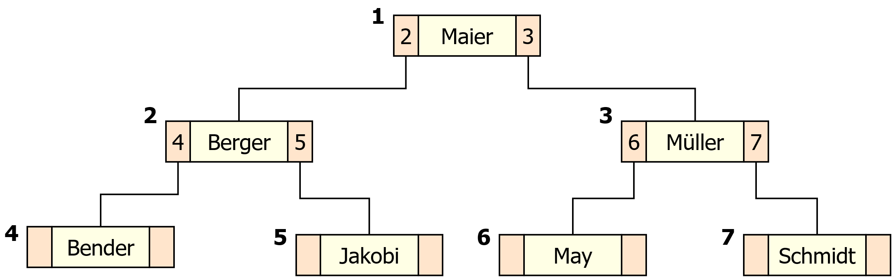
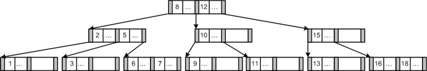
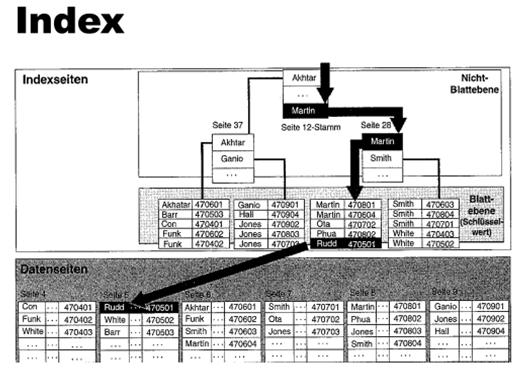
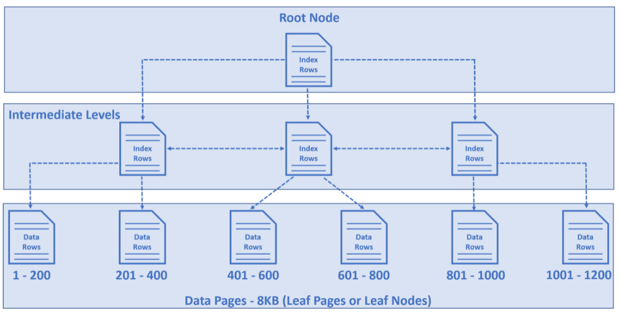
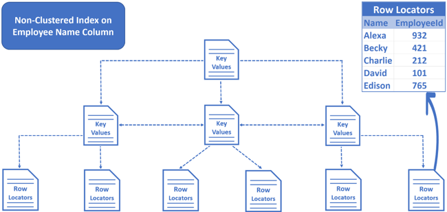
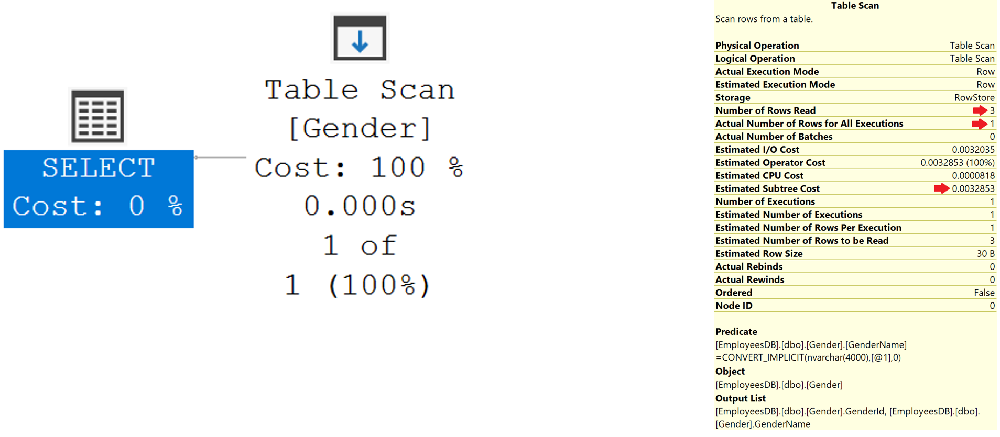
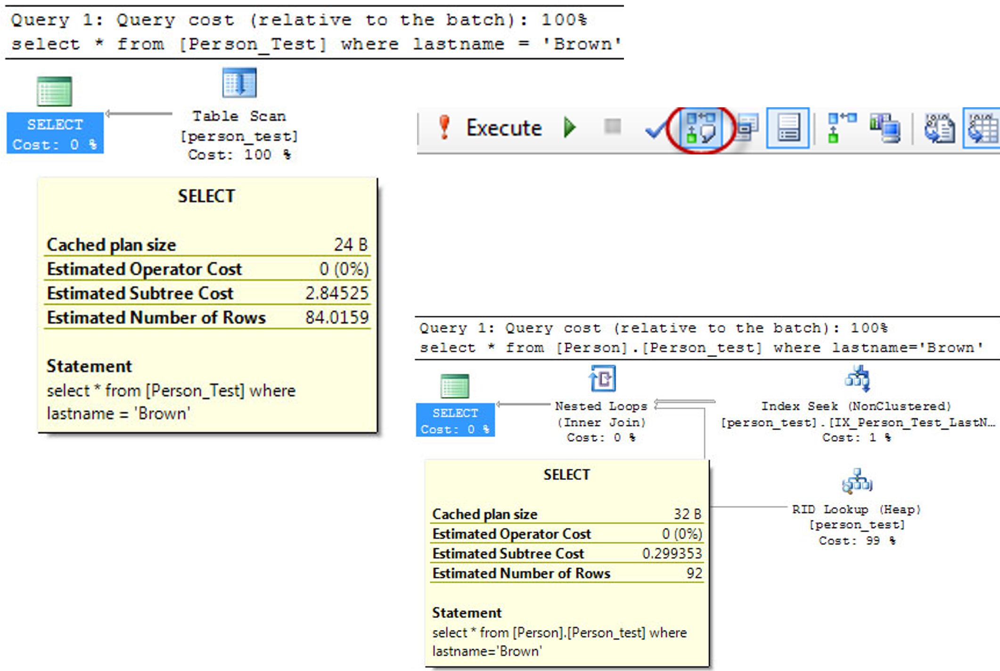
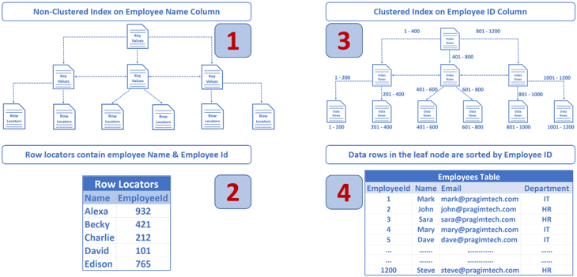
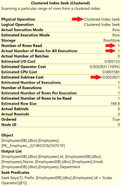

|                             |                   |                               |
| --------------------------- | ----------------- | ----------------------------- |
| **Techniker HF Informatik** | **Datenbanken 2** |  |

- [1. Datenbank Indizes](#1-datenbank-indizes)
  - [1.1. Baumstruktur](#11-baumstruktur)
  - [1.2. Definition: Was ist ein Index?](#12-definition-was-ist-ein-index)
  - [1.3. Aufbau](#13-aufbau)
  - [1.4. Index erstellen](#14-index-erstellen)
  - [1.5. Arten von Indexen](#15-arten-von-indexen)
  - [1.6. Heap Table](#16-heap-table)
  - [1.7. Zusammenfassung](#17-zusammenfassung)
  - [1.8. Ausführungsplan (Execution plan)](#18-ausführungsplan-execution-plan)
  - [1.9. Ausführungsplan lesen bzw. interpretieren](#19-ausführungsplan-lesen-bzw-interpretieren)
    - [1.9.1. Analyse Clustered Index Seek](#191-analyse-clustered-index-seek)
    - [1.9.2. Analyse Table Scan](#192-analyse-table-scan)
- [2. Aufgaben](#2-aufgaben)
  - [2.1. Gruppenarbeit Datenstrukturen](#21-gruppenarbeit-datenstrukturen)
  - [2.2. SQL-Indexe implementieren](#22-sql-indexe-implementieren)

</br>

# 1. Datenbank Indizes



**Datenzugriff:** In einer DB werden 2 Methoden zum Zugriff auf Daten eingesetzt: Tablescan oder **indizierter Zugriff**.
Bei einer Abfrage prüft die DB zunächst, ob ein **Index** vorhanden ist. Anschliessend wird mit dem Abfrageoptimierer (die Komponente für die Generierung optimaler Ausführungspläne) ermittelt, ob durch einen **Tablescan** oder durch die Verwendung des **Index** ein effizienterer Datenzugriff ermöglicht wird.

**Tablescan:**

- Der Startpunkt ist der erste Datensatz in der Tabelle.
- Scans erfolgen von Datensatz zu Datensatz.
- Jeder Datensatz in der Tabelle wird gelesen, und die den Abfragekriterien entsprechenden Zeilen werden extrahiert.
- Tablescans sind empfehlenswert für den Zugriff auf kleine Tabellen.

**Index:**

- Ziel und Zweck eines Indexes ist die Erhöhung der Performance einer Abfrage.
- Eine DB setzt Indices ähnlich ein, wie ein Leser den Index ( oder Inhaltsverzeichnis ) eines Buches verwendet. Um in einem Buch Infos zu einem bestimmten Thema zu finden, können Sie im Index am Ende des Buches nach dem Thema suchen. Im Index werden die Stichworte des Buches zusammen mit Verweisen auf die jeweilige Seite aufgelistet. So sparen Sie ziemlich viel Sucharbeit.
- Ein Index ist eine interne Tabelle von Zeigern auf bestimmte Zeilen mit bestimmten Spalten

## 1.1. Baumstruktur

**Binärbaum:**



**B+ Baum:**



Angenommen, eine Tabelle Kunde enthält 500'000 Datensätze.

```sql
SELECT * 
  FROM Kunde
  WHERE KundenID = 85000;
```

**Ohne Index muss das DBMS:**

- Jeden Datensatz prüfen
- Einen sogenannten Full **Table Scan** durchführen
- Seite für Seite lesen
- Laufzeit wächst proportional zur Anzahl Datensätze (**O(n)**).

**Mit einem Index kann das DBMS:**

- Die Suche über eine **Baumstruktur** durchführen
- Nur wenige Seiten lesen
- Direkt zum Ziel navigieren
- Laufzeit typischerweise O(log n).

## 1.2. Definition: Was ist ein Index?

**Ein Index ist eine zusätzliche Datenstruktur, die:**

- Suchoperationen beschleunigt
- Sortierungen unterstützt
- JOIN-Operationen optimiert

**Er funktioniert ähnlich wie:**

- Das Inhaltsverzeichnis eines Buches
- Der Index eines Lehrmittels

> **Wichtig:**
> Ein Index speichert nicht die Daten selbst, sondern:
> Den Schlüsselwert
> Einen Verweis (Pointer) auf die Datenseite

**Grundsätze:**

- Erstellen Sie Indices für **häufig durchsuchte Spalten** wie Primärschlüssel, Fremdschlüssel oder andere Spalten, die zum Verknüpfen von Tabellen eingesetzt werden.
- Indices beanspruchen **Speicherplatz** und führen zu erhöhten **Verwaltungs- und Wartungskosten**.
- In der Regel sind Indices für **kleine Tabellen** weniger empfehlenswert, da das Durchlaufen der Indexseiten aufwendiger sein kann als das Scannen der gesamten Tabelle.
- Spalten, auf die in einer Abfrage nur selten verwiesen wird, sollten nicht indiziert werden. Ebenso wenig wie Spalten, die nur wenig eindeutige Werte enthalten ( ex: männlich oder weiblich ). Hier bietet die Indizierung keine Vorteile.



In obiger Abbildung wird dargestellt, wie für das folgende Query die Suche im Indexbaum erfolgt. Selbstverständlich gibt es viele andere Varianten.

```sql
SELECT lastname, firstname
  FROM member
  WHERE lastname = 'Rudd'
```

1. Das DBS stellt fest, dass für die Spalte lastname ein Index vorhanden ist, der zum Abrufen von Zeilen geeignet ist, die den Nachnamen Rudd enthalten.
2. Die Suche auf Nicht-Blattebene beginnt im Wurzelknoten. Der letzte Schlüsselwert auf dieser Seite (Martin) ist kleiner als der Suchwert Rudd. Die Suche wird auf der Seite fortgesetzt, auf die dieser Schlüsselwert verweist.
3. Die Suche wird auf der Nicht-Blattebene der Indexseite (Seite 28) fortgesetzt. Der Suchwert Rudd liegt auf dieser Seite zwischen den Schlüsselwerten Martin und Smith. Die Suche wird auf der Seite fortgesetzt, auf die der erste dieser Schlüsselwerte verweist.
4. In diesem Schritt hat die Suche die Blattebene erreicht. Hier wird die Index-Seite nach der Index-Zeile durchsucht, deren Schlüsselwert mit dem Suchbegriff Rudd übereinstimmt. Die Zeilen-ID 470501 ist ein logischer Verweis auf den gesuchten physikalischen Datensatz.

Die meisten relationalen Datenbanken verwenden **B-Bäume** oder **B+-Bäume**.

## 1.3. Aufbau


**Ein Index besteht aus:**

- Root-Seite
- Indexseiten (Nicht-Blattebene)
- Datenseiten (Blattebene)

**Suchprinzip:**

- Start bei der Root-Seite
- Vergleich des Suchwerts mit Schlüsselbereichen
- Navigation in passende Indexseite
- Weiter bis zur Blattebene
- Zugriff auf Datenseite

---

## 1.4. Index erstellen

**Kreieren eines Index:**

- Ein Index wird auf einer Kolonne einer Tabelle kreiert.
- `CREATE INDEX indexname ON tabellenname (kolonnenname)`

## 1.5. Arten von Indexen

**Primärindex (Clustered Index):**



- Wird meist automatisch beim PRIMARY KEY erzeugt
- Daten werden physisch sortiert gespeichert
- Pro Tabelle **nur ein** Clustered Index möglich

```sql
CREATE TABLE Kunde (
    KundenID INT PRIMARY KEY,
    Name VARCHAR(100)
);
```

**Sekundärindex (Non-Clustered Index):**



- Separate Indexstruktur
- Daten bleiben physisch unverändert
- Mehrere pro Tabelle möglich

```sql
CREATE INDEX idx_kunde_name
  ON Kunde(Name);

-- Sinnvoll bei:
SELECT * 
FROM Kunde
WHERE Name = 'Müller';
```

**Zusammengesetzter Index (Composite Index):**

Index über mehrere Spalten.

```sql
CREATE INDEX idx_bestellung_kunde_datum
  ON Bestellung(KundenID, Bestelldatum);
```

> **Reihenfolge ist entscheidend!**

```sql
-- Index nutzbar bei:
WHERE KundenID = 10
WHERE KundenID = 10 AND Bestelldatum = '2025-01-01'

-- Nicht optimal bei:
WHERE Bestelldatum = '2025-01-01'
```

**Unique Index:**

Stellt sicher, dass Werte eindeutig sind.

```sql
CREATE UNIQUE INDEX idx_kunde_email
  ON Kunde(Email);
```

## 1.6. Heap Table

Eine Heap-Tabelle kann einen oder mehrere nicht geclusterte Indizes haben, aber hat **keinen geclusterten Index**.
Wenn eine Heap-Tabelle keine Nicht-Cluster-Indizes hat, wird bei einer Suchabfrage einen Table Scan ausgeführt. D.h. jede Zeile der Tabelle wird durchsucht.

Execution Plan bei einer Abfrage auf eine Tabelle (Gender) mit 3 Zeilen.



- Wenn keine Indizes vorhanden sind wird bei einer Suchabfrage ein **Tablescan** wird verwendet.
- Ein **Tablescan** muss nicht zwingend mit einer schlechten Performance in Verbindung stehen, insbesondere wenn die Tabelle nur wenige Datensätze beinhaltet.
- Bei geringen Datenmengen kann ein **Tablescan** ggf. **schneller** als die Suche über einen Index (non clustered) mit **Index-Seek** sein.

## 1.7. Zusammenfassung

- Indexe beschleunigen Lesen, verlangsamen Schreiben.
- Jede Fremdschlüsselspalte sollte indexiert sein.
- Zu viele Indexe verschlechtern Performance.
- Reihenfolge bei Mehrspaltenindex ist entscheidend.
- Index beschleunigt Suchoperationen massiv
- Index machen JOINs effizienter
- Index unterstützen Sortierungen

---

## 1.8. Ausführungsplan (Execution plan)

Im SQL Server Management Studio kann die Ausführung einer Abfrage mit Include Actual Execution Plan Symbol analysiert werden.



## 1.9. Ausführungsplan lesen bzw. interpretieren

**Beispiel der Abfrage:**

```sql
Select * from Employees 
  Where Name = 'ABC 932000'
```



> **Leserichtung:** Rechts nach Links u. Oben nach Unten

### 1.9.1. Analyse Clustered Index Seek

**SQL Abfrage:**

```sql
select * from Employees 
  where Id = 932000
```

**Analyse:**

- Operation ist "Operation um Clustered Index Seek"
- Anzahl der gelesenen Zeilen = 1, Mitarbeiter-ID ist eindeutig, daher erwarten wir 1 Zeile
- Tatsächliche Anzahl von Zeilen für alle Ausführungen = 1
- Mithilfe des Index kann SQL Server die gewünschte Mitarbeiterzeile direkt lesen.
- Daher beträgt sowohl die Anzahl der gelesenen Zeilen als auch die tatsächliche Anzahl der Zeilen für alle Ausführungen genau eins.



### 1.9.2. Analyse Table Scan

- Suche über eine Spalte ohne Index
- SQL Server muss jeden Datensatz in der Tabelle lesen (Full Table Scan)

**SQL Abfrage:**

```sql
Select * from Employees 
  Where Name = 'ABC 932000'
```

**Analyse:**

- Operation ist "Operation um Clustered Index Scan"
- Anzahl der gelesenen Zeilen = 1000000. D.h. die Datenbank muss 1 Million Zeilen lesen
- Tatsächliche Anzahl von Zeilen für alle Ausführungen = 1
- Im Allgemeinen sind Index-Scans für die Leistung schlecht.

---

</br>

# 2. Aufgaben

## 2.1. Gruppenarbeit Datenstrukturen

| **Vorgabe**             | **Beschreibung**                                                                   |
| :---------------------- | :--------------------------------------------------------------------------------- |
| **Lernziele**           | eine Einsicht über die verschiedenen physischen Speicherstrukturen in Datenbanken. |
|                         | Sie verstehen die unterschiedlichen Datenstrukturen und deren Einsatzgebiete.      |
| **Sozialform**          | Teamarbeit mit max. Grösse von 3-4 Personen                                        |
| **Auftrag**             | siehe unten                                                                        |
| **Hilfsmittel**         | Wiki, [edu](https://www.cs.usfca.edu/~galles/visualization/Algorithms.html)        |
| **Erwartete Resultate** |                                                                                    |
| **Zeitbedarf**          | 30 min                                                                             |
| **Lösungselemente**     | Präsentation (PowerPoint, Markdown)                                                |

**Auftrag:**

Ermitteln Sie alle wichtigen Informationen über das Ihnen zugeteilte Speicherstruktur und erstellen Sie eine kleine Zusammenfassung.
Dabei sollen folgende Punkte untersucht werden:

- Grundprinzip der Speicherstruktur
- Spezifische Merkmale
- Einsatzbereich (Beispiele)
- Vor-/ Nachteile

- Schaue die [Visualizing Algorithms](https://www.cs.usfca.edu/~galles/visualization/Algorithms.html) Seite an.
- Stelle die Ergebnisse mittels einer Kurzpräsentation der Klasse vor.
- Verwende dabei die Hilfsmittel wie Flow-Charts, Beamer, Wandtafel usw. und verweisen Sie ggf. auf weitere die Literatur.
- Die Zusammenfassungen sind dann den anderen Klassenkameraden zur Verfügung zustellen.

**Gruppen:**

In einzelnen Gruppen sollen folgende Speicherstrukturen untersucht werden:

- Heap / Hash
- ISAM
- B Baum
- B+ Baum

---

</br>

## 2.2. SQL-Indexe implementieren

| **Vorgabe**             | **Beschreibung**                                                             |
| :---------------------- | :--------------------------------------------------------------------------- |
| **Lernziele**           | Mit SQL in einer Datenbank Attribute indexieren und Suchabfragen analysieren |
|                         | Einen Ausführungsplan korrekt interpretieren                                 |
| **Sozialform**          | Einzelarbeit                                                                 |
| **Auftrag**             | siehe unten                                                                  |
| **Hilfsmittel**         |                                                                              |
| **Erwartete Resultate** |                                                                              |
| **Zeitbedarf**          | 30 min                                                                       |
| **Lösungselemente**     | SQL-Skriptdatei                                                              |

**A1 – Abfrage ohne Index:**

Erstelle eine Abfrage, in welcher die beiden Spalten NAME u. VORNAME der Student-Tabelle gelistet
werden. Kontrolliere dabei die Ausführung (Execution Plan).

**A2 – Index erstellen:**

Erstelle in der Student-Tabelle über die beiden Spalten NAME u. VORNAME einen Index
(`IX_StudentNachnameVorname`). Prüfe danach die Index Rubrik der Student Tabelle, hier sollte der
erstellte Index angezeigt werden.

```sql
CREATE NONCLUSTERED INDEX  index_name 
  ON tab_name(spalte_1 [{,spalte_2}...]) 
```

**A3 – Abfrage mit Index:**

Führe die Abfrage in Aufgabe A1 nochmals aus und prüfe die Veränderungen im Execution Plan.
Kontrolliere welcher Index nun für die Suche verwendet wurde.

**A4 – Fremdschlüssel indexieren:**

Erstelle zum Fremdschlüssel FachrichtungNr in der Student-Tabelle einen Index (`IX_Student_Fachrichtung`).

```sql
CREATE NONCLUSTERED INDEX  index_name 
  ON tab_name(spalte_1 [{,spalte_2}...]) 
```

**A5 – Abfrage mit Join:**

Erstelle eine komplexe Join Abfrage mit Student, Fachrichtung, Belegung und Kurs und analysieren den
Ausführungsplan (Execution Plan)

```sql
SELECT … FROM … INNER JOIN ..
```

**A6 – Index neu erstellen:**

Schreibe die SQL-Befehle, um bei allen Tabellen die vorgängig angelegten Indexe komplett neu zu reorganisieren (Defragmentierung).

```sql
ALTER INDEX ALL ON table REBUILD 
```

**A7 – Index löschen:**

Schreibe den SQL-Befehle, um den Index IX_StudentNachnameVorname in der Student-Tabelle zu löschen.

```sql
DROP INDEX index_name ON tab_name
```

---

© 2026 Lukas Müller – Licensed under CC BY-NC-ND 4.0
See [LICENSE](..\license.md) file for details.
