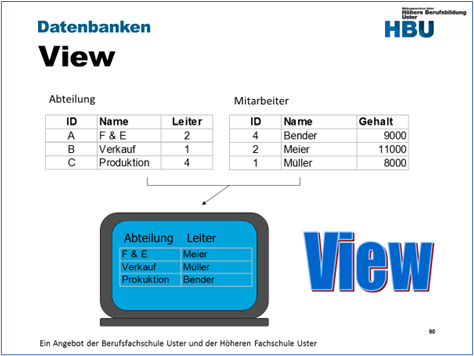
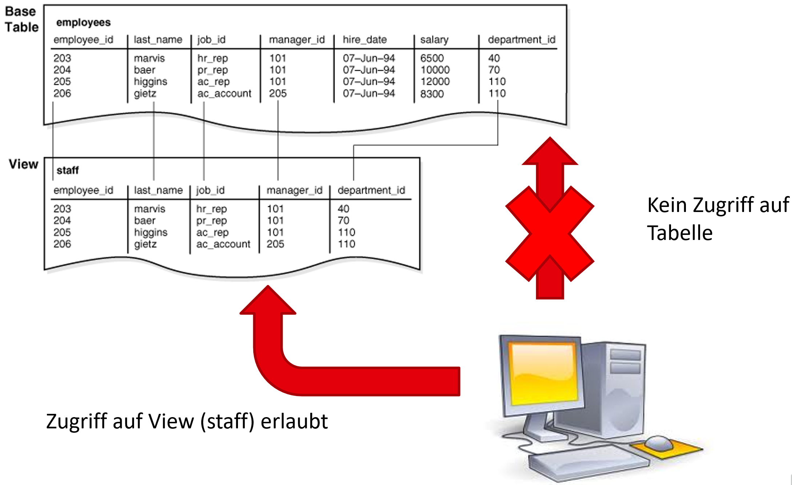
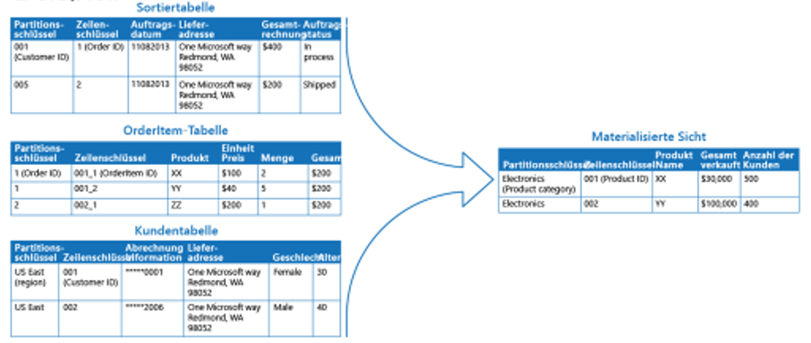

|                             |                     |                               |
| --------------------------- | ------------------- | ----------------------------- |
| **Techniker HF Informatik** | **Datenbanken Da2** |  |

- [1. SQL Views (virtuelle Tabellen)](#1-sql-views-virtuelle-tabellen)
  - [1.1. Idee](#11-idee)
  - [1.2. Was ist eine View?](#12-was-ist-eine-view)
  - [1.3. View erstellen](#13-view-erstellen)
  - [1.4. Betrachtungsweise](#14-betrachtungsweise)
  - [1.5. Sicherheit (Zugriffssteuerung)](#15-sicherheit-zugriffssteuerung)
  - [1.6. Datenabstraktion](#16-datenabstraktion)
  - [1.7. Arten von View's](#17-arten-von-views)
  - [1.8. Updatefähigkeit von Views](#18-updatefähigkeit-von-views)
  - [1.9. Vorteile](#19-vorteile)
- [2. Materialisierte Views (Materialized Views)](#2-materialisierte-views-materialized-views)
  - [2.1. Einführung](#21-einführung)
  - [2.2. Beispiel - normale View (Virtuelle View)](#22-beispiel---normale-view-virtuelle-view)
  - [2.3. Beispiel SQL-Server](#23-beispiel-sql-server)
  - [2.4. Vergleich: View vs. Materialisierte View](#24-vergleich-view-vs-materialisierte-view)
  - [2.5. Zusammenfassung](#25-zusammenfassung)
- [3. Aufgaben](#3-aufgaben)
  - [3.1. Views erstellen und testen](#31-views-erstellen-und-testen)

---

</br>

# 1. SQL Views (virtuelle Tabellen)



In einer normalisierten Datenbank (3. NF) sind Daten über viele Tabellen verteilt.
**Problem:** Endbenutzer oder BI-Tools sind mit komplexen JOIN-Orgien überfordert.

> **Lösung: Die View (Sicht)**

## 1.1. Idee

Viele Tabellen müssen für die Darstellung am Bildschirm und für Auswertungen wieder zusammengeführt werden.
Dieser Vorgang kann auf 2 Arten realisiert werden:

- Programmierung in **jedem** Programmteil, welcher die entsprechende Darstellung der Daten benötigt.
- Erstellen einer View, welche von **allen** Programmteilen verwendet werden kann.

## 1.2. Was ist eine View?

**Eine View (Sicht) ist:** Eine gespeicherte SELECT-Abfrage, die wie eine virtuelle Tabelle verwendet werden kann.

**Wichtige Eigenschaften:**

- Speichert keine eigenen Daten
- Speichert nur die Abfrage
- Wird bei Nutzung dynamisch ausgeführt
- Erhöht Lesbarkeit, Sicherheit und Wiederverwendbarkeit

## 1.3. View erstellen

```sql
CREATE VIEW [owner.] view_name [(column_name [, column_name...])]
AS 
select_statement [WITH CHECK OPTION]
```

```sql
-- View erstellen
CREATE VIEW Abteilungsuebersicht 
AS
  SELECT  a.Name as Abteilung, 
          m.Name as Leiter
  FROM Abteilung a
    inner join Mitarbeiter m
    on a.Leiter = m.ID

-- View abfragen
SELECT * from Abteilungsuebersicht;
```

**Views Einschränkungen:**

- Ohne `ORDER BY`, `SELECT INTO` Befehle

## 1.4. Betrachtungsweise

- Eine View ist ein gespeichertes Select-Statement.
- Eine View kann als virtuelle Tabelle betrachtet werden.

## 1.5. Sicherheit (Zugriffssteuerung)

Mit View's kann der **Zugriffsschutz** auf sensible Daten eingeschränkt werden.

**Tabelle Mitarbeiter enthält:**

- Name
- Gehalt
- Sozialversicherungsnummer

**Anforderung:**

- HR darf alles sehen.
- Fachabteilung nur Name.

```sql
CREATE VIEW v_Mitarbeiter_oeffentlich 
AS
  SELECT MitarbeiterID, Name
  FROM Mitarbeiter;
```

## 1.6. Datenabstraktion



View's ermöglichen eine Abstraktionsschicht, womit Anwendungen auch bei Tabellenstrukturänderungen nicht betroffen sind.

**Wenn sich Tabellenstruktur ändert:**

- View kann angepasst werden
- Anwendungen bleiben unverändert

> **View = Abstraktionsschicht**

## 1.7. Arten von View's

**Einfache View:**

- Basierend auf einer Tabelle
- Keine Aggregatfunktionen
- Meist updatefähig

```sql
CREATE VIEW v_Kunde_Zuerich AS
  SELECT *
  FROM Kunde
  WHERE Ort = 'Zürich';
```

**Komplexe View:**

- JOINs
- Aggregationen
- GROUP BY
- Berechnungen

```sql
CREATE VIEW v_Umsatz_pro_Kunde AS
SELECT
    k.KundenID,
    k.Name,
    SUM(bp.Menge * bp.Preis) AS Gesamtumsatz
FROM Kunde k
JOIN Bestellung b ON k.KundenID = b.KundenID
JOIN Bestellposition bp ON b.BestellungID = bp.BestellungID
GROUP BY k.KundenID, k.Name;
```

## 1.8. Updatefähigkeit von Views

Nicht jede View ist updatefähig.

**Updatefähig wenn:**

- Nur eine Basistabelle
- Keine Aggregatfunktionen
- Kein GROUP BY
- Keine DISTINCT
- Keine komplexen Berechnungen

## 1.9. Vorteile

- Eine View bietet alle Vorteile einer einfachen **Subroutine**, einmal programmieren, vielfach anwenden.
- Kapselung komplexer JOINs
- Eine View reduziert für deren Anwender die **Komplexität**, die sich darunter verbirgt.
- Eine View kann als Komponente des **Datenschutzes** eingesetzt werden, indem die Existenz von gewissen Zeilen oder Spalten (hier das Gehalt) je nach Benutzergruppe ein- oder ausgeblendet werden kann. Ein DBS kann den Benutzern keine Berechtigung zum Abfragen bestimmter Spalten in Basistabellen gewähren, sondern nur eine Berechtigung für Views.
- Lesbarere Abfragen
- Höhere Wartbarkeit
- Zentralisierung von Business-Logik
- Erhöhte Datensicherheit (Row- & Column-Level Security)
- Saubere Schnittstellen für Reporting-Tools

</br>

---

# 2. Materialisierte Views (Materialized Views)

## 2.1. Einführung



Anders als bei den klassischen Sichten (Views) wird bei **materialisierten Schichten** eine komplett neue (reale) Tabelle erstellt.
In den Views werden die Ergebnisse der Abfrage gespeichert (Redundanz). D.h. bei den **materialisierten Sichten** werden die abgeleiteten Sichtdaten explizit persistent gespeichert. **Materialisierten Sichten** führen somit **Redundanzen** der Daten ein.

## 2.2. Beispiel - normale View (Virtuelle View)

```sql
CREATE VIEW UmsatzProKunde 
AS
  SELECT KundenID, SUM(Betrag) AS Gesamtumsatz
  FROM Bestellung
  GROUP BY KundenID;
```

**Angenommen:**

- Tabelle Bestellung enthält **5 Millionen** Datensätze

- Häufige Abfrage:
  - `SELECT * FROM UmsatzProKunde;`

**Bei jeder Ausführung:**

- Vollständige Aggregation
- Hohe CPU-Last
- Viele I/O-Zugriffe

> **Performanceproblem!**

| **Normale View**                     | **Materialisierte View** |
| ------------------------------------ | ------------------------ |
| Speichert nur SQL                    | Speichert SQL + Resultat |
| Wird bei jedem Zugriff neu berechnet | Wird vorgängig berechnet |
| Keine eigene Datenhaltung            | Eigene physische Daten   |

## 2.3. Beispiel SQL-Server

```sql
CREATE VIEW UmsatzProKunde
WITH SCHEMABINDING
AS
  SELECT KundenID, SUM(Betrag) AS Gesamtumsatz
  FROM dbo.Bestellung
  GROUP BY KundenID;

CREATE UNIQUE CLUSTERED INDEX idx_mv
  ON UmsatzProKunde(KundenID);
```

## 2.4. Vergleich: View vs. Materialisierte View

| **Kriterium**      | **Normale View**               | **Materialisierte View** |
| ------------------ | ------------------------------ | ------------------------ |
| Speicherbedarf     | Kein zusätzlicher Speicher     | Zusätzlicher Speicher    |
| Performance SELECT | Langsam bei komplexen Abfragen | Sehr schnell             |
| Aktualität         | Immer aktuell                  | Potenziell veraltet      |
| Wartung            | Keine                          | Refresh notwendig        |
| Komplexität        | Einfach                        | Höher                    |

## 2.5. Zusammenfassung

**Vorteile:** Durch die Redundanzen wird eine Vorberechnung der Sichtdaten erreicht, welche zu **starken Performance-gewinnen** bei Anfragen führt. Ideal für Reporting, zur Reduktion komplexer JOINs und Entlastung produktiver Systeme.

**Nachteile:** Bei Modifikationen der Basisdaten müssen die Ergebnisse neu berechnet werden. Somit wird die Performance von Insert- und Update-Befehlen verschlechtert. Hoher Speicherverbrauch, Wartungsaufwand und komplexe Administration.

> **Fokus auf: Performanceoptimierung und Datenbereitstellung in relationalen Datenbanken**

- Bei den materialisierten Sichten werden die abgeleiteten Sichtdaten explizit persistent gespeichert.
- Anfragen an die materialisierte Sicht sind genauso schnell wie die Anfragen an eine Tabelle.
- Materialisierte Sichten enthalten redundante Daten. Es können Konsistenzprobleme auftreten.
- Im SQL-Standard ist **kein MV-Konzept** definiert.
- Die Konzepte der MVs wurden in den Datenbankprodukten unterschiedlich realisiert
- Die MVs werden auch "**MATERIALIZED VIEWS**" (Oracle) oder "**SUMMERIZED TABLE**" (DB2) benannt

---

</br>

# 3. Aufgaben

## 3.1. Views erstellen und testen

| **Vorgabe**             | **Beschreibung**                                       |
| :---------------------- | :----------------------------------------------------- |
| **Lernziele**           | Kann in einer Datenbank eine View erstellen und testen |
|                         | Kann komplexe Abfragen in einer View kapseln           |
| **Sozialform**          | Einzelarbeit                                           |
| **Auftrag**             | siehe unten                                            |
| **Hilfsmittel**         |                                                        |
| **Erwartete Resultate** |                                                        |
| **Zeitbedarf**          | 30 min                                                 |
| **Lösungselemente**     | SQL-Skriptdateien                                      |

Löse in der Schulverwaltung die nachfolgend aufgeführten View-Aufgaben.

**Syntax:**

> `CREATE VIEW [owner.]view_name [(spaltenname [,spaltenname…])]` </br>
> `AS select befehl [WITH CHECK OPTION]`

</br>

**A1: vw_Studenten_Fachrichtungen:**

- Erstelle einen View, der alle Studenten zusammen mit ihrer Fachrichtung auflistet.
- Name: *vw_Studenten_Fachrichtungen*
- Spalten: *StudentNr, StudentName, StudentVorname, Geburtsdatum, Fachrichtung, AnzahlSemester*

</br>

**A2: vw_Kurse_Studenten:**

- Erstelle einen View, der eine Liste der Kurse die von Studenten belegt wurden und die dazugehörigen Studenten listet.
- Name: *vw_Kurse_Studenten*
- Spalten: *KursNr, KursBezeichnung, StudentNr, StudentName, StudentVorname*

</br>

**A3: vw_Studenten_Fachrichtung_Anzahl:**

- Erstelle einen View, der die Anzahl der Studenten pro Fachrichtung zurück liefert.
- Name: *vw_Studenten_Fachrichtung_Anzahl*
- Spalten: *Fachrichtung, AnzahlStudenten*

</br>

**A4: vw_Studenten_Alter_Ueber30:**

- Erstelle einen View, der alle Studenten die älter als 30 Jahre sind, listet.
- Name: *vw_Studenten_Alter_Ueber30*
- Spalten: *StudentNr, Name, Vorname, Geburtsdatum, Alter*

</br>

**A5: vw_Studenten_MehrAls3Kurse:**

- Erstelle einen View, der alle Studenten auf, die mehr als drei Kurse belegen haben listet.
- Name: *vw_Studenten_MehrAls3Kurse*
- Spalten: *StudentNr, StudentName, StudentVorname, AnzahlBelegteKurse*

</br>

**A6: vw_Kurse_BWL_Studenten:**

- Erstelle einen View, der alle Kurse der BWL-Studenten (Fachrichtung = "BWL") listet
- Name: *vw_Kurse_BWL_Studenten*
- Spalten: *KursNr, KursBezeichnung, StudentNr, StudentName, StudentVorname*

---

© 2026 Lukas Müller – Licensed under CC BY-NC-ND 4.0
See [LICENSE](..\license.md) file for details.
