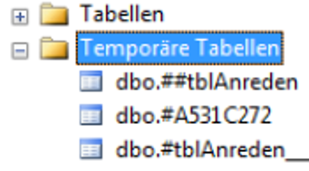
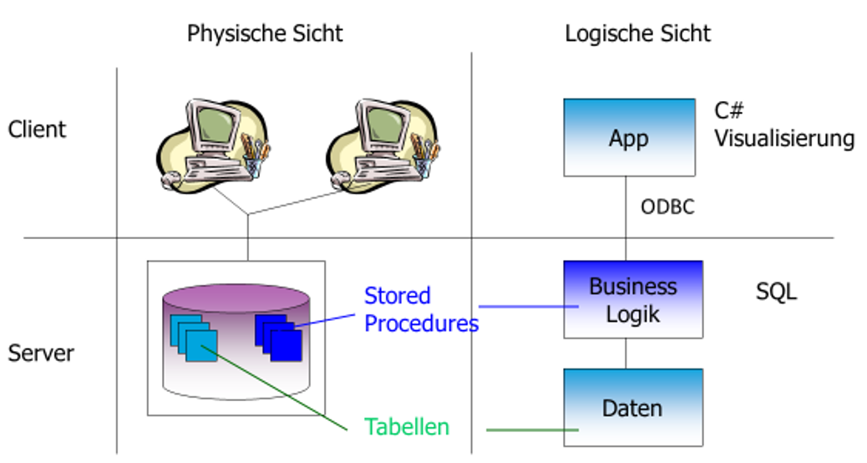
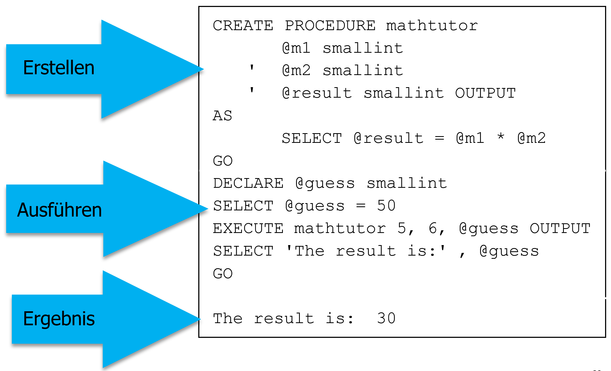
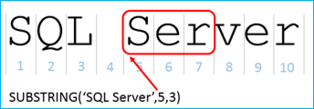
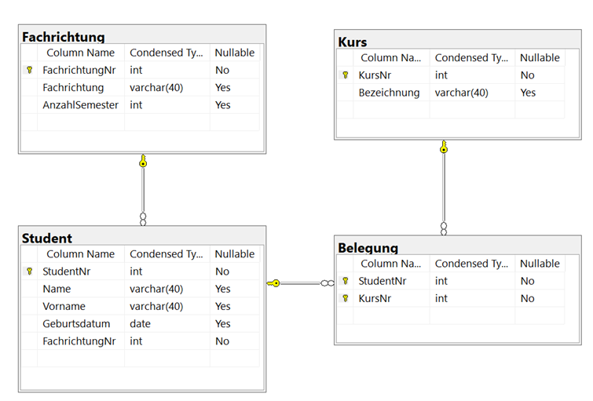

|                             |                          |                               |
| --------------------------- | ------------------------ | ----------------------------- |
| **Techniker HF Informatik** | **Kurs Datenbanken Da2** |  |

- [1. Transact SQL (T-SQL)](#1-transact-sql-t-sql)
  - [1.1. T-SQL Grundlagen](#11-t-sql-grundlagen)
  - [1.2. Einige Möglichkeiten in T-SQL](#12-einige-möglichkeiten-in-t-sql)
  - [1.3. T-SQL Variablen](#13-t-sql-variablen)
    - [1.3.1. Variablen deklarieren und zuweisen](#131-variablen-deklarieren-und-zuweisen)
  - [1.4. Ausgabe von Variablen](#14-ausgabe-von-variablen)
  - [1.5. Konvertierung von Datentypen](#15-konvertierung-von-datentypen)
  - [1.6. Gültigkeitsbereich (Scope)](#16-gültigkeitsbereich-scope)
  - [1.7. Zusammenfassung \& Best Practices](#17-zusammenfassung--best-practices)
  - [1.8. Temporäre Tabellen](#18-temporäre-tabellen)
    - [1.8.1. Vergleich: Temporäre Tabellen vs. Tabellenvariablen](#181-vergleich-temporäre-tabellen-vs-tabellenvariablen)
    - [1.8.2. Best Practices \& Performance](#182-best-practices--performance)
  - [1.9. Ablaufsteuerung](#19-ablaufsteuerung)
    - [1.9.1. Bedingte Logik: IF ... ELSE](#191-bedingte-logik-if--else)
    - [1.9.2. Die Fallunterscheidung: CASE](#192-die-fallunterscheidung-case)
    - [1.9.3. Schleifen: WHILE](#193-schleifen-while)
  - [1.10. Fehlerbehandlung (Exception Handling)](#110-fehlerbehandlung-exception-handling)
    - [1.10.1. TRY ... CATCH](#1101-try--catch)
    - [1.10.2. Fehler auslösen: RAISERROR vs. THROW](#1102-fehler-auslösen-raiserror-vs-throw)
    - [1.10.3. Best Practices](#1103-best-practices)
- [2. Stored Procedures](#2-stored-procedures)
  - [2.1. Parameter-Typen](#21-parameter-typen)
  - [2.2. Vorteile und Nachteile](#22-vorteile-und-nachteile)
  - [2.3. Prozedur erstellen](#23-prozedur-erstellen)
    - [2.3.1. Die Standard-Syntax (Grundgerüst)](#231-die-standard-syntax-grundgerüst)
  - [2.4. Variante mit OUTPUT-Parametern](#24-variante-mit-output-parametern)
  - [2.5. Aufruf einer Prozedur](#25-aufruf-einer-prozedur)
  - [2.6. Zusammenfassung der Syntax-Optionen](#26-zusammenfassung-der-syntax-optionen)
  - [2.7. Prozedur ändern und löschen](#27-prozedur-ändern-und-löschen)
- [3. User-Defined Functions (UDF)](#3-user-defined-functions-udf)
  - [3.1. Arten von Funktionen](#31-arten-von-funktionen)
  - [3.2. Vor- und Nachteile](#32-vor--und-nachteile)
  - [3.3. Function vs. Stored Procedure](#33-function-vs-stored-procedure)
- [4. Aufgaben](#4-aufgaben)
  - [4.1. Prozeduren implementieren](#41-prozeduren-implementieren)
  - [4.2. Benutzerdefinierte Funktionen implementieren](#42-benutzerdefinierte-funktionen-implementieren)

---

</br>

# 1. Transact SQL (T-SQL)

## 1.1. T-SQL Grundlagen

In gespeicherten **Prozeduren**, **Triggern** und **benutzerdefinierten Funktionen** kommen Sie teilweise mit den üblichen SQL-Anweisungen wie `SELECT`, `UPDATE`, `CREATE` et cetera aus. Gelegentlich werden Sie jedoch Geschäftslogik auf den SQL Server auslagern wollen, weil dieser spezielle Aufgaben einfach schneller erledigen kann als wenn Sie dies von Access aus durchführen.

```sql
-- Variablen deklarieren
DECLARE @i int, @j int;
DECLARE @Vorname nvarchar(255);

-- Variablen füllen
SET @i = 1;
SET @Vorname = 'André';
DECLARE @k int = 10;
SELECT @i = 1, @Vorname = 'André';

DECLARE @StudentNr int;
SET @StudentNr = (SELECT TOP 1 StudentNr FROM Student ORDER BY StudentNr);
SELECT @StudentNr;


-- DECLARE @StudentNr int;
DECLARE @StudentName varchar(255);
DECLARE @StudentVorname varchar(255);

SELECT TOP 1 @StudentNr=StudentNr, @StudentName=Name, @StudentVorname=Vorname
  FROM Student
  WHERE StudentNr = 1
  ORDER BY StudentNr;

SELECT @StudentNr, @StudentName, @StudentVorname;

SELECT @i As i, @Vorname As Vorname;
PRINT 'I: ' + CAST(@i As nvarchar(5)) + ' Vorname: ' + @Vorname;
```

## 1.2. Einige Möglichkeiten in T-SQL

Die Befehle von T-SQL bieten eine Reihe Möglichkeiten, die wir uns in den folgenden Abschnitten ansehen.
Dazu gehören die folgenden:

- Eingabe- und Ausgabeparameter nutzen
- Variablen, temporäre Tabellen und Table-Variablen für Zwischenergebnisse verwenden
- Programmfluss steuern (if then else)
- Anweisungen in Schleifen wiederholt ausführen (While)
- Daten hinzufügen, ändern und löschen
- Systemwerte abfragen
- Fehler behandeln
- Aufruf von anderen Stored Procedures

## 1.3. T-SQL Variablen

Eine **Variable** muss zunächst deklariert werden. Dies geschieht mit der Anweisung `DECLARE`, die zwei Parameter erwartet: den mit führendem **@­Symbol** ausgestatteten Variablennamen und den Datentyp.

### 1.3.1. Variablen deklarieren und zuweisen

In T-SQL werden Variablen genutzt, um Skalare (Einzelwerte) während der Ausführung eines Batches zwischenzuspeichern.

**Deklaration (`DECLARE`)**

- Jede Variable muss mit einem**@-Zeichen** beginnen.

```sql
DECLARE @Vorname NVARCHAR(50);
DECLARE @Alter INT, @Gewicht DECIMAL(5,2); -- Mehrere in einer Zeile möglich
```

**Zuweisung (SET vs. SELECT):**
Es gibt zwei Wege, einer Variablen einen Wert zu geben:

| Methode  | Beispiel                                         | Besonderheit                                       |
| -------- | ------------------------------------------------ | -------------------------------------------------- |
| `SET`    | `SET @Vorname = 'Marc';`                         | Standardweg für direkte Zuweisungen.               |
| `SELECT` | `SELECT @Vorname = Name FROM User WHERE ID = 1;` | Ermöglicht die Zuweisung direkt aus einer Tabelle. |

## 1.4. Ausgabe von Variablen

Um den Inhalt einer Variablen zu prüfen oder dem Benutzer anzuzeigen, gibt es zwei Befehle:

- `PRINT`: Gibt den Wert als Text im "Messages"-Tab des SSMS aus. (Gut für Debugging).
- `SELECT`: Gibt den Wert als Resultset (Tabelle) aus. (Gut für Endanwender/Applikationen).

```sql
DECLARE @Test INT = 100;
PRINT @Test;              -- Textausgabe
SELECT @Test AS Ergebnis; -- Tabellarische Ausgabe
```

Der `PRINT`-Befehl gibt lediglich Meldungen aus. Diese sehen Sie nach der Ausführung in der Registerkarte Meldungen. Bei einem längeren T-SQL-Skript, das viele Verarbeitungsschritte durchführt und erst am Ende ein Ergebnis liefert, lassen sich mit `PRINT` Informationen zu einzelnen Verarbeitungsschritten ausgeben – etwa Meldungen über die gerade eben ausgeführte SQL-Anweisung ergänzt mit der Anzahl der verarbeiteten Datensätze.

## 1.5. Konvertierung von Datentypen

Oft müssen Daten transformiert werden, z. B. wenn ein Datum als Text in einem Satz erscheinen soll.
Um für die Variablen eine Typkonvertierung auszuführen stehen verschiedene Systemfunktionen zur Verfügung.

Arbeiten Sie in einer SQL Server-Instanz mit der Standardsprache Englisch, müssen Sie entweder bei einer SQL-Anweisung mit Datumswerten das Datum formatieren oder aber Sie ändern das Datumsformat für das gesamte T-SQL-Skript

```sql
-- Datumsformat für nachfolgende ändern Befehle
SET DATEFORMAT dmy;
```

**Implizite vs. Explizite Konvertierung:**

- **Implizit**: SQL Server wandelt automatisch um (z. B. INT zu FLOAT).
- **Explizit**: Wir müssen nachhelfen, da sonst ein Fehler auftritt (z. B. VARCHAR + INT).

Die Funktionen `CAST` und `CONVERT`

```sql
DECLARE @Preis DECIMAL(10,2) = 19.99;

-- CAST (ANSI-Standard, einfacher)
PRINT 'Der Preis ist ' + CAST(@Preis AS VARCHAR(10));

-- CONVERT (T-SQL spezifisch, mächtiger für Datumsformate)
-- 104 ist der Code für deutsches Format (DD.MM.YYYY)
PRINT 'Heute ist der ' + CONVERT(VARCHAR(10), GETDATE(), 104);
```

## 1.6. Gültigkeitsbereich (Scope)

Ein kritischer Punkt in T-SQL ist der Scope.

> **Regel**: Eine Variable lebt nur innerhalb des Batches, in dem sie deklariert wurde.

Ein Batch endet im SQL Server Management Studio (SSMS) immer dann, wenn das Schlüsselwort `GO` erscheint oder das Skript zu Ende ist.

```sql
DECLARE @LokalVar INT = 10;
SELECT @LokalVar; 
GO -- Ende des ersten Batches

-- Hier existiert @LokalVar nicht mehr!
SELECT @LokalVar; -- FEHLER: Variable muss deklariert werden.
```

## 1.7. Zusammenfassung & Best Practices

**Initialisierung**: Variablen sind nach dem DECLARE immer NULL, sofern kein Standardwert (z.B. `DECLARE @i INT = 0`) gesetzt wird.
**Namenskonvention**: Verwenden Sie sprechende Namen (z. B. `@MaxBestellWert` statt `@m`).
**Sicherheit**: Variablen schützen vor SQL Injection, wenn sie als Parameter in Prepared Statements genutzt werden.

---

## 1.8. Temporäre Tabellen

**Temporäre Tabellen** sind physische Tabellen, die in der Systemdatenbank tempdb gespeichert werden. Sie verhalten sich fast wie normale Tabellen (man kann Indexe erstellen, Daten einfügen, löschen und ändern), haben aber eine **begrenzte Lebensdauer**.



Es gibt zwei Hauptarten, die sich durch ihr Präfix unterscheiden:

- **Lokale** temporäre Tabellen (`#Tabelle`)
  - **Präfix**: Ein einzelnes Hash-Zeichen (`#`).
  - **Sichtbarkeit**: Nur für die aktuelle Verbindung (Session) sichtbar, die sie erstellt hat.
  - **Lebensdauer**: Wird automatisch gelöscht, wenn die Verbindung geschlossen wird oder die Prozedur, in der sie erstellt wurde, endet.
- **Globale** temporäre Tabellen (`##Tabelle`)
  - **Präfix**: Zwei Hash-Zeichen `(##`).
  - **Sichtbarkeit**: Für alle aktiven Verbindungen am SQL Server sichtbar.
  - **Lebensdauer**: Wird gelöscht, wenn die erstellende Verbindung geschlossen wird und keine andere Verbindung mehr darauf zugreift.

**Erstellung und Befüllung:**

Explizite Deklaration (CREATE TABLE):

```sql
CREATE TABLE #TempMitarbeiter (
    ID INT PRIMARY KEY,
    Name NVARCHAR(100),
    LoginDatum DATETIME
);

INSERT INTO #TempMitarbeiter (ID, Name, LoginDatum)
  SELECT ID, Name, GETDATE() FROM Mitarbeiter WHERE Aktiv = 1;
```

Implizite Erstellung (SELECT INTO):

```sql
SELECT ID, Name, Gehalt * 1.1 AS NeuerLohn
  INTO #GehaltsAnpassung
  FROM Mitarbeiter
  WHERE Abteilung = 'IT';
```

### 1.8.1. Vergleich: Temporäre Tabellen vs. Tabellenvariablen

Ein häufiger Diskussionspunkt in der HF ist die Abgrenzung zur Tabellenvariable (`DECLARE @Table TABLE`).

| **Merkmal**    | **Temporäre Tabelle (#)**                |                                          |  |
| -------------- | ---------------------------------------- | ---------------------------------------- |
| Speicherort    | tempdb (Disk/Buffer)                     | tempdb (primär Memory, aber auch Disk)   |
| Transaktionen  | Vollständiger Support (Rollback möglich) | Keine Teilnahme an Transaktionen         |
| Indexe         | Ja (Clustered & Non-Clustered)           | Nur über Constraints (PK/Unique)         |
| Statistiken    | Ja (Wichtig für den Optimizer)           | Nein (Schlechter bei großen Datenmengen) |
| Einsatzbereich | Große Datenmengen (> 1000 Zeilen)        | Sehr kleine Zwischenmengen               |

### 1.8.2. Best Practices & Performance

**Explizites Löschen**: Auch wenn SQL Server sie automatisch löscht, sollte man temporäre Tabellen am Ende eines Skripts manuell mit `DROP TABLE #Tabelle` entfernen, um die tempdb sofort zu entlasten.
**Indexierung**: Wenn Sie auf einer `#Tabelle` viele Joins ausführen, erstellen Sie einen Index darauf. Das steigert die Performance massiv.
**Namenskollision**: SQL Server hängt intern eine Suffix-ID an lokale temporäre Tabellen an, sodass verschiedene User gleichzeitig #Daten nutzen können, ohne sich gegenseitig zu stören.

## 1.9. Ablaufsteuerung

### 1.9.1. Bedingte Logik: IF ... ELSE

Der IF-Block prüft eine Bedingung. Ist diese wahr, wird der nachfolgende Befehl oder Block ausgeführt.

- **Wichtig**: Mehrere Befehle müssen in einen `BEGIN ... END`-Block gefasst werden (ähnlich zu `{}` in C# oder Java).

```sql
DECLARE @Bestand INT = 5;

IF @Bestand < 10
BEGIN
    PRINT 'Warnung: Bestand niedrig!';
    -- Hier könnten weitere Befehle stehen (z.B. Nachbestellung auslösen)
END
ELSE
BEGIN
    PRINT 'Bestand ausreichend.';
END
```

### 1.9.2. Die Fallunterscheidung: CASE

Das CASE-Statement ist extrem mächtig, da es direkt innerhalb von SELECT-Abfragen verwendet werden kann, um Daten zu transformieren.

- **Simple CASE**: Vergleicht einen Ausdruck mit festen Werten.
- **Searched CASE**: Erlaubt komplexe logische Bedingungen (`<, >, AND, OR`).

```sql
SELECT 
    ProduktName,
    Preis,
    Kategorie = CASE 
        WHEN Preis < 50 THEN 'Günstig'
        WHEN Preis BETWEEN 50 AND 150 THEN 'Mittel'
        ELSE 'Premium'
    END
FROM Produkte;
```

### 1.9.3. Schleifen: WHILE

T-SQL kennt nur die WHILE-Schleife. Es gibt keine FOR-Schleife; diese muss über einen Zähler in einer WHILE-Schleife simuliert werden.

- **BREAK**: Bricht die Schleife sofort ab.
- **CONTINUE**: Springt direkt zum nächsten Schleifendurchlauf.

```sql
DECLARE @Counter INT = 1;

WHILE @Counter <= 5
BEGIN
    PRINT 'Durchlauf Nummer: ' + CAST(@Counter AS VARCHAR(5));
    SET @Counter = @Counter + 1;
    
    IF @Counter = 3 CONTINUE; -- Überspringt den Rest für die 3
    IF @Counter > 4 BREAK;    -- Stoppt vorzeitig
END
```

## 1.10. Fehlerbehandlung (Exception Handling)

### 1.10.1. TRY ... CATCH

Dies ist der moderne Standard in T-SQL, um Laufzeitfehler (z. B. Division durch Null, Constraint-Verletzungen) abzufangen.

```sql
BEGIN TRY
    -- Code, der einen Fehler verursachen könnte
    INSERT INTO Mitarbeiter (ID, Name) VALUES (1, 'Meier'); -- ID 1 existiert schon
END TRY
BEGIN CATCH
    SELECT 
        ERROR_NUMBER() AS FehlerNummer,
        ERROR_MESSAGE() AS Nachricht;
END CATCH
```

**Beispiel THROW:**

```sql
IF @Guthaben < 0
    THROW 51000, 'Kontostand darf nicht negativ sein.', 1;
```

Mit der Systemvariablen `@@Error` kennen Sie bereits eine Möglichkeit zur Fehlerbehandlung. `@@Error` enthält nach jeder SQL-Anweisung die Fehlernummer zu dem Fehler, der durch die Anweisung ausgelöst wurde. Gab es keinen Fehler, ist der Wert von `@@Error` 0.

```sql
DECLARE @Zahl1 int = 1, @Zahl2;

-- Kein Fehler ---> @@ERROR = 0
SET @Zahl2 = @Zahl1 + 1;
SELECT @@ERROR AS Fehlernummer1;

-- Fehler ---> @@ERROR = 8134
SET @Zahl2 = @Zahl1 / 0;
SELECT @@ERROR AS Fehlernummer1;

-- Weitere Informationen zum Fehler
SELECT ERROR_NUMBER() AS FehlerNr,
       ERROR_MESSAGE() AS Fehler,
       ERROR_LINE() AS FehlerLine,
       ERROR_PROCEDURE() AS FehlerProc,
       ERROR_STATE() AS FehlerStatus,
       ERROR_SEVERITY() AS FehlerSchweregrad;
```

### 1.10.2. Fehler auslösen: RAISERROR vs. THROW

Wenn Sie eigene Geschäftsregeln verletzen (z.B. "Kunde ist nicht kreditwürdig"), müssen Sie manuell einen Fehler werfen.

| **Merkmal**     | **RAISERROR (Älter)**                | **THROW (Modern & Empfohlen)**        |
| --------------- | ------------------------------------ | ------------------------------------- |
| **Syntax**      | Komplex (ID, Severity, State)        | Einfach: THROW 50000, 'Nachricht', 1; |
| **Schweregrad** | Einstellbar                          | Immer 16 (beendet den Batch)          |
| **Transaktion** | Bricht Transaktion nicht zwingend ab | Bricht Transaktion fast immer ab      |

### 1.10.3. Best Practices

- **Vermeidung von WHILE-Schleifen**: In SQL ist "Set-based Thinking" (mengenbasierte Operationen) fast immer schneller als eine Schleife, die Zeile für Zeile durchgeht (RBAR - Row By Agonizing Row).
- **Transaktions-Sicherheit**: Kombinieren Sie TRY...CATCH immer mit BEGIN TRANSACTION, COMMIT und ROLLBACK, um Dateninkonsistenzen zu vermeiden.
- **Error-Logging**: Nutzen Sie den CATCH-Block, um Fehler in eine spezielle ErrorLog-Tabelle wegzuschreiben.

---

</br>

# 2. Stored Procedures



Bisher haben wir interaktiv mit SQL gearbeitet. Auf diese Weise kann man zwar lernen, wie SQL funktioniert, aber nicht, wie es praktisch eingesetzt wird. Die typischen SQL-Anwender sind Applikationsentwickler, die ihren Lebensunterhalt nicht damit verdienen, interaktiv Datenbank-Abfragen an einem Terminal einzugeben. Hier kommen wir zum Begriff der **Stored Procedure**. Bei einer **Stored Procedure** handelt es sich um eine benannte **Zusammenstellung** von SQL-Statements, die auf der DB gespeichert ist

Gespeicherte Prozeduren sind **kleine Programme**, die direkt auf dem Server **gespeichert** sind und dort ausgeführt werden. Diese können lediglich Daten zurückgeben (wie eine normale `SELECT`-Anweisung), Daten manipulieren (über die Verwendung von DML-Befehlen) oder auch vielfältige komplexe Aufgaben übernehmen.

Neben den Sichten (Views) können Sie auch mit gespeicherten Prozeduren auf die Daten einer SQL Server-Datenbank zugreifen und sich das ermittelte Ergebnis ausgeben lassen. Dabei sind gespeicherte Prozeduren gegenüber Sichten wesentlich **flexibler**:

- Sie erlauben zum Beispiel den Einsatz von Parametern und bieten zudem die Möglichkeit, Daten hinzuzufügen, zu ändern und zu löschen.
- Dabei können gespeicherte Prozeduren eine oder mehrere SQL-Anweisungen oder auch weitere Befehle und sogar Strukturen wie Bedingungen oder Variablen enthalten.

Eine Stored Procedure (SP) ist ein im SQL Server vorkompiliertes und gespeichertes Paket von T-SQL-Anweisungen. Man kann sie als eine Art "**Funktion**" oder "**Methode**" der Datenbank verstehen, die von Applikationen (C#, Java, Python) oder anderen SQL-Skripten aufgerufen wird.

```sql
CREATE PROCEDURE dbo.usp_GetKundenBestellungen
    @KundenID INT,                  -- Input-Parameter
    @MindestBetrag DECIMAL(10,2) = 0 -- Input mit Standardwert
AS
BEGIN
    SET NOCOUNT ON; -- Unterdrückt die Meldung '(X Zeilen betroffen)' für bessere Performance

    SELECT * FROM Bestellungen
    WHERE KundenID = @KundenID 
      AND GesamtBetrag >= @MindestBetrag;
END
GO
```

**Aufruf der Prozedur:**

```sql
EXEC dbo.usp_GetKundenBestellungen @KundenID = 5, @MindestBetrag = 100.00;
```

## 2.1. Parameter-Typen

Stored Procedures unterstützen verschiedene Wege der Datenkommunikation:

- **Input-Parameter**: Werte, die an die Prozedur übergeben werden (siehe oben).
- **Output-Parameter (OUTPUT)**: Ermöglichen es der Prozedur, Werte an den Aufrufer zurückzugeben, ohne ein ganzes Resultset (Tabelle) zu senden.
- **Return-Werte (RETURN)**: Ein Integer-Wert, der primär zur Statusmeldung genutzt wird (z. B. 0 für Erfolg, 1 für Fehler).

## 2.2. Vorteile und Nachteile

- **Vorteile**
  - **Performance**: Prozeduren werden beim ersten Ausführen kompiliert. Der Execution Plan wird im **Cache** gespeichert, was bei wiederholten Aufrufen Zeit spart.
  - **Sicherheit (SQL Injection)**: Da Parameter strikt **typisiert** sind, bieten SPs einen hervorragenden Schutz gegen SQL-Injection-Angriffe.
  - **Rechteverwaltung**: Ein User kann **Berechtigungen** erhalten, eine Prozedur auszuführen, ohne direkten Zugriff auf die zugrunde liegenden Tabellen zu haben (Prinzip der minimalen Rechte).
  - **Wartbarkeit**: Geschäftslogik ist **zentral** in der DB gespeichert. Ändert sich eine Formel, muss sie nur an einer Stelle (in der SP) angepasst werden, nicht in zehn verschiedenen Applikationen.
  - **Netzwerklast**: Anstatt hunderte Zeilen SQL-Code über das Netzwerk zu schicken, wird nur der kurze Befehl EXEC ... gesendet.
  - Update während Laufzeit: Prozeduren können während der Laufzeit aktualisiert werden.
- **Nachteile**
  - **Versionierung**: Die **Quellcode-Verwaltung (Git)** ist bei Datenbank-Objekten oft komplexer als bei reinem Applikationscode.
  - **Portabilität**: Stored Procedures sind stark **herstellerspezifisch** (T-SQL für MS SQL vs. PL/SQL für Oracle). Ein Wechsel des Datenbank-Anbieters erfordert ein **komplettes Rewrite**.
  - **Debuggen**: Das Debuggen von **komplexer** Logik innerhalb des SQL Servers ist oft mühsamer als in modernen IDEs wie Visual Studio oder IntelliJ.
  - **Business Logic Verteilung**: Kritiker sagen, Logik gehöre in den App-Server (**Middleware**), nicht in die Datenbankschicht.

## 2.3. Prozedur erstellen

In T-SQL gibt es verschiedene Wege, eine Prozedur zu definieren, je nachdem, welche Anforderungen an Parameter, Sicherheit oder Performance gestellt werden.

**Syntax:**

```sql
CREATE [ OR ALTER ] { PROC | PROCEDURE }
    [schema_name.] procedure_name [ ; number ]
    [ { @parameter_name [ type_schema_name. ] data_type }
        [ VARYING ] [ NULL ] [ = default ] [ OUT | OUTPUT | [READONLY]
    ] [ ,...n ]
[ WITH <procedure_option> [ ,...n ] ]
[ FOR REPLICATION ]
AS { [ BEGIN ] sql_statement [;] [ ...n ] [ END ] }
[;]

<procedure_option> ::=
    [ ENCRYPTION ]
    [ RECOMPILE ]
    [ EXECUTE AS Clause ]
```

### 2.3.1. Die Standard-Syntax (Grundgerüst)

Dies ist die Basisform mit Eingabeparametern und einer sauberen Struktur.

```sql
-- Prüfung, ob die Prozedur existiert (ab SQL Server 2016)
CREATE OR ALTER PROCEDURE dbo.usp_GetMitarbeiterByAbteilung
    @AbteilungsID INT,                -- Pflichtparameter
    @Status VARCHAR(10) = 'Aktiv'     -- Optionaler Parameter mit Standardwert
AS
BEGIN
    -- Unterdrückt die Meldung 'X Zeilen betroffen' (Performance-Best-Practice)
    SET NOCOUNT ON;

    SELECT Vorname, Nachname, Eintrittsdatum
    FROM dbo.Mitarbeiter
    WHERE DeptID = @AbteilungsID
      AND Status = @Status;
END;
GO
```

## 2.4. Variante mit OUTPUT-Parametern

Diese Variante wird genutzt, wenn die Prozedur nicht nur eine Tabelle zurückgeben soll, sondern gezielte Einzelwerte an das aufrufende Programm liefern muss.

```sql
CREATE OR ALTER PROCEDURE dbo.usp_GetLagerBestand
    @ProduktID INT,
    @Bestand INT OUTPUT,          -- Wert wird nach außen gereicht
    @LetzteAenderung DATE OUTPUT  -- Zweiter Output-Parameter
AS
BEGIN
    SELECT 
        @Bestand = Menge,
        @LetzteAenderung = DatumAktualisierung
    FROM dbo.Lager
    WHERE PID = @ProduktID;
    
    -- Rückgabewert für den Status (0 = Erfolg)
    RETURN 0;
END;
GO
```

## 2.5. Aufruf einer Prozedur

```sql
-- Standard
EXEC dbo.usp_GetMitarbeiterByAbteilung @AbteilungsID = 1;

-- Mit Output
DECLARE @b INT, @d DATE;
EXEC dbo.usp_GetLagerBestand 101, @b OUTPUT, @d OUTPUT;
SELECT @b AS AktuellerBestand, @d AS Datum;
```



## 2.6. Zusammenfassung der Syntax-Optionen

| **Option**         | **Zweck**                                                                  |
| ------------------ | -------------------------------------------------------------------------- |
| **DEFAULT**        | Erlaubt den Aufruf der Prozedur ohne Angabe dieses Parameters.             |
| **OUTPUT**         | Gibt Daten an die aufrufende Umgebung zurück (ähnlich ByRef).              |
| **RECOMPILE**      | Erzwingt jedes Mal einen neuen Ausführungsplan (gegen Parameter Sniffing). |
| **SCHEMA_BINDING** | Verhindert, dass zugrunde liegende Tabellen geändert werden können.        |

## 2.7. Prozedur ändern und löschen

Bestehende Prozeduren können verändert oder auch gelöscht werden.

```sql
-- Prozedur wird gelöscht
DROP PROCedures proc_name;

-- Prozedur wird aktualisiert
ALTER PROCedures proc_name ...
```

---

</br>

# 3. User-Defined Functions (UDF)

## 3.1. Arten von Funktionen



In SQL Server unterscheiden wir drei Haupttypen von benutzerdefinierten Funktionen:

- **Skalare Funktionen (Scalar Functions)**
  - Gibt genau einen Wert zurück (z. B. INT, VARCHAR, DECIMAL).
  - Einsatz: Berechnungen, Formatierungen.
  - Beispiel: Eine Funktion, die den Bruttopreis aus einem Nettopreis berechnet.
- **Inline-Tabellenfunktionen (Inline Table-Valued Functions - iTVF)**
  - Gibt eine Tabelle (Resultset) zurück. Sie besteht nur aus einem einzigen SELECT-Statement.
  - Besonderheit: Der SQL Server behandelt sie wie eine View mit Parametern. Sie ist sehr performant, da sie vom Optimizer "aufgelöst" (inlined) werden kann.
- **Multi-Statement Tabellenfunktionen (MSTVF)**
  - Gibt ebenfalls eine Tabelle zurück, enthält aber einen komplexen Code-Block (BEGIN...END) mit mehreren Befehlen.
  - Besonderheit: Sie nutzt eine interne Tabellenvariable zum Zwischenspeichern der Ergebnisse

**Beispiel Skalare Funktion (Beispiel: MwSt-Rechner):**

```sql
CREATE FUNCTION dbo.fn_GetBrutto (@Netto DECIMAL(10,2), @Satz DECIMAL(4,2))
RETURNS DECIMAL(10,2)
AS
BEGIN
    RETURN @Netto * (1 + @Satz / 100);
END;
GO

-- Aufruf:
SELECT ProduktName, dbo.fn_GetBrutto(Preis, 19.0) AS BruttoPreis FROM Produkte;
```

**Inline-Tabellenfunktion (Beispiel: Kunden-Filter):**

```sql
CREATE FUNCTION dbo.fn_KundenInRegion (@Region NVARCHAR(50))
RETURNS TABLE
AS
RETURN (
    SELECT KundenID, Name FROM Kunden 
      WHERE Land = @Region
);
GO

-- Aufruf (wie eine Tabelle):
SELECT * FROM dbo.fn_KundenInRegion('Schweiz');
```

## 3.2. Vor- und Nachteile

- **Vorteile**
  - **Wiederverwendbarkeit**: Komplexe Logik (z. B. eine komplexe Altersberechnung) muss nur einmal geschrieben werden.
  - **Modularität**: SQL-Code wird lesbarer und kürzer.
  - **Integration**: Funktionen können direkt in der SELECT-Liste, in WHERE-Klauseln oder JOINs (via CROSS APPLY) verwendet werden.
- **Nachteile (Vorsicht: Performance-Falle!)**
  - **Zeilenweise Ausführung (RBAR)**: Skalare Funktionen werden oft für jede einzelne Zeile des Resultsets aufgerufen. Bei 1 Million Zeilen bedeutet das 1 Million Funktionsaufrufe – das kann die Abfrage massiv verlangsamen.
  - **Eingeschränkte Befehle**: In Funktionen sind keine Befehle erlaubt, die den Datenbankzustand ändern (`INSERT, UPDATE, DELETE` auf echte Tabellen sind verboten).
  - **Kein Fehlerhandling**: `TRY...CATCH` ist innerhalb von Funktionen nicht erlaubt.
  - **Statistiken**: MSTVFs haben oft schlechte Schätzungen für die Zeilenanzahl, was zu ineffizienten Ausführungsplänen führt.

## 3.3. Function vs. Stored Procedure

| **Merkmal**          | **User-Defined Function**                | **Stored Procedure**                   |
| -------------------- | ---------------------------------------- | -------------------------------------- |
| **Rückgabewert**     | Zwingend (Skalar oder Tabelle)           | Optional (via Return-Code oder Output) |
| **Aufruf**           | In SQL-Statements (SELECT, WHERE)        | Via EXEC-Befehl                        |
| **DML-Operationen**  | Nicht erlaubt (nur auf lokale Variablen) | Erlaubt (INSERT, UPDATE, etc.)         |
| **Fehlerbehandlung** | Kein TRY...CATCH möglich                 | TRY...CATCH voll unterstützt           |
| **Output**           | Nur ein Objekt                           | Mehrere Resultsets möglich             |

---

</br>

# 4. Aufgaben

## 4.1. Prozeduren implementieren

| **Vorgabe**             | **Beschreibung**                                       |
| :---------------------- | :----------------------------------------------------- |
| **Lernziele**           | kann user defined Funktionen implementieren und testen |
| **Sozialform**          | Einzelarbeit                                           |
| **Auftrag**             | siehe unten                                            |
| **Hilfsmittel**         |                                                        |
| **Erwartete Resultate** |                                                        |
| **Zeitbedarf**          | 60 min                                                 |
| **Lösungselemente**     | SQL-Skriptdatei                                        |



**A1:**

Erstelle eine Prozedur `uspSumSemester`, welche die Summe der Semester aller Fachrichtungen ermittelt.

```sql
CREATE PROCEDURE uspSumSemester @parameter datatype
  AS
```

---

**A2:**

Erstelle eine Prozedur `upsSelectStudent`, welche alle Studenten mit deren Fachrichtung listet.

```sql
CREATE PROCEDURE upsSelectStudent
  AS
```

**A3:**

Der Zugriff auf Tabelle Fachrichtung soll vollständig für alle Befehle (**CRUD**) mit folgenden Prozeduren gekapselt werden.
Erstelle für folgende Operationen eine Prozedur.

- **Create**  - `uspFachrichtungCreate()`
- **Read**    - `uspFachrichtungRead()`
- **Update**  - `uspFachrichtungUpdate()`
- **Delete**  - `uspFachrichtungDelete()`

```sql
CREATE PROCEDURE usp… @parameter datatype
  AS
```

---

## 4.2. Benutzerdefinierte Funktionen implementieren

| **Vorgabe**             | **Beschreibung**                                       |
| :---------------------- | :----------------------------------------------------- |
| **Lernziele**           | kann user defined Funktionen implementieren und testen |
| **Sozialform**          | Einzelarbeit                                           |
| **Auftrag**             | siehe unten                                            |
| **Hilfsmittel**         |                                                        |
| **Erwartete Resultate** |                                                        |
| **Zeitbedarf**          | 50 min                                                 |
| **Lösungselemente**     | SQL-Skriptdatei                                        |


**A1:**
Erstelle die Skalarfunktion `ufnGetShortFieldOfStudyName(id)`, welche die Kurzbezeichnung einer Fachrichtungen zurück liefert.

**Beispiel:**
BWL           - BW
Maschinenbau  - MB
Biologie      - BI

```sql
-- Beispiel
CREATE FUNCTION dbo.ufnGetShortFieldOfStudyName (@id int)  
RETURNS varchar(10)   
AS   

-- Testaufruf
select plz, dbo.ufnGetShortFieldOfStudyName (FachrichtungNr) from Fachrichtung;
```

---

**A2:**
Erstellen Sie die Funktion `ufnGetStudentFullName()`. welche eine StudentNr erwartet und die und Vorname, Nachname kommagetrennt z.B. «**HANS, MÜLLER**» in Grossschrift zurückliefert.

```sql
-- Beispiel Aufruf: 
select StudentNr,dbo.ufnGetStudentFullName (StudentNr) from Student;
```

---

**A3:**
Erstellen Sie die Tabellenwertfunktion `ufnMemberOfStudy()`, welche alle Studenten einer Fachrichtung als Tabelle zurückgibt.

```sql
-- Beispiel Aufruf: 
select * from dbo.ufnMemberOfStudy (1);
```

---

© 2026 Lukas Müller – Licensed under CC BY-NC-ND 4.0
See [LICENSE](..\license.md) file for details.
