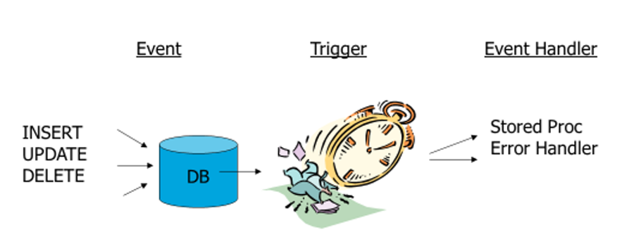
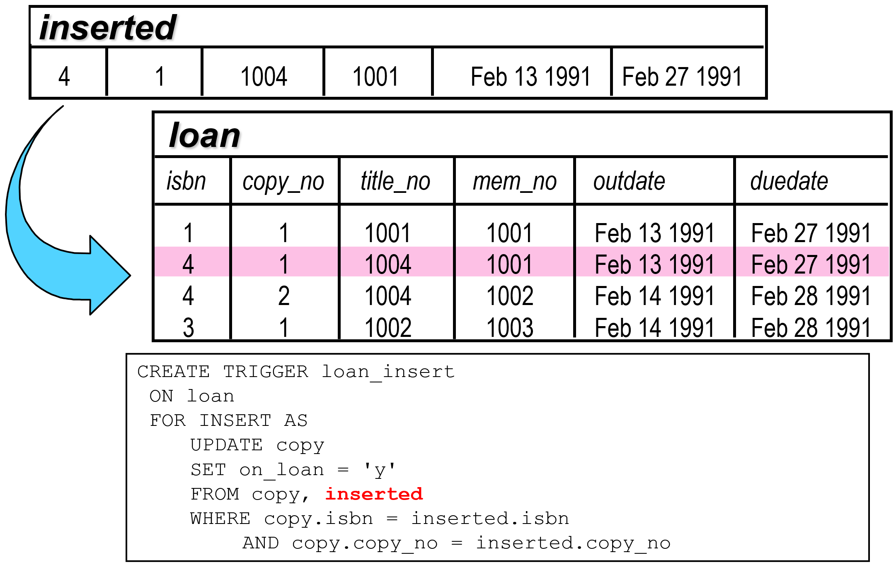
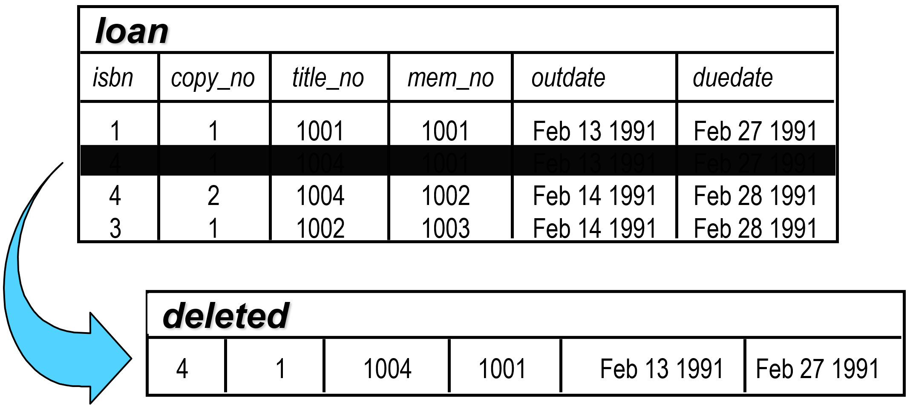
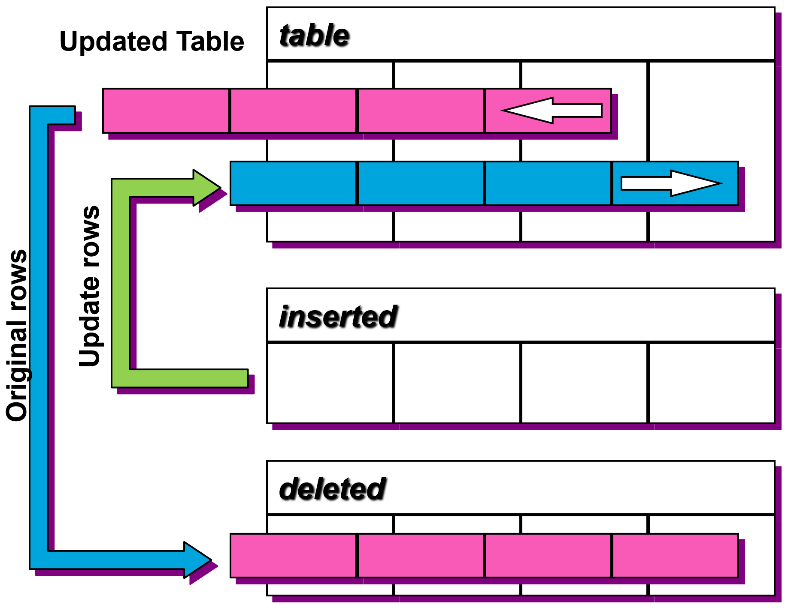
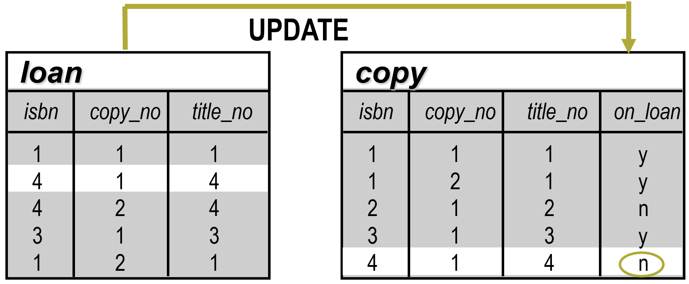

|                             |                     |                               |
| --------------------------- | ------------------- | ----------------------------- |
| **Techniker HF Informatik** | **Datenbanken Da2** |  |

- [1. Datenbank-Trigger in T-SQL](#1-datenbank-trigger-in-t-sql)
  - [1.1. Was ist ein Trigger?](#11-was-ist-ein-trigger)
  - [1.2. Die zwei Haupttypen](#12-die-zwei-haupttypen)
  - [1.3. Die virtuellen Tabellen: inserted und deleted](#13-die-virtuellen-tabellen-inserted-und-deleted)
  - [1.4. INSERT INTO Befehl (inserted table)](#14-insert-into-befehl-inserted-table)
    - [1.4.1. DELETE Befehl (deleted Table)](#141-delete-befehl-deleted-table)
    - [1.4.2. UPDATE Befehl (inserted and deleted)](#142-update-befehl-inserted-and-deleted)
  - [1.5. Syntax-Beispiel: Audit-Log](#15-syntax-beispiel-audit-log)
  - [1.6. Das Prinzip des INSTEAD OF-Triggers](#16-das-prinzip-des-instead-of-triggers)
  - [1.7. Einsatzbereiche](#17-einsatzbereiche)
  - [1.8. Vor- und Nachteile](#18-vor--und-nachteile)
  - [1.9. Beispiele](#19-beispiele)
  - [1.10. Zusammenfassung \& Best Practice](#110-zusammenfassung--best-practice)
- [2. Aufgaben](#2-aufgaben)
  - [2.1. Gruppenarbeit – TSQL-Trigger](#21-gruppenarbeit--tsql-trigger)
  - [2.2. Trigger implementieren](#22-trigger-implementieren)

---

</br>

# 1. Datenbank-Trigger in T-SQL

## 1.1. Was ist ein Trigger?



Ein Trigger ist eine spezielle Art von Stored Procedure, die nicht manuell aufgerufen wird, sondern automatisch ausgeführt wird, wenn ein bestimmtes Ereignis in der Datenbank eintritt.
Wir konzentrieren uns hier auf DML-Trigger (Data Manipulation Language), die bei folgenden Aktionen feuern:

- **INSERT**
- **UPDATE**
- **DELETE**

## 1.2. Die zwei Haupttypen

- **AFTER-Trigger (FOR)**: Wird ausgeführt, nachdem die Aktion (z. B. das Insert) erfolgreich war und die Constraints (z. B. Fremdschlüssel) geprüft wurden, aber bevor die Transaktion endgültig committet ist.
- **INSTEAD OF-Trigger**: Ersetzt die eigentliche Aktion. Dies wird oft verwendet, um Views beschreibbar zu machen, die über mehrere Tabellen gehen.

## 1.3. Die virtuellen Tabellen: inserted und deleted

Das Herzstück jedes Triggers sind zwei spezielle Tabellen, die nur während der Ausführung des Triggers im Arbeitsspeicher existieren:

| **Operation** | **Tabelle inserted**                  | **Tabelle deleted**                  |
| ------------- | ------------------------------------- | ------------------------------------ |
| **INSERT**    | Enthält die neuen Zeilen.             | Ist leer.                            |
| **DELETE**    | Ist leer.                             | Enthält die gelöschten Zeilen.       |
| **UPDATE**    | Enthält die Zeilen nach der Änderung. | Enthält die Zeilen vor der Änderung. |

## 1.4. INSERT INTO Befehl (inserted table)



### 1.4.1. DELETE Befehl (deleted Table)



### 1.4.2. UPDATE Befehl (inserted and deleted)



> **Wichtig**: Trigger in SQL Server feuern einmal pro Statement, nicht pro Zeile. Wenn Sie 1.000 Zeilen gleichzeitig einfügen, enthält die inserted-Tabelle 1.000 Zeilen. Ihr Code muss also immer mengenbasiert (set-based) geschrieben sein!

## 1.5. Syntax-Beispiel: Audit-Log

Ein klassisches Einsatzgebiet ist das Protokollieren von Preisänderungen.

```sql
CREATE TRIGGER trg_AuditPreisAenderung
ON dbo.Produkte
AFTER UPDATE
AS
BEGIN
    SET NOCOUNT ON;

    -- Nur protokollieren, wenn sich die Spalte 'Preis' wirklich geändert hat
    IF UPDATE(Preis)
    BEGIN
        INSERT INTO dbo.PreisHistorie (ProduktID, AlterPreis, NeuerPreis, AenderungsDatum)
        SELECT 
            d.ProduktID, 
            d.Preis, -- Alter Wert aus 'deleted'
            i.Preis, -- Neuer Wert aus 'inserted'
            GETDATE()
        FROM deleted d
        JOIN inserted i ON d.ProduktID = i.ProduktID;
    END
END;
```

## 1.6. Das Prinzip des INSTEAD OF-Triggers

Im Gegensatz zum `AFTER`-Trigger, der erst läuft, wenn die Tat bereits vollzogen ist, tritt der `INSTEAD OF`-Trigger vor der eigentlichen Aktion in Kraft. Das Löschen findet nur statt, wenn du es innerhalb des Triggers explizit programmierst.

**Produktsperre bei Lagerbestand:**

```sql
CREATE TRIGGER trg_PreventDeleteIfInStock
  ON dbo.Produkte
  INSTEAD OF DELETE
AS
BEGIN
    SET NOCOUNT ON;

    -- 1. Prüfung: Gibt es Produkte in der Löschmenge mit Bestand > 0?
    IF EXISTS (
        SELECT 1 
        FROM deleted 
        WHERE Lagerbestand > 0
    )
    BEGIN
        -- Fehlermeldung ausgeben und Transaktion abbrechen
        RAISERROR('Löschen nicht möglich: Einige Produkte haben noch Lagerbestand!', 16, 1);
        ROLLBACK TRANSACTION;
        RETURN;
    END

    -- 2. Wenn die Prüfung bestanden wurde: Das eigentliche Löschen durchführen
    -- WICHTIG: Da wir im INSTEAD OF Trigger sind, müssen wir das DELETE 
    -- jetzt manuell für die erlaubten Zeilen ausführen.
    DELETE p
    FROM dbo.Produkte p
    JOIN deleted d ON p.ProduktID = d.ProduktID;
    
    PRINT 'Löschvorgang erfolgreich ausgeführt.';
END;
GO
```

> **Manuelle Ausführung des Befehls**: Beim `INSTEAD OF` wird das ursprüngliche DELETE komplett unterdrückt wird. Ohne den manuellen `DELETE`-Befehl im zweiten Teil des Triggers würde die Datenbank einfach gar nichts tun (und trotzdem "Erfolg" melden).
> **Mengenbasierte Logik**: Beachte das `IF EXISTS` und den `JOIN` auf die `deleted`-Tabelle. Da ein User mit einem einzigen Befehl (`DELETE FROM Produkte WHERE Kategorie = 'Elektronik'`) viele Zeilen löschen kann, muss der Trigger alle betroffenen Zeilen in der `deleted`-Tabelle gleichzeitig prüfen.

## 1.7. Einsatzbereiche

- **Audit-Logging**: Überwachung von sensiblen Datenänderungen.
- **Komplexe Integritätsregeln**: Regeln, die über einfache CHECK-Constraints hinausgehen (z. B. "Ein Kunde darf nur 5 aktive Bestellungen haben").
- **Daten-Synchronisation**: Automatische Aktualisierung von abgeleiteten Werten oder Statustabellen.
- **Sicherheits-Checks**: Verhindern von Löschvorgängen zu bestimmten Uhrzeiten.
  
## 1.8. Vor- und Nachteile

- **Vorteile**
  - **Zentralisierung**: Die Logik wird direkt bei den Daten erzwungen, egal aus welcher Applikation die Änderung kommt.
  - **Automatisierung**: Keine manuelle Programmierung von Audit-Aufrufen im Frontend nötig.
  - **Integrität**: Garantierte Ausführung innerhalb der Transaktion (schlägt der Trigger fehl, rollt die gesamte Änderung zurück).
- **Nachteile (Die "dunkle Seite")**
  - **Unsichtbare Logik**: Trigger führen "magische" Aktionen im Hintergrund aus. Das erschwert das Debugging für Entwickler massiv.
  - **Performance-Killer**: Da Trigger innerhalb der Transaktion laufen, halten sie Sperren (Locks) länger offen. Komplexe Trigger-Logik kann das gesamte System verlangsamen.
  - **Komplexität**: Wenn Trigger wiederum andere Trigger auslösen (rekursive Trigger), entstehen schwer durchschaubare Kettenreaktionen.
  - **Wartbarkeit**: Geschäftslogik wird in der Datenbank versteckt, was oft gegen moderne Architektur-Prinzipien (Clean Architecture) verstößt.

## 1.9. Beispiele

**Beispiel AFTER DELETE:**

```sql
CREATE TRIGGER loan_delete
  ON loan
  AFTER DELETE 
  AS
  UPDATE copy
    SET on_loan = 'N'
    FROM copy, deleted
    WHERE copy.isbn = deleted.isbn
      AND copy.copy_no = deleted.copy_no
```



**Beispiel: Spion-Trigger:**

```sql
CREATE TRIGGER spion
  ON dbo.DatabaseLog
  AFTER DELETE 
  AS
  DECLARE @LogId INT;
  SELECT @LogID = (SELECT DatabaseLogID FROM DELETED);

  EXEC msdb.dbo.sp_send_dbmail
      @recipients = 'administrator@tsql.de',
      @body = 'Ein Logeintrag wurde gelöscht',
      @subject = @LogID;
GO      
```

## 1.10. Zusammenfassung & Best Practice

- **Halten Sie Trigger kurz**: Nur minimale Logik ausführen.
- **Vermeiden Sie Trigger, wenn möglich**: Prüfen Sie zuerst, ob Constraints oder Default-Werte ausreichen.
- **Mengenbasiert denken**: Nutzen Sie niemals Cursor in Triggern; arbeiten Sie immer mit Joins auf inserted und deleted.

Mengenbasierte Logik: Beachten Sie das IF EXISTS und den JOIN auf die deleted-Tabelle. Da ein User mit einem einzigen Befehl (DELETE FROM Produkte WHERE Kategorie = 'Elektronik') viele Zeilen löschen kann, muss der Trigger alle betroffenen Zeilen in der deleted-Tabelle gleichzeitig prüfen.

Sicherheit: Dies ist eine "Hard-Wired"-Business-Rule. Selbst wenn ein Administrator direkt im Management Studio versucht, eine Zeile zu löschen, verhindert der Trigger dies.

---

</br>

# 2. Aufgaben

## 2.1. Gruppenarbeit – TSQL-Trigger

| **Vorgabe**         | **Beschreibung**                                                             |
| :------------------ | :--------------------------------------------------------------------------- |
| **Lernziele**       | gewinnen eine Übersicht zu den Einsatzmöglichkeiten der SQL Datenbanktrigger |
|                     | können verschiedenen Ausprägungen von SQL Trigger korrekt anzuwenden.        |
| **Sozialform**      | Gruppenarbeit                                                                |
| **Auftrag**         | siehe unten                                                                  |
| **Hilfsmittel**     |                                                                              |
| **Zeitbedarf**      | 35 min (Arbeit), 8-10 min (Präsentation)                                     |
| **Lösungselemente** | SQL-Skriptdatei (Beispiele)                                                  |

> **Bemerkung**: Erstelle die Beispiele, wenn möglich in der Schulverwaltungsdatenbank.

**Gruppe 1:**

- Erkläre in Ihrem Beispiel Code die Möglichkeiten eines **DML After Triggers**.
- Zeige dabei insbesondere die Verwendung der inserted u. updated Tabellen.

**Gruppe 2:**

- Erkläre in Ihrem Beispiel Code die Möglichkeiten eines **DML Instead Triggers**.
- Zeige dabei insbesondere wozu die `inserted` u. `updated` Tabellen benötigt werden.

**Gruppe 3:**

- Erkläre in Ihrem Beispiel Code die Möglichkeiten eines **DDL Triggers**.
- Zeige insbesondere auch, auf welche `Events` reagiert und wie der Trigger ein- bzw. ausgeschaltet (enabled, disabled) werden kann.
- Untersuche zudem wozu die folgende Anweisung benötigt wird: `DECLARE @EventData XML = EVENTDATA();`

**Gruppe 4:**

- Zeige in einem Beispiel Code wozu **Logon Trigger** eingesetzt werden.
- Untersuche auch wozu die folgende Anweisung benötigt wird: `SET @LogonTriggerData = eventdata()`

--

## 2.2. Trigger implementieren

| **Vorgabe**         | **Beschreibung**                                                             |
| :------------------ | :--------------------------------------------------------------------------- |
| **Lernziele**       | gewinnen eine Übersicht zu den Einsatzmöglichkeiten der SQL Datenbanktrigger |
|                     | können verschiedenen Ausprägungen von SQL Trigger korrekt anzuwenden.        |
| **Sozialform**      | Gruppenarbeit                                                                |
| **Auftrag**         | siehe unten                                                                  |
| **Hilfsmittel**     |                                                                              |
| **Zeitbedarf**      | 35 min (Arbeit), 8-10 min (Präsentation)                                     |
| **Lösungselemente** | SQL-Skriptdatei (Beispiele)                                                  |


**Syntax:**

```sql
CREATE TRIGGER [Besitzer.]Triggername
  ON [Besitzer.]Tabellenname | Sichtname
  [AFTER | INSTEAD OF] {INSERT | UPDATE | DELETE}
  [WITH ENCRYPTION]
  AS 
  Sql_Anweisungen
```

**A1:**

- Implementiere die Anforderung, dass bei einem Neueintrag eines Studenten das **Geburtsdatum** nicht in der **Zukunft** liegen darf.
  - a) Lösung mit Check Constraint
    - `ALTER TABLE tabelle ADD CONSTRAINT chk_StudentGeburtsdatum CHECK (...)`
  - b) Lösung mit INSTEAD Trigger
    - `CREATE TRIGGER trigger_name ON tabelle INSTEAD OF INSERT BEGIN ... END`

---

**A2:**

- Stelle sicher, dass pro **Fachrichtung** nicht mehr als **20 Studenten** möglich sind.
  - a) Lösung mit `AFTER INSERT`
    - `CREATE TRIGGER trigger_name ON tabelle AFTER INSERT AS BEGIN ... END`
  - b) Lösung mit `INSTEAD` Trigger
    - `CREATE TRIGGER trigger_name ON tabelle INSTEAD OF INSERT BEGIN ... END`

---

**A3:**

Erstelle einen Trigger, welcher beim Löschen einer **Fachrichtung** automatisch alle zugeordneten **Studenten** mitlöscht.

> Achtung: Falls ein Foreign Key Constraint existiert, muss dieser zuerst gelöscht werden!
> `CREATE TRIGGER trigger_name ON tabelle AFTER [DELETE ¦ INSERT ¦ UPDATE] AS BEGIN ... END`

---

**A4:**

- Erstelle ein Trigger welcher sämtliche Modifikationen (**Update**) in der Studenten-Tabelle in einer **Log-Tabelle** protokolliert.
- Die Log-Tabelle muss vorgängig von Ihnen angelegt werden.
- Attribute für Log-Tabelle (**ID, Datum, Benutzername, Meldungstext**)

```sql
CREATE TRIGGER trigger_name trigger ON tabelle AFTER UPDATE AS
BEGIN ... END
user_name( )
getdate()
```

--

**A5:**

- Wenn der Anwender einen Datensatz in der `Studenten`-Tabelle ändert, soll automatisch in einem Feld (z.B. `letzte_bearbeitung (DateTime)`) das Änderungsdatum gesetzt werden.
- Wie lässt sich diese Anforderung lösen?
