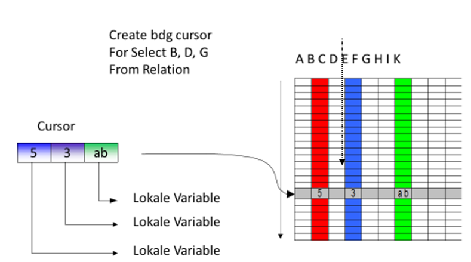

|                             |                     |                               |
| --------------------------- | ------------------- | ----------------------------- |
| **Techniker HF Informatik** | **Datenbanken Da2** |  |

- [1. Cursor in T-SQL](#1-cursor-in-t-sql)
  - [1.1. Der Lebenszyklus eines Cursors](#11-der-lebenszyklus-eines-cursors)
  - [1.2. Syntax-Beispiel](#12-syntax-beispiel)
  - [1.3. Einsatzbereiche](#13-einsatzbereiche)
  - [1.4. Vor- und Nachteile](#14-vor--und-nachteile)
  - [1.5. Zusammenfassung \& Best Practice](#15-zusammenfassung--best-practice)
- [2. Aufgaben](#2-aufgaben)
  - [2.1. Cursor implementieren](#21-cursor-implementieren)

---

</br>

# 1. Cursor in T-SQL



Ein **Cursor** ist ein Datenbank-Objekt, das dazu dient, eine Ergebnismenge (Resultset) Zeile für **Zeile** zu durchlaufen.

- Normalerweise denkt SQL in Mengen: "Ändere alle Preise um 10 %".
- Ein Cursor denkt individuell:
  - "Nimm die erste Zeile, mach etwas,
  - nimm die zweite Zeile, mach etwas anderes...".
- Man nennt dieses Vorgehen auch **RBAR (Row By Agonizing Row)**.

## 1.1. Der Lebenszyklus eines Cursors

Die Arbeit mit einem **Cursor** folgt immer einem festen 5-Schritte-Muster:

- `DECLARE`: Definition der SQL-Abfrage, die durchlaufen werden soll.
- `OPEN`: Ausführung der Abfrage und Bereitstellung des Resultsets im Speicher.
- `FETCH`: Abrufen einer spezifischen Zeile in Variablen.
- `CLOSE`: Schliessen des Cursors (gibt die Sperren auf den Zeilen frei).
- `DEALLOCATE`: Endgültiges Löschen der Cursor-Struktur aus dem Arbeitsspeicher.

## 1.2. Syntax-Beispiel

Stellen wir uns vor, wir müssen für jeden Kunden eine individuelle, komplexe E-Mail-Logik auslösen, die nicht über ein einfaches UPDATE machbar ist.

```sql
DECLARE @KundenName NVARCHAR(100);
DECLARE @Email NVARCHAR(100);

-- 1. Cursor deklarieren
DECLARE kunden_cursor CURSOR FOR 
SELECT Name, Email FROM dbo.Kunden WHERE Aktiv = 1;

-- 2. Cursor öffnen
OPEN kunden_cursor;

-- 3. Die erste Zeile abrufen
FETCH NEXT FROM kunden_cursor INTO @KundenName, @Email;

-- Schleife starten (@@FETCH_STATUS = 0 bedeutet Erfolg)
WHILE @@FETCH_STATUS = 0
BEGIN
    -- Hier passiert die zeilenweise Logik
    PRINT 'Verarbeite Kunde: ' + @KundenName + ' (' + @Email + ')';
    
    -- Nächste Zeile holen
    FETCH NEXT FROM kunden_cursor INTO @KundenName, @Email;
END;

-- 4. & 5. Aufräumen
CLOSE kunden_cursor;
DEALLOCATE kunden_cursor;
```

## 1.3. Einsatzbereiche

Wann ist ein Cursor trotz seiner Nachteile sinnvoll?

- **Administrative Aufgaben**: Wenn Befehle ausgeführt werden müssen, die kein Set-Processing unterstützen (z. B. `ALTER INDEX` für jede Tabelle in der DB einzeln aufrufen).
- **Komplexe Business-Logik**: Wenn eine Zeile Auswirkungen auf die Berechnung der nächsten Zeile hat (und moderne `WINDOW FUNCTIONS` wie LEAD/LAG nicht ausreichen).
- **Integration externer Systeme**: Aufruf einer Stored Procedure für jeden einzelnen Datensatz.

## 1.4. Vor- und Nachteile

- **Vorteile**
  - **Flexibilität**: Erlaubt **komplexe Logik**, die zeilenweise entscheiden muss.
  - **Verständlichkeit**: Für Programmierer, die aus der imperativen Welt (C#, Java) kommen, ist die Logik oft leichter zu lesen als hochkomplexe Joins.
- **Nachteile** (Die Performance-Warnung)
  - **Performance**: Cursor sind **extrem langsam**. SQL Server ist für Mengenoperationen optimiert. Ein Cursor verursacht **massiven Overhead** durch ständige Kontextwechsel in der Engine.
  - **Ressourcenverbrauch**: Er belegt Speicher in der tempdb und hält Sperren (Locks) auf den Tabellen oft viel länger offen als nötig, was zu **Deadlocks** führen kann.
  - **Wartbarkeit**: Cursor-Code ist oft sehr lang und unübersichtlich.

## 1.5. Zusammenfassung & Best Practice

In der modernen Datenbankentwicklung gilt: **"Cursor sind fast immer vermeidbar."**

Bevor einen Cursor eingesetzt wird, zwingend prüfen:

- Kann ich ein einfaches `UPDATE` mit `JOIN` nutzen?
- Helfen mir `WINDOW FUNCTIONS` (z. B. `ROW_NUMBER, RANK, SUM OVER`)?
- Kann ich eine `WHILE`-Schleife mit einer temporären Tabelle nutzen? (Oft effizienter als ein Cursor).

---

</br>

# 2. Aufgaben

## 2.1. Cursor implementieren

| **Vorgabe**             | **Beschreibung**                                |
| :---------------------- | :---------------------------------------------- |
| **Lernziele**           | kann ein CURSOR Logik implementieren und testen |
| **Sozialform**          | Einzelarbeit                                    |
| **Auftrag**             | siehe unten                                     |
| **Hilfsmittel**         |                                                 |
| **Erwartete Resultate** |                                                 |
| **Zeitbedarf**          | 30 min                                          |
| **Lösungselemente**     | SQL-Skriptdatei                                 |

**Auftrag:**

- Erstelle die Skalarfunktion `ufnGetListOfCourse()`, welche sämtliche Bezeichnungen der Kurse in einer kommagetrennten Zeichenkette zurückliefert.
- Ermittele in der Funktion die Bezeichnungen mittels einer satzweisen Verarbeitung in einer Schleife (`CURSOR`).

Beispiel Aufruf: `select dbo ufnGetListOfCourse();`

---

© 2026 Lukas Müller – Licensed under CC BY-NC-ND 4.0
See [LICENSE](..\license.md) file for details.
